# 0. Document Control

| Campo | Valor canónico de esta compilación |
|---|---|
| Canonical title | PROCUREMENT RESEARCH — Canonical Engineering Specification |
| Archivo | `PROCUREMENT_RESEARCH_CANONICAL_ENGINEERING_SPEC_v1_1_1.md` |
| Versión | 1.1.1 — actualización documental de inputs sobre v1.1; P1–P7 y D1–D5 conservados |
| Fecha | 2026-09-22; baseline v1.1 del 2026-09-18 |
| Status | Baseline v1.1.1 con owner patch activo `EM-SPEC-OWNER-PATCH-2026-09-24-01`: Bru rebindea únicamente el contrato de handoff/orquestación desde Paperclip retirado hacia la Oficina canónica propia. Conserva arquitectura de research, criterios, dependencias, gates y aceptación. No es aceptación de IMPs, validación económica ni autorización de ejecución Real. |
| Mandante | Bru |
| Intended consumers | Principal Systems Architect, Senior Quant Research Engineer, Astra/Paperclip, workers y reviewers, equipo de ingeniería, Codex/Claude y responsables de research y governance. |
| Función | Única referencia de ingeniería del corpus consolidado. Los originales conservan su función de research provenance e historical evidence. |
| Informe de auditoría | `PROCUREMENT_RESEARCH_CANONICAL_CONSOLIDATION_REPORT_v1_1_1.md` y `PROCUREMENT_RESEARCH_v1_1_to_v1_1_1_PATCH_REPORT.md`. El Patch Report v1.0→v1.1 se conserva como registro histórico. Ningún reporte define otra arquitectura. |
| Evidencia inspeccionada | La consolidación histórica v1.1 registra 19 fuentes D00–D18; ese conteo no es una nueva lectura ni un audit operativo actual. Esta revisión incorpora la confirmación directa de Bru y las dos piezas del audit de inputs que entregó (§0.5); no reejecuta sus inspecciones de Mac/BruNode ni audita el lago. |

## 0.1 Registro de fuentes

Los identificadores D00–D18 son referencias documentales locales a esta SPEC; no son nombres de subsistemas. Las páginas citadas son páginas físicas del PDF, empezando en 1. Cuando título interior y nombre del archivo difieren, se conserva el nombre del archivo para identificarlo inequívocamente. Una fecha desconocida no se deduce de los documentos que lo citan.

| ID | Archivo leído completo | Versión / fecha documentada | Extensión |
|---|---|---|---:|
| D00 | Pasted text.txt | Prompt de compilación de esta entrega; sin versión propia | Texto completo |
| D01 | PROCUREMENT_RESEARCH_Master_Plan_P7_Canonical_Decisions_v1_0_2026-09-16.pdf | v1.0 / 2026-09-16 | 12 páginas |
| D02 | PROCUREMENT_RESEARCH_Master_Plan_P6_Canonical_Decisions_v1_0_2026-09-16.pdf | v1.0 / 2026-09-16 | 13 páginas |
| D03 | PROCUREMENT_RESEARCH_Master_Plan_P5_Canonical_Decisions_v1_0_2026-09-16.pdf | v1.0 / 2026-09-16 | 12 páginas |
| D04 | PROCUREMENT_RESEARCH_Master_Plan_P1-P4_Canonical_Decisions_v1_0_2026-09-16.pdf | v1.0 / 2026-09-16 | 10 páginas |
| D05 | PROCUREMENT_RESEARCH_Master_Plan_Open_Points_v1_0_2026-09-16.pdf | v1.0 / 2026-09-16 | 10 páginas |
| D06 | PROCUREMENT_RESEARCH_Revision_Action_Plan_v1_0_2026-09-16.pdf | v1.0 / 2026-09-16 | 9 páginas |
| D07 | accion_plan.md | Sin versión/fecha propia explícita | Texto completo |
| D08 | Power_Gas_Plan_Maestro_v1_1_2026-09-14.pdf | v1.1 / 2026-09-14 | 19 páginas |
| D09 | PROCUREMENT_RESEARCH_Global_Reward_Architecture_v1_0_2026-09-16.pdf | v1.0 / 2026-09-16 | 6 páginas |
| D10 | STRATEGY_RESEARCH_Strategy_Catalogue_and_Learning_Architecture_v1_0_2026-09-15.pdf | v1.0 / 2026-09-15 | 18 páginas |
| D11 | STRATEGY_RESEARCH_Q02_Strategy_Catalogue_S1-S5_v0_1_2026-09-15.pdf | v0.1 / 2026-09-15 | 13 páginas |
| D12 | STRATEGY_RESEARCH_Resolucion_13_Preguntas_v0_1_2026-09-15.pdf | v0.1 / 2026-09-15 | 20 páginas |
| D13 | RESEARCH_Fundamental_Price_Drivers_v0_1_2026-09-15.pdf | v0.1 / 2026-09-15 | 11 páginas |
| D14 | ALEXANDRIA_MARKET_DYNAMICS_SENTIMENT_RESEARCH_IDEA_V1.pdf | Research idea V1 / 2026-09-09 | 16 páginas |
| D15 | Power_Gas_Cuaderno_Investigacion_13_Preguntas_v1_2026-09-14.pdf | v1.0 / 2026-09-14 | 10 páginas |
| D16 | eex-reference-price.md | Sin versión/fecha propia; cita procedimiento EEX V5.36 | Texto completo |
| D17 | sortino-handout.pdf | Procurement strategy scoring handout; sin versión/fecha explícita | 6 páginas |
| D18 | PROCUREMENT_RESEARCH_v1_1_PATCH_DECISIONS_D1-D5.md | v1.1 Patch Decision Packet; sin fecha interna explícita, recibido 2026-09-18 | Texto íntegro, 1.032 líneas |

D18 contiene las decisiones **D1–D5 del patch**. Esas etiquetas no son los IDs bibliográficos D01–D05. Las baselines exactas son los dos Markdown v1.0 entregados el 2026-09-17; sus SHA-256 y la huella de D18 constan en el Patch Report. La v1.1 constituye la baseline canónica de esta revisión documental v1.1.1; ambas baselines conservan su historial y sus hashes. La publicación documental no cambia por sí sola la versión vinculada al runtime (§0.5).

## 0.2 Reglas de autoridad

1. Una decisión explícitamente CANONICAL, FROZEN, accepted o conceptually closed conserva autoridad en su ámbito. D18 ordena un patch limitado a D1–D5 y sus consecuencias necesarias sobre v1.0: añade contratos, hace explícita la semántica de dependencias y reclasifica OD-01; no autoriza reabrir P1–P7 ni reconstruir el plan.
2. Un refinamiento o reemplazo explícito posterior prevalece sobre la decisión anterior que identifica. Fecha más reciente o mayor extensión, por sí solas, no autorizan reinterpretación.
3. Los contratos específicos P1–P4, P5, P6 y P7 gobiernan sus respectivos ámbitos. P5 preserva P1–P4; P6 preserva P1–P5; P7 declara expresamente que no redefine P1–P6. Esta reserva de autoridad resuelve, por ejemplo, la frase imprecisa sobre WAIT y volumen en P7 (§22).
4. Global Reward, Strategy Catalogue / Learning Architecture, Resolución Q01–Q13 y Fundamental Price Drivers gobiernan sus conceptos dentro de los límites que los contratos específicos posteriores preservan o refinan.
5. Revision Action Plan y Action Plan organizan trabajo; Master Plan aporta el marco no sustituido. Sus estados históricos «OPEN» no reabren cierres específicos posteriores.
6. Ideas y workbooks previos aportan provenance. Alexandria sólo aporta lo incorporado explícitamente al proyecto Power & Gas; no completa por analogía contratos ausentes.
7. Si no hay autoridad suficiente para resolver una incompatibilidad, se registra como `TRUE_OPEN_CONFLICT` y se bloquea únicamente la decisión dependiente. Está prohibido elegir una variante en silencio.

`MUST / DEBE`, `MUST NOT / NO DEBE` y «prohibido» expresan contratos adoptados del corpus o consecuencias necesarias para preservarlos. «Candidato», «puede», «propuesto» y «futuro» conservan el carácter no obligatorio de su fuente. Las tablas de interfaces, IDs, dependencias y backlog organizan los contratos; no afirman que exista una implementación o un schema físico aprobado. Elegir serialización, nombres de campos de código, librería o tecnología es un IMPLEMENTATION DETAIL cuando no cambia la semántica.

## 0.3 Estados de madurez

La madurez se registra por afirmación y por dimensión. Un componente puede tener concepto CANONICAL / FROZEN y ejecución económica BLOCKED por una dependencia concreta; no se aplana esa información a «listo».

| Estado | Significado | Uso que se prohíbe |
|---|---|---|
| CANONICAL / FROZEN | Decisión conceptual cerrada y trazable. | Interpretarla como prueba de edge o código ya construido. |
| IMPLEMENTATION-READY | Contrato suficientemente especificado para materialización en el alcance indicado. | Saltar auditorías necesarias; afirmar que el instrumento P6 está validado antes de su closure gate. |
| AUDIT-DEPENDENT | Concepto cerrado; faltan datos, contratos, parámetros reales o verificación. | Inventar valores o devolver el concepto al backlog conceptual. |
| EVIDENCE-DEPENDENT | Arquitectura definida; el experimento debe decidir utilidad, calibración o selección. | Declarar demostrado lo documentado. |
| BLOCKED | El trabajo dependiente no puede cerrar por una dependencia identificada. | Parar trabajo independiente o convertir un bloqueo histórico en estado actual comprobado. |
| OPEN DECISION | Elección conceptual legítima aún no resuelta. | Incluir aquí programación, auditoría o calibración de contratos congelados. |

`OUT OF CURRENT SCOPE / FUTURE REQUIREMENT ONLY` clasifica alcance según D18 D5, no falta de definición conceptual del proyecto actual ni madurez empírica. Los contratos D1–D4 están FROZEN aunque sus implementaciones y evidencias no estén acreditadas.

`IMPLEMENTATION DETAIL` clasifica un faltante de materialización; no es un séptimo estado de madurez. Los estados de datos, los de una ejecución, los veredictos científicos y los eventos de governance tienen namespaces distintos (§3); tampoco sustituyen estos seis estados.

## 0.4 Non-goals y control de cambios

Esta entrega no implementa código, ejecuta backtests, escoge parámetros por intuición, valida un feed, demuestra ahorro ni activa compras. No concede acceso a sistemas externos ni transferencia automática de IP. El handoff solicitado autoriza la redacción de esta especificación; cualquier uso real sigue el contrato de Production Governance.

Cambiar identidad de Strategy, semántica BUY/WAIT, población, baseline, benchmark, reward, métricas, criterios, protocolo OOS o envelope requiere cambio explícito de versión y trazabilidad `Supersedes / Canonical`. Completar un campo con su valor auditado no permite cambiar su significado. Todos los receipts anteriores se conservan. Durante implementación, una contradicción real o necesidad de alterar semántica frozen activa `SPEC_CHANGE_REQUEST` (§20.2.12); la Oficina y sus workers no aprueban ese cambio por sí mismos. D18 amplía el contrato documental de handoff. El owner patch `EM-SPEC-OWNER-PATCH-2026-09-24-01` supersede sólo el binding nominal de ese handoff a Paperclip y lo rebindea a la Oficina canónica autorizada; las referencias históricas a Paperclip se conservan como provenance, no como autoridad operativa vigente.

**Source / Authority:** D00 §§1–12; D04 pp.1–2,10; D03 pp.1,12; D02 pp.1–3,13; D01 pp.1,11–12; D06 pp.8–9; D08 pp.3,17–19.

**Patch authority:** D18 §0, D1–D5 y §§1–3. Los tres entregables v1.1 sustituyen la referencia operativa a los entregables v1.0 sin borrar su provenance.

## 0.5 Actualización documental de inputs — 2026-09-22

**Autoridad:** confirmación directa de Bru de las cantidades en MW y su instrucción posterior de actualizar la documentación con el audit de inputs. El identificador de revisión **1.1.1** distingue estos bytes de la baseline v1.1; no introduce un nuevo plan, IMP, gate ni una decisión económica.

| Referencia de esta revisión | Fuente / alcance | Integridad de la copia recibida |
|---|---|---|
| U-BRU | Confirmación en la conversación del 2026-09-22: Monthly Gas/Power 10/10 MW; Quarterly Gas/Power 60/20 MW; autorización de la actualización documental. | Confirmación del owner; no contrato corporativo independiente ni prueba de vigencia histórica. |
| U-AUDIT | [AUDIT_INPUTS_ENERGY_MARKETS.md](sources/AUDIT_INPUTS_ENERGY_MARKETS.md), fecha de corte 2026-09-22, entregado por Bru como resultado del audit de Codex. | SHA-256 `96e0b76356f901acdaf4fed9634908818ecd4d78627955d7217792367143710f` |
| U-MATRIX | [AUDIT_INPUTS_ENERGY_MARKETS.csv](sources/AUDIT_INPUTS_ENERGY_MARKETS.csv), 36 requisitos del mismo audit. | SHA-256 `9470e789fef1389204a76b27bf2849009c5c65d3dfac06167de58a8ccc005f04` |

U-AUDIT y U-MATRIX son dos entregables del **mismo audit**, no dos verificaciones independientes. Los localizadores que citan a Mac/BruNode proceden de ese informe; aquí se conservaron las copias recibidas, sin afirmar una nueva lectura remota de esos archivos. D00–D18 y sus conteos describen la consolidación histórica.

**Cambios:** §4.1 incorpora las cuatro cantidades y conserva la discrepancia histórica de Power Quarterly; §6.5 registra el lago EEX y los límites del inventario; §§21–24 actualizan únicamente conocimiento/readiness factual; §25.3 aplica esos hechos al backlog existente. §25.1 y §25.2 permanecen literalmente iguales a v1.1.

**Límite de publicación:** estos son documentos actualizados, no un `IMP_RECEIPT` ni un despliegue. No se reescriben hashes de receipts aceptados, no se reabren entregas por esta edición y no se declara una migración de la SPEC instalada. El cambio de referencia que eventualmente consuma el runtime debe conservar la trazabilidad de la baseline y de las aceptaciones previas. Los criterios de aceptación y las dependencias no se relajan.

# 1. Executive Mandate

El sistema resuelve un problema de procurement: cubrir obligaciones conocidas de Power y Gas dentro de sus plazos, reduciendo el coste de adquisición frente al Benchmark B correspondiente. La unidad económica es la obligación/campaña completa. Esperar puede conservar la posibilidad de comprar más barato, pero consume tiempo; comprar sólo reduce el volumen pendiente por la cantidad efectivamente ejecutada.

Monthly y Quarterly son misiones de primer nivel, con evaluación separada. Power y Gas también se mantienen separados. El primer experimento trabaja únicamente con Gas Quarterly porque P5 lo congela como población homogénea; no reduce el mandato general del proyecto. Su resultado no se extrapola automáticamente a Power o Monthly.

`Prediction != Decision`: describir el mercado, anticipar una dirección o clasificar correctamente una anomalía no demuestra que una secuencia BUY/WAIT cubra mejor la obligación. La decisión utiliza evidencia admitida y Procurement State; Sizing Policy determina la cantidad y Execution determina los fills. El coste all-in H procede de esos fills y costes reconciliados. El resultado de campaña es V = B − H, con unidades compatibles y cobertura visible.

La arquitectura preserva una autoridad de decisión y un objetivo económico: S1–S5 generan evidencia para una global Candidate Policy; la policy elige BUY/WAIT; las cantidades y los límites tienen contratos separados. La Value Layer estima consecuencias económicas futuras, mientras el Learning Loop acumula Experience y produce nuevas Policy Versions offline. Ninguna versión activa se modifica silenciosamente.

Mejorar procurement requiere evidencia válida, mejora después de costes, downside y estabilidad conforme al contrato de su misión. Una mejora frente al baseline interno y un PASS de research son preguntas diferentes; ninguno concede autoridad productiva. OOS, Shadow y Real Execution producen tipos de evidencia distintos. La autonomía se gana mediante gates, dentro de un Safety / Autonomy Envelope externo que la policy no puede modificar.

El siguiente trabajo concreto es materializar el contrato de una campaña auditada, los datos point-in-time, el benchmark y el evaluador, y ejecutar después el protocolo A0 frente a A1. La implementación avanzada depende de los resultados de ese recorrido (§20), no del atractivo de una familia de modelos.

**Source / Authority:** D04 P1–P4, pp.3–9; D03 P5.1–P5.9, pp.3–11; D01 P7.1–P7.8, pp.3–11; D09 §§1–3, pp.2–3; D08 pp.1,4–8,16–17.

# 2. Scope and Non-Scope

| Ámbito | Incluido y límite normativo |
|---|---|
| Procurement | Power y Gas; Monthly y Quarterly; obligaciones, BUY/WAIT, sizing separado, ejecución, cobertura, coste, benchmark y valor. La relación entre obligaciones se recupera del contrato real, no se presume aditiva ni alternativa. |
| Research actual | Primer experimento P5: hipótesis derivada de S1, Gas Quarterly, A0 Calendar-only / price-blind frente a A1 = A0 + S1. |
| Research posterior | Utilidad incremental de Z, drivers, S2–S5, sizing aprendido, hora de decisión Q07, Value/Policy Learning y combinaciones admitidas por evidencia. Nuevas Strategies sólo por §8.7, sin cambiar el catálogo inicial. No hay orden global futuro congelado para añadir capas. |
| Implementation | Interfaces conceptuales, manifests, ledgers, evaluador mínimo, fixtures, scoring, control de versiones y receipts; posteriormente Learning Loop, Shadow y mecanismos de governance. Cada bloque respeta sus prerequisites. |
| Commercial / production governance | Materialidad comercial, mandatos, rights/IP, ejecución real, aprobación inicial, límites, niveles de autonomía, monitoring, fallback y rollback. Contratos independientes de research PASS. |
| Fuera del primer experimento | Power, Monthly, optimización de hora intradía, Z, Fundamental Price Drivers, Extraordinary State, S2–S5, local policies autónomas y meta-policy. No se añaden para rescatar S1. |
| Fuera del mandato actual | SELL/CLOSE o gestión de una cuenta de trading; reconstrucción de Alexandria; sus pilotos, budgets, UI y gates; portfolio aggregation Power/Gas o Monthly/Quarterly en el alcance actual (§23); promesa de mínimo futuro o de ahorro; programación en esta entrega. |
| Strategy / Capability Extension | Tres intake channels y un Strategy Admission Contract común (§8.7). Admisión como Evidence Generator, sin reward económico propio ni ejecución automática. |
| External Model / Tool Integration | Role-discovery y evaluación por rol de JEV u otra capacidad (§11.6); integración opcional sólo con valor demostrado y autoridad aplicable. |
| Operator Interface | Human Visual Observability, chart/time-series y límites de información/autoridad (§26) como contrato funcional actual. Diseño y frontend completos después, fuera del critical path inmediato. |
| Canonical Office handoff | Extender la Oficina canónica autorizada y ejecutar el canonical IMP graph mediante WORK-PACKETs, reviews y receipts (§20.2/§25.2); routing es asunto de oficina. Paperclip queda como provenance histórica, no como runtime requerido. |
| Product / Mission Economic Separation | Power Monthly, Power Quarterly, Gas Monthly y Gas Quarterly son dominios separados cuando apliquen. Sin score combinado, pesos conjuntos, portfolio objective ni pooling para cumplir mínimos. |

Q08 permanece **aparcada por diseño** como Operational Sidecar. Decision Decomposition Matrix y State Transition Tree son propuestas de ese ámbito, no componentes obligatorios del primer experimento. Septiembre y la práctica histórica de las 11:00 no crean un deadline para la investigación ni una señal operativa. Las 11:00 tampoco tienen una zona horaria confirmada en el corpus.

Q04 mantiene la prioridad de validar lógica antes de ampliar optimización; Q05 asigna Monte Carlo a incertidumbre, robustez y stress, y Markov a transiciones sólo si aportan valor. Q11–Q13 gobiernan todos los experimentos: objetivo económico, suficiencia de datos y refutación. No son fases que se marcan completadas y se olvidan.

**Source / Authority:** D03 pp.2–11; D06 Steps 5–8, pp.5–8; D12 Q04–Q13, pp.8–17; D15 pp.3–9; D04 pp.3,7–9; D01 pp.3,10–11.

**Patch authority:** D18 D1–D5. Una futura optimización conjunta exige requerimiento explícito del cliente o evidencia auditada del mandato que la exija, y una nueva definición versionada (§23); no es trabajo elegible actual.

# 3. Canonical Vocabulary

Éste es el diccionario normativo. Las secciones posteriores desarrollan contratos sin crear definiciones alternativas. Upstream y downstream describen dependencias conceptuales, no una topología de software ya implementada. «Datos PIT» significa datos admitidos por el Point-in-Time Contract de §6.

## 3.1 Problema, observación y evidencia

| Canonical name | Definición | Qué NO significa | Upstream dependencies | Downstream consumers | Source |
|---|---|---|---|---|---|
| Procurement | Cobertura de una obligación de compra dentro de su plazo y restricciones, evaluada económicamente. | Trading P&L, compra opcional o predicción del mínimo futuro. | Mandato, contrato, datos de ejecución | Evaluator, Reward, Learning | D04 P1–P3; D08 pp.1,4–8 |
| Mission | Ámbito de obligación y evaluación Monthly o Quarterly para un producto/campaña. | Una señal, un fill o una combinación implícita de obligaciones. | Mandato real | Procurement State, P5, evaluación | D04 pp.3,7; D03 pp.5–6 |
| Monthly | Misión mensual con benchmark 1-0-1 y evaluación propia. | Quarterly abreviado o sustituto automático de su evidencia. | Obligación mensual, calendario, B/H | Scoring Monthly | D04 P3.5 |
| Quarterly | Misión trimestral con benchmark 3-1-3 y episodios de procurement completos. | Tres meses de compras durante delivery; equivalencia automática con Monthly. | Obligación trimestral, ventana/deadline auditados | P5, scoring Quarterly | D04 P2/P3; D03 P5.4; D08 p.5 |
| BUY | Decisión de actuar en una oportunidad válida; cantidad y ejecución siguen sus contratos. | Cantidad fija, fill garantizado o cobertura por la cantidad solicitada. | Candidate Policy, oportunidad válida | Sizing Policy, Execution | D04 P1; D03 P5.4; D02 P6.3–P6.5 |
| WAIT | No comprar en esa oportunidad: conserva volumen pendiente y consume tiempo. | Cancelar obligación, reducir volumen o garantizar un precio futuro. | Candidate Policy, Procurement State | Estado siguiente, Value Layer | D03 P5.4; D02 P6.3/P6.5 |
| Sizing | Decisión de cuánta obligación restante ejecutar ante BUY. | Volumen total del mandato ni intensidad de una anomalía. | BUY, volumen pendiente, límites | Execution | D04 P1.1–P1.2 |
| Sizing Policy | Componente que determina la cantidad bajo obligación y restricciones. Forma final a calibrar/aprender/validar. | Cantidad implícita en BUY; algoritmo final fijado por el control P5.2. | Procurement State, BUY, límites | Requests de ejecución | D04 P1.2; D03 P5.2 |
| Procurement State | Obligación/volumen restante, tiempo restante, progreso de cobertura, presión de procurement y restricciones de campaña. | Market State ni una capa general de Risk Management. | Mandato, calendario, ledger de fills | Candidate Policy, sizing, feasibility, value | D12 Q02/Q03; D01 P7.1/P7.6 |
| Market Dynamics & Sentiment State | Capa de percepción del comportamiento del mercado representada por Z_t. | Decision Engine completo ni orden de compra. | Datos PIT y representaciones admitidas | Contexto, strategies y Candidate Policy admitidas | D13 §2.1; D06 Step 4 |
| Z_t | Tupla `(m_t,e_t,c_t,q_t,u_t)` en el instante t. | Suma, scalar score único o especificación numérica ya calibrada. | Estimaciones de sus cinco componentes | Market Intelligence y consumers admitidos | D13 p.3; D08 p.9 |
| Dynamic Mode | Presión, tendencia, transición o neutralidad de la dinámica del mercado; puede representarse probabilísticamente. | Dirección aislada o enum de Alexandria obligatorio. | Observación causal de dinámica | Z_t, consumers admitidos | D13 p.3; D08 p.9 |
| Energy | Intensidad/capacidad de desplazamiento del movimiento del precio, `e_t`. | Electricidad, MW, Conviction o permiso de acción. | Observación causal del movimiento | Z_t | D13 pp.3–4; D08 p.9 |
| Conviction | Respaldo estructural y contextual del movimiento, `c_t`. | Magnitud del movimiento o certeza del estimador. | Estructura/contexto PIT admitidos | Z_t | D13 p.3; D08 p.9 |
| Sentiment | Comportamiento inferido, `q_t`; Panic/Fear/Center/Greed/Euphoria son interpretaciones conservadas del marco. | Emoción humana observada, dirección automática ni umbral aprobado. | Evidencia causal de comportamiento | Z_t | D13 p.3; D08 p.9 |
| Uncertainty | Incertidumbre o falta de identificación; incluye información incompleta, stale, conflictiva o no disponible según ámbito. | Conviction baja, cero numérico por defecto o driver adicional. | Fuente, calidad y estimación | Z_t, drivers, State, data/OOD gates | D13 pp.3–4; D04 P4 |
| Fundamental Price Drivers | Taxonomía complementaria de Base State y Extraordinary State, 23 bloques. | Sustituto de Z ni lista de 23 features obligatorias. | Observables PIT por driver | Market Intelligence, experimentos posteriores | D13 §§2–7; D06 Step 3 |
| Base State | Condiciones conocidas del mercado: 9 bloques Power y 10 Gas. | Evento extraordinario duplicado ni todos los inputs de la policy. | Fuentes físicas/económicas/calendario | Drivers, Market Intelligence | D13 §§4–5 |
| Extraordinary State | Nueva información/shock transversal; un evento puede actualizar varios drivers conservando identidad única. | Segunda copia del Base State o cuatro premios independientes por un shock. | Publicación/evento PIT, expectation si existe | Drivers afectados, contexto | D13 §§6–7 |
| STATE / CHANGE / SURPRISE | Situación conocida; cambio frente al estado/versión anterior; diferencia frente a expectativa previa documentada. | Tres nombres para variación de precio. SURPRISE no existe sin expected demostrable. | Estado actual, anterior y expectativa fechada | Representación de drivers | D13 §§3,7 |
| Market Intelligence Core | Combinación candidata de Z, Base Fundamental Drivers y Extraordinary State. | Decision Engine completo; obligación de admitir todas sus variables. | Componentes admitidos y PIT | Candidate Policy junto a Procurement State | D12 Q09–Q10; D06 Step 4 |
| S1–S5 | Catálogo de cinco Strategies con identidades de §8. | Cinco hypotheses o cinco autoridades autónomas de compra. | Semántica D10, inputs permitidos | Evidence, experimentos, Candidate Policy | D10 p.2; D03 p.1; D01 P7.1 |
| Strategy | Familia de lógica de mercado con rol, variables, parámetros y refutación definidos. | Hypothesis experimental, Candidate Policy global o algoritmo necesariamente RL. | Semántica congelada e inputs | Hypotheses derivadas, evidence | D10 pp.2–14; D03 P5.1 |
| Hypothesis | Afirmación refutable delimitada para un experimento; puede derivarse de una Strategy o preceder a una futura Strategy Candidate por los canales de §8.7. | Renombre de S1–S5 o resultado demostrado. | Strategy/pregunta, población, protocolo | Experiment, refutation | D03 P5.1/P5.7; D18 D1.1–D1.3 |
| Evidence Generator | Rol de producir evidencia estructurada, con incertidumbre y trazabilidad. | Autoridad independiente BUY/WAIT. | Inputs PIT, definición de Strategy | Candidate Policy, ablations | D01 P7.1 |
| Candidate Policy | Única policy global inicial que integra evidencia admitida y Procurement State para elegir BUY/WAIT. | Una Strategy aislada, un predictor o una versión ya autorizada en producción. | State, evidence, configuración | Action, Experience, gates | D01 P7.1/P7.6 |
| Policy Version | Identidad reproducible de lógica, parámetros, calibración y configuración que produjeron las acciones. | Modelo mutable en caliente o autorización de autonomía por sí misma. | Offline learning/configuración congelada | Evaluator, Shadow, Execution, receipts | D01 P7.2/P7.8 |

## 3.2 Evaluación, aprendizaje y autoridad

| Canonical name | Definición | Qué NO significa | Upstream dependencies | Downstream consumers | Source |
|---|---|---|---|---|---|
| Baseline | Comparador interno ejecutable, con policy y supuestos predeclarados. | Benchmark B o fallback productivo autorizado por defecto. | Obligación, reglas, execution contract | Comparación experimental | D03 P5.2/P5.6; D01 P7.8 |
| Calendar-only / price-blind baseline | A0 experimental P5: calendario determinista; BUY según oportunidades y reparto igual de volumen restante entre oportunidades programadas restantes. | DCA monetario genérico, timing por precio o sizing final aprendido. | Calendario auditado, Procurement State de factibilidad | A0, Delta V | D03 P5.2/P5.5 |
| Benchmark B | Referencia económica de evaluación de campaña: media por fecha de referencia diaria seleccionada bajo 1-0-1/3-1-3. | Policy, precio ejecutable o futuro benchmark visible al decidir. | Referencias oficiales/provisionales, calendario y versión | V, scoring, reconciliación | D04 P2.1; D16 §3 |
| Official reference | Settlement diario oficial válido según fuente/proveedor y versión de evaluación. | Proxy derivado o demostración de fill posible. | Feed oficial, validación y revisiones | B, reconciliation | D16 §§1,3–5 |
| Provisional reference | Aproximación derivada explícitamente etiquetada y reconciliable; no equivalencia demostrada. | Settlement oficial por reproducir una parte de su fórmula. | Trades/book accesibles y fallback predeclarado | B provisional, auditoría | D16 §§2–5; D02 P6.6 |
| H | Coste unitario all-in de cubrir la obligación completa, calculado desde execution ledger. | Coste de un trade, promedio de solicitudes o coste de sólo la porción conveniente. | Fills, cantidades, costes y unidades | V, reward, evaluation | D04 P2.2; D02 P6.4–P6.6 |
| V = B − H | Valor económico realizado/evaluado de campaña en unidad compatible; positivo supera B. | Total EUR sin volumen MWh compatible ni V(s). | B y H válidos, campaña completa | Scoring, reward, Experience | D04 P2.4/P3.5 |
| Delta V | Diferencia de valor entre brazos comparables: V_A1−V_A0; con mismo B, H_A0−H_A1. | PASS absoluto o mejora de producción autorizada. | Par A0/A1 válido | P5.7 refutation | D03 P5.7; D02 P6.6 |
| Sortino | Media de V dividida por downside deviation target cero con denominador `n−1` del handout. | Ratio anualizado, desviación sólo dividida entre pérdidas o gate Monthly importado. | Serie Quarterly completa, convención de §5 | Research Quarterly, downside gate | D17 §§1,4–6; D04 P2.3/P3 |
| C | Expected contribution multiple `pG/(ℓA)` cuando definido. | R=G/A ni hard gate research C>2.25–3.00. | Ganancias/pérdidas/frecuencias | Reportes y eventual regla comercial | D17 §3; D04 P3.1 |
| Global Procurement Reward | Único objetivo económico compartido por Strategies, anclado al valor de procurement. | Reward económico por Strategy o score crudo agregado Power/Gas. | V, H, completion y parametrización validada | Value/Policy Learning | D09 §§1–3; D01 P7.6 |
| Auxiliary learning objective | Objetivo local de representación, predicción o calibración. | Segunda definición del éxito económico. | Datos/targets del subproblema | Representaciones de Strategy/contexto | D09 §§3–4 |
| Ablation contribution | Diferencia del reward global con y sin una capa bajo protocolo comparable. | Segundo economic reward ni atribución causal garantizada. | Runs comparables, un reward | Credit assignment, selección de capas | D09 §3.3; D10 §7 |
| Value Layer | Estimación del valor económico esperado de estados/acciones bajo el reward global. | Accuracy de precio o obligación de usar Q-learning en producción. | State, Action, Reward, Experience | Candidate Policy, aprendizaje | D01 P7.6 |
| V(s), V_pi(s) | Valor futuro esperado desde un estado bajo policy pi. | V=B−H ya realizado para una campaña. | State, policy, reward futuro | Value learning, diagnóstico | D01 P7.6.D |
| Q(s,a), Q_pi(s,a) | Valor futuro esperado de tomar a en s y continuar bajo pi. | Precio actual, dinero garantizado o acción aprobada. | State, action, transition, reward | Candidate Policy, Bellman | D01 P7.6.D–G |
| Bellman | Formulación recursiva que propaga consecuencias económicas futuras hacia la decisión actual. | Nombre alternativo de Q-learning o licencia para alterar reward. | State, transitions, reward, gamma | Value Layer | D01 P7.6.E–F |
| Q-learning | Primera familia RL candidata mientras BUY/WAIT sea discreto y el estado suficientemente Markov-like. | Algoritmo productivo obligatorio o requisito para P5. | Datos/support, reward válido, State, evaluator | Comparación empírica de value learners | D01 P7.6.F; D10 p.15 |
| Representation Learning | Uso de supervised, semi-supervised, self-supervised o unsupervised según el subproblema para aprender representaciones. | Escalera de madurez hacia RL. | Datos y objetivos auxiliares | Evidence, State | D01 P7.6.A |
| Value / Policy Learning | Aprendizaje del valor de consecuencias y elección de acciones bajo el objetivo global. | Sustituto del contrato económico o simple representación del mercado. | Experience, value/reward contracts | Nueva Policy Version | D01 P7.2/P7.6 |
| Stochastic policy | Distribución de probabilidad de acciones con configuración versionada. | Aprendizaje online, seed elegida por resultado o exploración live inicial. | Valores/evidencia, uncertainty, configuración | Research, policy validation | D01 P7.4/P7.6.G |
| Exploration / Exploitation | Probar acciones para aprender / elegir lo actualmente considerado mejor. | Permiso de probar compras reales por curiosidad del modelo. | Policy, entorno y governance | Research y modo operativo aprobado | D01 P7.4 |
| Experience | Registro de state/frontier, versión, recomendación, acción/fills cuando existen y outcome/reward con provenance. | Sólo el reward final ni evidencia homogénea de cualquier origen. | Replay, Shadow o Real Execution | Offline Learning Loop | D01 P7.5; D10 §7 |
| Replay | Reconstrucción cronológica sobre datos históricos PIT con acciones y ejecución simuladas. | Experience factual de compras reales o Shadow prospectivo. | P4, P6, input bundle congelado | Evaluación histórica, Experience simulada | D02 P6.1–P6.10; D01 P7.5 |
| OOS | Evidencia fuera del material usado para elegir/calibrar la versión, sellada y con reglas de consumo. | Muestra reusable tras modificar la policy mirando el resultado. | Split, versiones y registro de acceso | Research gates, nueva validación | D03 P5.8 |
| Shadow | Consumo prospectivo de información y recomendaciones factuales sin compras reales; fills hipotéticos siguen simulados. | Backtest, Live o prueba de costes efectivamente pagados. | Versión fija, captura prospectiva | Forward evidence, Experience | D01 P7.5; D08 p.17 |
| Real Execution | Acciones, fills y costes realmente realizados bajo autoridad concedida, separando intervención humana. | Recomendación de Shadow o resultado atribuible íntegramente a la policy intervenida. | Approval/envelope, policy y execution | Experience factual y governance | D01 P7.3/P7.5/P7.8 |
| Learning Loop | Ciclo offline de Experience, review/learning, nueva versión y revalidación antes de sustitución. | Hot learning o promoción automática por entrenar. | Experiencia cerrada y provenance | Nueva Candidate Policy Version | D01 P7.2; D06 Step 8 |
| Safety / Autonomy Envelope | Límites duros externos y no aprendibles sobre scope, acciones, cantidades, datos, deadlines y autoridad. | Penalización blanda o parámetro optimizable por la policy. | Mandato y governance | Controlador externo, execution | D01 P7.7 |
| Autonomy Promotion Gate | Conjunción de validity, evidence, economic, downside, stability y forward. | Sortino aislado, paso del tiempo o compensación por promedio. | OOS/Shadow/Real y contratos | Governance de promoción | D01 P7.6.H |
| Production Governance | Autoridad separada para activación, promociones permitidas, demotion/halt/rollback y sus receipts. | Candidate Policy autoampliando su scope. | Gates, envelope, autorización | Operación y Policy Version activa | D01 P7.8 |
| PASS / HOLD / FAIL / INVALID | Criterios predeclarados cumplidos / evidencia insuficiente / refutación con prueba válida / prueba metodológicamente no interpretable. | Status técnico P6 ni autorización productiva. | Validity y evaluación del ámbito indicado | Research review | D03 P5.7; D05 p.9; D08 p.16 |
| VALID_RUN / DATA_BLOCKED / COVERAGE_INCOMPLETE / BENCHMARK_PROVISIONAL / INVALID_RUN | Estados técnicos del evaluator definidos en §14, con causas y ejes separados. | Escala de rendimiento o equivalencia uno a uno con veredicto científico. | Input bundle, replay, accounting, provenance | P5/P3 evaluation | D02 P6.10 |
| AVAILABLE NOW / FORWARD CAPTURE / PROXY / UNAVAILABLE | Disponibilidad por requisito de información. | Readiness agregada del candidato. | Data audit | Data Sufficiency Matrix | D04 P4.4 |
| DATA_READY / DATA_PROVISIONAL / FORWARD_ONLY / DATA_BLOCKED | Readiness por candidato según requisitos críticos y evidencia PIT. | Porcentaje universal de cobertura o permiso productivo. | Data Sufficiency Matrix | Admission a experimentos | D04 P4.4 |
| Autonomy Evidence Score | Futuro score `A_t=min(E_t,P_t,D_t,S_t,F_t)`; dimensiones normalizadas todavía por definir. | Gate de validez completo ni umbral A1–A4 ya calibrado. | Evidencia normalizada y governance | Promoción futura, si se materializa | D01 P7.6.J |

## 3.3 Símbolos y etiquetas con más de un ámbito

| Colisión documental | Regla de lectura y materialización |
|---|---|
| `q_t` | Dentro de Z_t significa Sentiment. En P1/P5 `q_t` o `q_t(control)` significa cantidad de compra. Los campos de implementación deben mantener namespace/semántica explícitos; no compartir una variable sin calificación. El índice `q` de V_q identifica un quarter. |
| `V`, `V(s)` | V sin argumento es resultado de campaña B−H; V_pi(s) es valor futuro esperado de estado. |
| `A0`, `A1` | En §13 son brazos de ablation; en §16 son niveles de autonomía. «A1 aprobado» sin ámbito es ambiguo y no basta como receipt. |
| `S1`–`S5` | En esta SPEC son Strategies. Los workstreams S1/S3/S4/S5 de Alexandria y los códigos bibliográficos S1–S4 del Master Plan no son estas Strategies. |
| `Energy` | `e_t` es intensidad de movimiento; Energy/Power en el mandato/taxonomía designa electricidad. |
| `Policy` | Candidate Policy decide procurement; «dirección de policy» en drivers E9/G9 es política pública. |
| `H`, `Q`, `B`, `C`, `R` | H económico no es Hypothesis; Q de quarter no es Q-value; B benchmark no es baseline; C múltiplo no es Conviction; R win/loss no es `R_campaign`. |
| `DATA_BLOCKED`, `HOLD` | Conservar ámbito: data-readiness, run, research o governance. Compartir una etiqueta no iguala sus contratos. |

**Source / Authority:** D00 §3; D04 pp.3–9; D03 pp.1,4,9–11; D02 pp.4–12; D01 pp.3–11; D10 pp.2–17; D13 pp.3–9; D08 pp.7–9,19; D14 p.13 sólo para excluir la colisión de workstreams.

## 3.4 Términos incorporados por el patch v1.1

Esta extensión del diccionario referencia los contratos completos; no cambia las definiciones anteriores.

| Canonical name | Definición y límite | Contrato / Source |
|---|---|---|
| Strategy Candidate | Strategy propuesta, formalizada y versionada que aún debe superar la admisión común; no equivale a Hypothesis, edge demostrado o authority. | §8.7; D18 D1 |
| Strategy / Capability Extension Contract | Entrada de nuevas Strategies por los tres canales aprobados y convergencia al único Strategy Admission Contract. | §8.7; D18 D1.1–D1.6 |
| Strategy Admission Contract | Requisitos de identidad, datos, refutación, comparación, evidencia y aceptación antes de admitir un Evidence Generator. | §8.7; D18 D1.4–D1.5 |
| External Model / Tool Integration Contract | Determinación y evaluación de valor por rol; un componente puede ser admitido en un rol y rechazado en otro. No obliga a integrar JEV. | §11.6; D18 D2 |
| Operator Interface Boundary | Frontera de presentación e interacción autorizada sobre el estado backend canónico; no otra Source of Truth. | §26; D18 D3 |
| Human Visual Observability | Capacidad funcional de inspección visual y temporal de contexto, evidence, State, recomendaciones, ejecución y outcomes con provenance/PIT explícitos. | §26; D18 D3.1–D3.3 |
| IMP | Unidad de implementación del backlog canónico con objetivo, dependencias y acceptance propios. Su existencia documental no significa que esté ejecutada o aceptada. | §§20.2,25; D18 D4 |
| ST | Subtask acotada de un IMP, que hereda su contexto y límites; cerrar ST no cierra el IMP. | §20.2.5/20.2.10; D18 D4.5/D4.10 |
| WORK-PACKET | Contrato de trabajo entregado a un worker con alcance, versión, inputs, límites y criterios suficientes para ejecutar una ST. | §20.2.7; D18 D4.7 |
| ST_RECEIPT | Registro estructurado del trabajo realmente realizado por una ST; el PASS del worker es recomendación sujeta a review. | §20.2.8–20.2.10; D18 D4.8–D4.10 |
| IMP_RECEIPT | Registro de aceptación del IMP tras superar su gate completo; sólo entonces permite reevaluar las dependencias downstream. | §20.2.10; D18 D4.10 |
| SPEC_CHANGE_REQUEST | Solicitud trazable ante contradicción frozen o necesidad de cambio arquitectónico; bloquea la rama afectada y vuelve a autoridad de arquitectura/research. | §20.2.12; D18 D4.12 |
| REQUIRES / REQUIRES_AUDIT / REQUIRES_EVIDENCE | Dependencias consumidas y satisfechas para la elegibilidad del alcance correspondiente. | §20.2.3–20.2.4/§25.2; D18 D4.3–D4.4 |
| RESOLVES_AUDIT / PRODUCES_EVIDENCE / UNLOCKS | Auditorías/evidencia que el IMP debe producir y consumidores potenciales que pueden reevaluarse tras aceptación; no son prerequisites de su productor. | §20.2.3–20.2.4/§25.2; D18 D4.3–D4.4 |

`ADMIT / HOLD / REJECT` pertenece a la admisión de un rol externo (§11.6); `PASS / HOLD / FAIL / INVALID` conserva su ámbito experimental y no se convierte automáticamente en admisión, cierre IMP o autorización productiva. `READY`, `ST accepted` e `IMP accepted` son estados de ejecución de oficina, no DATA_READY, research PASS ni Production Governance. Los roles de Astra/Opus/Luna/DeepSeek/Paperclip se definen únicamente en §20.2.1.

# 4. Procurement Problem Contract

**Estado:** CANONICAL / FROZEN en su arquitectura conceptual. La materialización de obligaciones, calendarios, productos y parámetros operativos es AUDIT-DEPENDENT. La selección y validación de la Sizing Policy permanece EVIDENCE-DEPENDENT; no reabre la separación entre decisión y cantidad.

## 4.1 Obligación y Mission

Procurement consiste en cubrir una obligación conocida de Power o Gas dentro de sus restricciones y plazo, buscando reducir su coste completo frente al Benchmark B. Monthly y Quarterly son Mission de primera clase, con contratos y poblaciones de evaluación separados. Power y Gas también permanecen separados; ningún agregado puede ocultar incumplimientos o aumentar artificialmente la evidencia disponible.

El **volumen total de la obligación ya es conocido** según P1.1. No constituye una OPEN DECISION. La confirmación actual de Bru del 2026-09-22 aporta las cantidades de las cuatro combinaciones producto/Mission siguientes, que quedan incorporadas como **datos confirmados por el owner en MW**. No deben volver a pedirse como si fueran desconocidas.

| Producto | Mission | Cantidad confirmada | Unidad | Fuente actual |
|---|---|---:|---|---|
| Gas | Monthly | 10 | MW | Confirmación de Bru, 2026-09-22 |
| Power | Monthly | 10 | MW | Confirmación de Bru, 2026-09-22 |
| Gas | Quarterly | 60 | MW | Confirmación de Bru, 2026-09-22 |
| Power | Quarterly | 20 | MW | Confirmación de Bru, 2026-09-22 |

**Provenance y discrepancia:** D08 p.4, D15 p.2 y CCR-08 conservan «10 Energy» sin unidad explícita para Power Quarterly. La confirmación actual es **20 MW**: se usa como dato actual comunicado por Bru, no como conversión de «10 Energy» ni como modificación retroactiva de las fuentes. Los valores anteriores se preservan en sus documentos y en CCR-08. Las otras tres cantidades coinciden con los antecedentes según U-AUDIT §§1/4.

**Alcance:** conocer la cantidad en MW no identifica una campaña concreta, no fija cuánto ejecutar en cada BUY y no confirma producto/hub/contrato, vigencia, periodo/horas/perfil de entrega, liquidación, calendario ni ownership. Esos vínculos siguen pendientes. No se extrapolan estas cantidades a todas las campañas históricas ni se convierten a MWh sin evidencia aplicable. La ficha completa de campaña no queda aceptada por esta tabla.

**Source / Authority de la actualización:** U-BRU; [U-AUDIT §§1,4,5,8](sources/AUDIT_INPUTS_ENERGY_MARKETS.md); U-MATRIX, requisitos de cantidades.

| Input del contrato de campaña | Contenido exigido para materializarlo | Estado de sus valores reales |
|---|---|---|
| Identidad | Campaign ID, producto/contrato exacto, Power/Gas, Monthly/Quarterly, mercado o hub aplicable | AUDIT-DEPENDENT |
| Obligación | Cantidad y unidad confirmadas en la tabla anterior; periodo/perfil, vigencia, vínculo a campaña y enmiendas/cancelaciones cuando existan | Cantidad en MW confirmada por Bru; restantes campos AUDIT-DEPENDENT |
| Calendario | Apertura y cierre de campaña, oportunidades válidas de decisión, deadline y estructura de pausa/exclusión aplicable | AUDIT-DEPENDENT |
| Factibilidad | Lotes, redondeos, restricciones operativas y regla terminal de cobertura, si existe | AUDIT-DEPENDENT |
| Ejecución | Versión del contrato de fills, latencia, partial fills, spread/slippage, fees y tratamiento de costes | AUDIT-DEPENDENT |
| Estado de cobertura | Volumen ejecutado, volumen restante y asignación a obligaciones sin doble contabilización | Contrato cerrado; registro por implementar |

MW y MWh son magnitudes distintas. Horas y perfil de entrega deben justificar cualquier conversión. La ubicación alemana del cliente no identifica por sí sola un contrato de Gas. Las ventanas del Benchmark B de §5 tampoco determinan automáticamente todos los permisos de ejecución de la campaña.

## 4.2 BUY / WAIT y Sizing Policy

La action policy decide BUY o WAIT en una oportunidad válida. La codificación histórica es BUY = 1 y WAIT = 0; no representa cantidad, probabilidad ni rentabilidad.

| Acción | Semántica canónica | Efecto sobre la obligación |
|---|---|---|
| BUY | Decide actuar; la Sizing Policy suministra la cantidad solicitada \(q_t\), y Execution aplica el contrato vigente | Sólo los fills elegibles reducen volumen restante |
| WAIT | No solicita compra en esa oportunidad; cantidad solicitada cero | Conserva volumen restante y deadline; consume tiempo |

La arquitectura distingue **BUY/WAIT**, **Sizing** y **Execution**. Conocer la obligación total no fija cuánto comprar en cada BUY. La Sizing Policy podrá ser basada en reglas, calibrada, aprendida o integrada en una política secuencial más amplia; esa selección algorítmica no está congelada. Sus cantidades deben respetar la obligación restante y las restricciones auditadas. Un BUY puede producir ejecución parcial o no-fill; una solicitud no equivale a cobertura.

El primer experimento usa el controlador experimental determinista común definido en §13. Ese control aísla el efecto de S1 sobre timing y no redefine la futura Sizing Policy aprendida. Candidato y baseline comparten obligación, deadline, oportunidades de decisión, controlador, ejecución y costes. Procurement State conserva obligación y factibilidad; en ese experimento no introduce timing alpha independiente.

## 4.3 Procurement State, cobertura y cierre

Procurement State aporta el contexto de la obligación a la decisión: volumen cubierto/restante, tiempo y deadline, oportunidades válidas y restricciones de factibilidad. No equivale a Market Dynamics & Sentiment State. Su actualización debe seguir los fills efectivos y el avance temporal del replay o de la ejecución factual.

La identidad de reconciliación es:

\[
\text{Opening Obligation}=\text{Executed Volume}+\text{Remaining Volume}.
\]

Debe cumplirse después de cada paso y al cierre, salvo enmiendas/cancelaciones explícitamente documentadas en la obligación real. Son invariantes:

- WAIT, datos faltantes y conveniencia del evaluador nunca eliminan volumen restante.
- Los partial fills conservan el residual no ejecutado.
- Un mismo fill o cobertura no se contabiliza dos veces entre obligaciones solapadas.
- La cobertura se informa separadamente de H y V.
- Al deadline se aplica exactamente la regla terminal predeclarada del contrato. Si no existe una regla válida y queda remanente, no se fabrica un fill de cierre: se marca `COVERAGE_INCOMPLETE` y no procede un PASS económico ordinario.

**Supersedes:** la descripción del Master Plan de obligación/tamaño de BUY como un único pendiente. **Canonical:** P1.1–P1.2 cierra volumen total conocido y propiedad de la decisión de sizing; P5 fija únicamente el controlador experimental; P6 cierra contabilidad y comportamiento ante remanente sin regla terminal.

**Source / Authority:** [D04] *Master Plan P1–P4 Canonical Decisions*, v1.0, 16-09-2026, P1 pp. 2–3, P2.2 p. 4; [D03] *Master Plan P5 Canonical Decisions*, v1.0, 16-09-2026, P5.2 pp. 4, P5.4–P5.6 pp. 6–8; [D02] *Master Plan P6 Canonical Decisions*, v1.0, 16-09-2026, P6.2–P6.5 pp. 4–7; [D08] *Power & Gas Plan Maestro*, v1.1, 14-09-2026, pp. 4–5 y 13.

# 5. Economic Evaluation Contract

**Estado:** CANONICAL / FROZEN para Benchmark B, significado de H, V, convenciones documentadas de scoring y gates de research. Reproducción del benchmark, coste real, reconciliación y evidencia OOS son AUDIT-DEPENDENT / EVIDENCE-DEPENDENT. Ningún documento de arquitectura acredita que estos gates ya se hayan superado.

## 5.1 Objetos económicos y separación de funciones

| Objeto | Definición canónica | No significa |
|---|---|---|
| Benchmark B | Referencia de evaluación 1-0-1 o 3-1-3, calculada con una referencia seleccionada por fecha de negociación | Baseline ejecutable; precio futuro accesible a la policy; fill garantizado |
| Baseline | Policy experimental comparadora que cubre la misma obligación bajo reglas explícitas | Benchmark B; media de settlements |
| H | Coste unitario all-in de cubrir la obligación completa con la policy, derivado del execution ledger | Coste de un único trade; precio medio sin costes; volumen solicitado |
| V | Procurement value por unidad compatible: B menos H | Total EUR automático; accuracy predictiva; retorno diario de trading |
| Global Procurement Reward | Objetivo económico común gobernado en §10 y anclado en la economía de procurement | Reward económico independiente por Strategy; R, C o accuracy de un módulo |

El baseline del primer experimento es **Calendar-only / price-blind**, regulado en §13. Puede consumir precios para Execution/accounting, pero no para modificar su timing. La antigua referencia informal a DCA como benchmark queda sustituida por el benchmark documental.

## 5.2 Referencia diaria oficial y provisional

Se preservan tres valores diferentes: **EEX Daily Settlement Price** oficial; **derived daily reference** provisional; **AskFi procurement benchmark** que promedia referencias diarias. La fórmula multidiaria de AskFi no es la fórmula de settlement oficial de EEX.

D16 describe una ventana de 17:05–17:15 CE(S)T para German Power y 17:00–17:15 CE(S)T para Gas, incluido THE. Son reglas documentadas del corpus; no se ha verificado código actual ni vigencia externa del procedimiento citado. Su materialización exige producto exacto, calendario y conversión UTC/DST según §6.

Para la parte teórica descrita por D16:

\[
T=\frac1n\sum_{i=1}^{n}p_i,\qquad M=\frac{\bar b+\bar a}{2},
\]

\[
P_{\mathrm{theoretical}}=
\begin{cases}
0.75T+0.25M,&\text{trades y órdenes adecuadas};\\
T,&\text{sólo trades};\\
M,&\text{sólo órdenes adecuadas};\\
P_{\mathrm{alternative}},&\text{ninguno}.
\end{cases}
\]

T es media aritmética de precios de trades, no VWAP. \(\bar b\) y \(\bar a\) corresponden a órdenes que cumplen las reglas del procedimiento; sus medias pueden ser temporales o aritméticas. Los filtros de tamaño, spread y duración y el control final de plausibilidad/arbitraje no se reproducen íntegramente mediante el proxy descrito. El valor oficial puede diferir del teórico.

El proxy utiliza filas accesibles y deduplicadas del producto y fecha exactos:

\[
m_j=\frac{bid_j+ask_j}{2},\quad
\hat T=\frac1n\sum_{i=1}^{n}p_i,\quad
\hat M=\frac1k\sum_{j=1}^{k}m_j,
\]

\[
\hat R_d=
\begin{cases}
0.75\hat T+0.25\hat M,&\text{trades y midpoints};\\
\hat T,&\text{sólo trades};\\
\hat M,&\text{sólo midpoints};\\
\mathrm{missing},&\text{ninguno}.
\end{cases}
\]

Los contadores intradiarios n y k de estas fórmulas son locales; no son el n de campañas utilizado en scoring. \(\hat M\) es media aritmética de eventos capturados, no una reconstrucción de ponderación temporal ni de todos los filtros oficiales.

Si la ventana estricta no contiene observaciones accesibles, se aplica el fallback determinista:

\[
W_{\mathrm{fallback}}=\{x:|t_x-17{:}15|\le60\text{ minutos}\}.
\]

Se aplica la misma fórmula a esas filas y se conserva el etiquetado `nearby-60m` / `eex-derived-reference`. Si tampoco hay datos utilizables, permanece missing. No se elige una ventana alternativa según el rendimiento obtenido. Las observaciones posteriores a 17:15 sólo pueden entrar en una decisión cuando se demuestre su disponibilidad efectiva para la policy. Ni el proxy ni el settlement presuponen un precio de ejecución.

## 5.3 Selección por fecha y ventanas de Benchmark B

Para cada fecha de negociación d se selecciona una referencia:

\[
R_d=
\begin{cases}
R_d^{\mathrm{official}},&\text{existe fila oficial válida};\\
\hat R_d,&\text{en otro caso, si existe referencia derivada};\\
\mathrm{missing},&\text{ninguna referencia disponible}.
\end{cases}
\]

La fila oficial válida tiene prioridad; entre correcciones oficiales prevalece el timestamp de proveedor más reciente. El conjunto de fechas incluidas, fuentes y cobertura debe quedar trazado:

\[
B_t=\frac1{|D_t|}\sum_{d\in D_t}R_d.
\]

| Mission | Benchmark | Ventana documental | Interpretación |
|---|---|---|---|
| Monthly | 1-0-1 | \([S-1\text{ mes},S)\) | Mes anterior al mes que comienza en S |
| Quarterly | 3-1-3 | \([Q-4\text{ meses},Q-1\text{ mes})\) | Tres meses y un mes excluido antes del trimestre que comienza en Q |

El extremo inicial se incluye y el final se excluye. Para el cálculo mostrado, D_t es el conjunto trazado de fechas de negociación de la ventana con una referencia seleccionada disponible. El calendario de fechas esperadas se conserva por separado para informar cobertura y missing; no todos los días civiles son trading dates. Si D_t está vacío, B no está definido. Cada fecha incluida aporta el mismo peso, independientemente de ticks o volumen. Calcular con fechas disponibles no certifica suficiencia del benchmark: sus faltantes y status permanecen visibles. Fechas missing no se rellenan con cero ni desaparecen sin trazabilidad. Su aparición posterior exige recalcular conjunto y denominador, conservando cobertura y versiones anteriores.

La ventana del benchmark es una referencia económica: no autoriza ejecutar dentro del mes excluido ni sustituye el calendario real de procurement. B cerrado/revisado pertenece a la evaluation view; no puede utilizarse como futuro conocido por la policy.

## 5.4 Reconciliación y validez de benchmark

Se conservan ambos valores, procedencia, timestamps y hashes de filas cuando estén disponibles. La sustitución oficial sobre derivado cambia la versión de evaluación, nunca la decision view histórica ni los fills originales.

\[
\delta_d=\hat R_d-R_d^{\mathrm{official}},\qquad
B_{\mathrm{official}}-B_{\mathrm{proxy}}=-\frac1N\sum_d\delta_d.
\]

La igualdad requiere N fechas sin cambios. Si un oficial completa una fecha missing, se recalculan numerador, conjunto y denominador. Reconciliación por sustitución no demuestra que el proxy sea idéntico al settlement.

D16 reporta que una proyección rechaza oficiales de 0.01 como placeholder aunque el procedimiento allí citado permite ese valor en ciertos contratos Power con precio teórico negativo. Se conserva como **limitación de implementación reportada y caso de audit/fixture**, no como regla canónica para rechazar 0.01 ni como código actual verificado. También queda pendiente la alineación empírica del proxy con un feed oficial o externo autorizado. Un cálculo reproducible con benchmark provisional conserva `BENCHMARK_PROVISIONAL`; no se eleva silenciosamente a evidencia oficial.

## 5.5 H, V y unidades

H es el coste **all-in unitario de cubrir la obligación completa** con la policy, computado desde el execution ledger. Cada coste económico atribuible entra exactamente una vez. La definición cubre Replay y ejecución factual; la naturaleza de las observaciones y supuestos se conserva en provenance.

\[
V_q=B_q-H_q,\qquad V_m=B_m-H_m.
\]

En Quarterly, B_q, H_q y V_q siguen EUR/MWh. Monthly utiliza unidades compatibles entre su benchmark y coste. V positivo significa superar el benchmark; negativo, quedar por debajo. Total EUR exige volumen compatible en MWh y costes reconciliados; no se obtiene multiplicando V por MW directamente.

La fórmula numérica exacta de H, su denominator unitario, fills, costes y relación entre cobertura financiera y compra física deben materializarse desde el mandato y ledger auditados. No se impone una media de fills ni una suma financiera/física no documentada. Tampoco se sustituye coste desconocido por cero. Cobertura incompleta se informa por separado y no se oculta dentro de V.

Cuando dos brazos comparten B y contratos comparables:

\[
\Delta V_q=V_{A1,q}-V_{A0,q}=H_{A0,q}-H_{A1,q}.
\]

La supervivencia de una Hypothesis por \(\Delta V\) y el PASS de la Candidate Policy son evaluaciones diferentes; §13 fija la refutación del primer experimento. El reward económico y sus posibles formulaciones de aprendizaje se rigen por §10, sin alterar B/H/V ni convertir métricas auxiliares en rewards económicos por Strategy.

## 5.6 Scoring Quarterly: población y fórmulas exactas

La unidad de observación es la campaña trimestral completada, no un día o una señal. Para valores V_q:

\[
\mathcal W=\{q:V_q>0\},\quad\mathcal L=\{q:V_q<0\},
\]
\[
n_+=|\mathcal W|,\quad n_-=|\mathcal L|,\quad n=n_++n_-,\quad
p=\frac{n_+}{n},\quad\ell=\frac{n_-}{n}=1-p.
\]

n es el número de observaciones **no neutras** del handout. Para impedir confusión de población, el reporte distingue `n_total` de campañas completadas, `n_neutral` con V exactamente cero y `n_nonzero = n`. Este nombre de reporte explicita la población existente; no introduce otra métrica. No se sustituye n por n_total en las fórmulas.

\[
G=\frac1{n_+}\sum_{q\in\mathcal W}V_q,\quad
A=\frac1{n_-}\sum_{q\in\mathcal L}|V_q|,\quad
\mu=\frac1n\sum_qV_q=pG-\ell A,
\]
\[
R=\frac GA,\qquad C=\frac{pG}{\ell A}=\frac p\ell R,\qquad
\mu=\ell A(C-1).
\]

R expresa tamaño medio de ganancia frente a pérdida; debe acompañarse de p. C incorpora frecuencias y magnitudes: cuando está definido, C=1 representa equilibrio bruto y C>1 contribución esperada de ganancias superior a pérdidas. Se calculan sólo las expresiones cuyos grupos y denominadores estén definidos.

\[
T=0,\quad D_q=\min(V_q-T,0)=\min(V_q,0),
\]
\[
\sigma_{\mathrm{down}}=\sqrt{\frac{\sum_q\min(V_q,0)^2}{n-1}},\qquad
\mathrm{Sortino}=\frac\mu{\sigma_{\mathrm{down}}}.
\]

El denominador es **n menos uno**, no número de pérdidas menos uno ni n. No se anualiza. Para las magnitudes perdedoras:

\[
L_i=|V_i|\ (i\in\mathcal L),\quad
L_{\mathrm{rms}}=\sqrt{\frac1{n_-}\sum_{i\in\mathcal L}L_i^2},\quad
\kappa=\frac{L_{\mathrm{rms}}}{A}\ge1,
\]
\[
\sigma_{\mathrm{down}}=A\kappa\sqrt{\frac{n_-}{n-1}},\qquad
\mathrm{Sortino}=\frac{pR-\ell}{\kappa\sqrt{n_-/(n-1)}}.
\]

Las igualdades auxiliares requieren sus términos definidos. La aproximación \(\mathrm{Sortino}\approx(pR-\ell)/(\kappa\sqrt\ell)\) es sólo de muestra grande. El mapeo orientativo R≈2.3–3 a Sortino≈0.9–1.4 presupone p=ℓ=0.5, κ=1 y esa aproximación; no sustituye el cálculo exacto ni define un gate universal.

## 5.7 Casos neutrales, degenerados y minimum evidence

V exactamente cero es neutral: no añade procurement value ni cuenta como éxito. El tratamiento aritmético conserva el handout y reporta neutralidad por separado. No se introduce epsilon, tolerancia ex post ni numerador/denominador alternativo para producir un PASS.

| Condición | Tratamiento |
|---|---|
| n<2 | Convención de downside no utilizable; declarar caso insuficiente |
| Sin downside, \(\sigma_{down}=0\) | Sortino indefinido/no finito; no constituye aprobación |
| Grupo ganador o perdedor vacío | Medias y ratios afectados permanecen explícitamente no definidos |
| Evidencia insuficiente o ratios relevantes indefinidos/inestables | HOLD; no fabricar números ni PASS |
| C no definido | Informar su indisponibilidad; C no se transforma en un hard research gate |

En Quarterly, una muestra sólo positiva produce Sortino indefinido y, por no poder satisfacer el screen requerido con evidencia interpretable, HOLD. En Monthly no se importa ese screen ni se impone HOLD sólo por un ratio diagnóstico no aplicable: una muestra con 24 meses OOS completos y mean(V_m)>0 conserva el contrato Monthly, sujeto a los controles de validez propios de la evaluación.

El mínimo de campañas completadas y el n de scoring son conteos distintos. No se inventa un mínimo adicional de campañas no neutras o pérdidas. Los controles de estabilidad y dependencia de una campaña excepcional deben predeclararse; sus parámetros concretos no se eligen después del OOS.

| Gate | Quarterly | Monthly |
|---|---|---|
| Benchmark | 3-1-3 | 1-0-1 |
| Criterio económico | mean(V_q)>0 después de costes | mean(V_m)>0 después de costes |
| Evidencia mínima | ≥8 trimestres completados en OOS final, abarcando ≥2 años calendario | ≥24 meses OOS completados, dos años completos |
| Screen estadístico | Sortino>1 estricto | No se importa automáticamente el umbral Quarterly |
| Integridad | OOS sellado ex ante; mejora no dependiente de un único trimestre excepcional | Evaluación propia, separada de Quarterly |
| Población | Power y Gas separados | Mission separada; sin inflar evidencia con Quarterly |

El primer experimento restringe adicionalmente OOS a las últimas ocho campañas elegibles Gas Quarterly, según §13; no altera el contrato general. Evidencia por debajo del mínimo implica HOLD. El rango λ∈[2.25,3.00] del handout se retiene como referencia de comodidad comercial: **C>λ no es un requisito de PASS de research**. C se reporta cuando está definido. Un umbral comercial material en EUR/MWh o contractual de C, si se requiere, se fija ex ante con economía real del cliente y gobierno separado. No se inventa ahora ni se exige mejora monotónica a la primera Policy Version validada.

## 5.8 PASS / HOLD / FAIL / INVALID

| Verdict de research | Significado |
|---|---|
| PASS | Cumple criterios predeclarados con evidencia válida y suficiente; puede avanzar al siguiente paso autorizado de research |
| HOLD | Falta evidencia, datos, parámetros auditados, documento o validación para decidir |
| FAIL | Una prueba válida e interpretable con evidencia suficiente no cumple la Hypothesis o criterios aplicables |
| INVALID | Leakage, contabilidad, ejecución o metodología impiden interpretar el resultado |

Estos verdicts son distintos de los run statuses de §14 y del data readiness de §6. `VALID_RUN` no implica PASS; cobertura incompleta, benchmark provisional o datos inválidos no se compensan con un score elevado. PASS de research tampoco activa producción ni satisface por sí solo el Autonomy Promotion Gate.

**Supersedes:** D08 dejaba por confirmar obligatoriedad Sortino, función de C, mínimos económicos/evidencia y extensión Monthly. **Canonical:** D04 P2–P3 cierra los criterios anteriores, preservando la matemática de D17 y separando admisión comercial.

**Source / Authority:** [D04] *Master Plan P1–P4 Canonical Decisions*, v1.0, 16-09-2026, P2 pp. 4–5 y P3 pp. 6–7; [D16] *eex-reference-price.md*, introducción y §§1–5, sin versión/fecha documental explícita; [D17] *Sortino Scores and Win/Loss Multiples — Procurement strategy scoring handout*, §§1–7, pp. 1–6, sin versión/fecha explícita; [D08] *Power & Gas Plan Maestro*, v1.1, 14-09-2026, pp. 5–8, 14 y 16; [D03] *Master Plan P5 Canonical Decisions*, v1.0, 16-09-2026, P5.2 p. 4, P5.6–P5.8 pp. 8–10; [D02] *Master Plan P6 Canonical Decisions*, v1.0, 16-09-2026, P6.6 p. 8, P6.8 p. 10 y P6.10 p. 12. Reward: autoridad específica en §10.

# 6. Data and Point-in-Time Contract

**Estado:** CANONICAL / FROZEN conceptualmente. P4.1, inventario y auditoría de datos reales, permanece AUDIT-DEPENDENT; las celdas de disponibilidad no pueden completarse por razonamiento.

## 6.1 Temporalidad, versiones y vistas

Cada dato conserva cuatro semánticas distintas:

| Semántica | Significado |
|---|---|
| Occurred/reference time | Evento, periodo o instante al que se refiere |
| Publication/source availability time | Momento de publicación o disponibilidad en origen |
| Policy-consumable time | Momento en que la policy podía consumirlo realmente |
| Revision/version | Versión concreta del valor y su lineage |

**Publicado no significa disponible para la policy.** En cada decision boundary sólo se expone información cuyo consumo real en ese momento pueda demostrarse. Si no existe prueba suficiente, el dato se trata como unavailable para Replay. Los timestamps de máquina se almacenan en UTC; la presentación puede convertir a la zona de mercado. La auditoría verifica DST, calendarios y resolución; no sustituye disponibilidad por una conversión horaria.

Se mantienen dos vistas:

- **Decision-time view:** versiones realmente conocidas/consumibles en cada decisión histórica.
- **Evaluation view:** outcomes, benchmark cerrado y revisiones de evaluación.

Una revisión puede actualizar la segunda vista y crear un nuevo receipt; nunca viaja hacia atrás al Decision State. Una corrección de benchmark tampoco modifica el execution ledger. Forecast observado posteriormente y vintage de forecast disponible entonces son inputs distintos.

## 6.2 Missing, revisiones, proxies y fallbacks

Missing nunca se inventa, convierte silenciosamente a cero, forward-fill o excluye de la muestra sin trazabilidad. En un input crítico, sólo puede utilizarse una conducta ante indisponibilidad ya predeclarada para la Candidate Policy y registrada en el ledger. Sin conducta/fallback congelado, el evaluador marca `DATA_BLOCKED`.

Las revisiones crean versiones nuevas; no reescriben el estado histórico. La reconstrucción histórica sólo se admite con evidencia contemporánea verificable de qué estuvo realmente disponible y respetando §6.1. Si esa evidencia no existe, corresponde captura prospectiva o unavailable.

Los proxies deben estar predeclarados, identificados, permitidos y ser point-in-time válidos; conservan procedencia y reconciliación pendiente. No se relabelan como oficiales. Si hay varias fuentes de fallback, su jerarquía se fija ex ante y no se selecciona según el resultado económico. El fallback intradiario de §5.2 también está sujeto a estas reglas.

## 6.3 Data Sufficiency Matrix

Existe una fila por **requisito importante de información**, no una fila por archivo. Su contrato contiene ocho campos:

| Campo | Contenido |
|---|---|
| requirement | Información necesaria |
| mission and candidate | Mission y candidato que la necesitan |
| critical versus optional | Criticidad para ese consumidor |
| source type | Tipo de fuente |
| historical coverage | Historia realmente disponible |
| point-in-time validity | Evidencia de consumo válido en las fronteras de decisión |
| availability status | Uno de los cuatro estados de disponibilidad |
| short validation note | Nota breve de validación cuando sea necesaria |

| Eje | Valores canónicos |
|---|---|
| Disponibilidad del requisito | `AVAILABLE NOW` / `FORWARD CAPTURE` / `PROXY` / `UNAVAILABLE` |
| Data-readiness del candidato | `DATA_READY` / `DATA_PROVISIONAL` / `FORWARD_ONLY` / `DATA_BLOCKED` |

Los dos ejes no son sinónimos. No se introduce un porcentaje universal de cobertura que compense inputs críticos ausentes con muchos opcionales disponibles. Si falta un requisito crítico, el candidato **no es DATA_READY**. Las conclusiones se sostienen en las filas auditadas; no se inventan umbrales o una tabla automática de equivalencias que los documentos no fijan. `DATA_BLOCKED` también aparece como run status en §14, con contexto de decisión/campaña; ese uso no transforma el estado de una ejecución en el del candidato completo.

## 6.4 Audit requerido y salida

La auditoría debe identificar productos/contratos exactos, series existentes, cobertura por fuente, frecuencia/resolución intradiaria donde corresponda, unidades, timezone/DST, missing, revisiones, publicación y consumo. Debe comprobar vintages históricos de forecasts, Fundamental Price Drivers y Extraordinary State, referencias oficiales/proxy, provenance y requisitos de los candidatos activos. El rango 2020–2026 comunicado en D04 es una entrada por verificar, no cobertura certificada.

También se auditan permisos de uso y capacidades/contrato del backtesting existente. La elección técnica sigue esa evidencia: reutilizar un componente suficiente; añadir únicamente lo que falta si es casi suficiente; construir un engine completo sólo si la auditoría demuestra necesidad. Todo motor externo debe producir outputs clave reconciliables de forma independiente antes de atribuir edge. Esta decisión de tooling no concede autoridad de producción.

Entregables de esta dependencia: inventario verificado, manifest temporal/versionado, Data Sufficiency Matrix poblada y dictamen fundamentado por candidato. Los bloqueos concretos quedan en §§21 y 24; no se reabre P4 por el hecho de faltar esos datos.

**Supersedes:** el esquema previo abreviado de tiempo de referencia/publicación/versión. **Canonical:** cuatro semánticas, incluida disponibilidad efectiva para la policy; UTC; dos vistas; jerarquías ex ante y matriz por requisito.

**Source / Authority:** [D04] *Master Plan P1–P4 Canonical Decisions*, v1.0, 16-09-2026, P4.1–P4.5 pp. 8–9 y pendientes p. 10; [D02] *Master Plan P6 Canonical Decisions*, v1.0, 16-09-2026, P6.2–P6.3 pp. 4–5, P6.6–P6.7 pp. 8–9 y P6.9–P6.10 pp. 11–12; [D08] *Power & Gas Plan Maestro*, v1.1, 14-09-2026, pp. 6 y 11; [D16] *eex-reference-price.md*, §§2–5.

## 6.5 Inventario factual disponible y límites — corte 2026-09-22

**Fuente:** [U-AUDIT §§1,3,7,8](sources/AUDIT_INPUTS_ENERGY_MARKETS.md) y U-MATRIX, requisitos del lago/cobertura/temporalidad. Son hallazgos reportados por el audit recibido, no una nueva auditoría del lago ejecutada al editar esta SPEC.

El lago está en **`/srv/hot-data/EEX`**, fuera de `/srv/hot-data/energy-markets/app`. El informe registra 59.961 Parquet según el log de importación y 93 GB totales del directorio. Estas cifras globales no se confunden con el subtotal de las cuatro raíces examinadas:

| Raíz bajo `/srv/hot-data/EEX/` | Archivos en el audit | Primer / último día de partición observado |
|---|---:|---|
| `table=eex_derivative_trade/cmdty=NATGAS/area=THE` | 2.801 | 2020-11-02 / 2026-07-28 |
| `table=eex_derivative_trade/cmdty=POWER/area=DE` | 4.802 | 2020-11-02 / 2026-07-28 |
| `table=eex_derivative_top_of_book/cmdty=NATGAS/area=THE` | 9.251 | 2025-07-25 / 2026-07-28 |
| `table=eex_derivative_top_of_book/cmdty=POWER/area=DE` | 33.453 | 2025-07-25 / 2026-07-28 |

Las fechas son extremos de particiones observadas: no certifican cobertura uniforme, completitud por contrato ni ocho campañas elegibles. Los campos reportados incluyen `ShortCode`, `Maturity`, `ProductISIN`, `InstrumentISIN`, `Tm`, `TrdDate`, `_retrieved_at_utc`, precios, cantidades, hashes y acciones de actualización; top-of-book añade bid/ask. El explorador mapea `G0BM/G0BQ` y `DEBM/DEBQ`. Ese mapping identifica candidatos técnicos de Gas THE y Power DE-LU; **no prueba que correspondan al mandato del cliente**.

**Corrección de alcance IMP-03:** el resultado histórico `dataArtifactsPresent=[]` describe app/reference, no ausencia global de datos en BruNode. Se preserva el receipt histórico y se incorpora el alcance EEX mediante el trabajo de inventario/reconciliación del IMP existente, reutilizando auditorías y paquetes ya producidos cuando sus evidencias sean aplicables. No se marca DEP-06/07 satisfecha por esta nota, ni se duplica el inventario sin necesidad.

**PIT:** tiempo del evento y retrieval no son publicación o consumo histórico demostrado. La recuperación posterior no demuestra automáticamente leakage ni inutilidad de todo el histórico, pero tampoco acredita causalidad anterior a la captura. Cada uso debe conservar su evidencia y limitación; siguen rigiendo §§6.1–6.4. La presencia de archivos no acredita derechos/entitlements, calendario contractual ni compras del cliente.

**Tooling y benchmark:** U-AUDIT registra `/home/op/apps/power-markets-explorer/scripts/generate_eex_snapshot.py` y su entorno de lectura como herramientas existentes, no un benchmark validado de campaña. También reporta código en `src/economic-calculation/benchmark.mjs` y una aceptación IMP-08 para cálculo/fixtures sintéticos. La metodología D16/§5 ya existe; no debe solicitarse de nuevo como desconocida. La referencia provisional de G0BQ/202604 del 2025-12-01 fue un cálculo de un día, no settlement oficial, campaña completa ni precio ejecutable. Los archivos externos `Program.fs` y `HighResolutionProcurementModel.fs` no se localizaron en el alcance del audit; no se afirma que no existan en otro entorno.

**Pendientes:** vínculo campaña-datos, cobertura por instrumento, updates/deletes/duplicados, metadata temporal suficiente para el uso, fuente y reconciliación de benchmark, y derechos aplicables. Los originales operativos de empresa no se localizaron en las rutas inspeccionadas; no se inspeccionaron correos ni otros sistemas corporativos. «No encontrado en ese alcance» no equivale a «nunca entregado».

# 7. Market Observation / Intelligence Architecture

La arquitectura separa la descripción del comportamiento del mercado, la información fundamental y el estado de la obligación de compra. Market Dynamics & Sentiment State y Fundamental Price Drivers forman el bloque de observación/inteligencia; Procurement State se incorpora en la arquitectura de decisión de §9. Una observación favorable no crea autoridad de BUY, modifica Sizing Policy ni demuestra valor económico.

La identidad conceptual de estas capas está **CANONICAL / FROZEN**. Sus observables, fuentes y disponibilidad histórica requieren audit; la utilidad de cada representación requiere evidencia. El sistema no debe implementar todos los componentes como inputs obligatorios por el hecho de que pertenezcan al catálogo. El primer experimento de §13 sólo añade S1 al baseline y no admite Z_t, Fundamental Price Drivers, Extraordinary State ni S2–S5 para rescatar el resultado.

**Source / Authority:** D06 — Revision Action Plan v1.0, 2026-09-16, pasos 3–4, pp. 4–5; D12 — Resolución de 13 Preguntas v0.1, 2026-09-15, Q09–Q10, pp. 13–14; D03 — P5 Canonical Decisions v1.0, 2026-09-16, P5.5 y P5.9, pp. 7 y 11.

## 7.1 Market Dynamics & Sentiment State

El nombre canónico es **Market Dynamics & Sentiment State**. Su representación conceptual es:

\[
Z_t=(m_t,e_t,c_t,q_t,u_t).
\]

t identifica el instante causal de observación. El vector reúne cuatro dimensiones descriptivas del comportamiento y la incertidumbre de su estimación; no es una Policy ni una señal de compra.

| Componente | Definición canónica | Frontera normativa |
|---|---|---|
| **m_t — Dynamic Mode** | Presión, tendencia, transición o neutralidad del comportamiento del precio. Puede representarse mediante una distribución. | Presión y tendencia no se reducen a una etiqueta de dirección. El corpus de procurement no fija un enum operativo, un número obligatorio de estados ni una fórmula de estimación. |
| **e_t — Energy** | Intensidad o capacidad de desplazamiento del movimiento del precio. | Energy aquí **no significa electricidad, Power ni MW**. Intensidad no equivale a respaldo estructural ni autoridad de acción. |
| **c_t — Conviction** | Respaldo estructural y contextual del movimiento. | No es la magnitud del movimiento ni la certeza del modelo que lo estima. |
| **q_t — Sentiment** | Comportamiento inferido, expresado mediante las referencias Panic, Fear, Center, Greed y Euphoria. | No son emociones humanas observadas directamente, thresholds aprobados ni instrucciones de compra. Sentiment no equivale automáticamente a dirección. |
| **u_t — Uncertainty** | Incertidumbre o falta de identificación de la estimación. | No se sustituye por una certeza artificial cuando falta información; no es un driver fundamental adicional. |

Los cálculos concretos de cada componente no están congelados por esta fórmula. No se importan de Alexandria los rangos numéricos de scores, códigos de modos, niveles Flight, fórmulas de velocidad/energía, endpoints de Conviction ni una escalera de modelos. Los niveles −6…+6 conservan únicamente su condición histórica de visualización candidata; no son parámetros operativos.

Las dependencias upstream son observaciones causales de precio, estructura y contexto admitidas por el contrato de datos de §6. Las salidas pueden alimentar Market Intelligence, estrategias y Candidate Policies cuando el experimento lo permita. Deben preservar disponibilidad, incertidumbre, versión y trazabilidad hacia sus inputs. No se obliga a comprimir toda la información fundamental dentro de Z_t; puede conservarse como evidencia separada. La conveniencia de cada representación se evalúa mediante ablations.

Z_t no es un Decision Engine completo: dos observaciones de mercado equivalentes pueden requerir decisiones diferentes cuando cambian el volumen restante, el tiempo restante o el deadline. Su integración debe demostrar valor incremental frente a representaciones más simples, usando el resultado económico de procurement, no la apariencia de los scores ni la accuracy predictiva aislada.

**Source / Authority:** D13 — Fundamental Price Drivers v0.1, 2026-09-15, §§1–2, pp. 2–3; D08 — Plan Maestro v1.1, 2026-09-14, pasos 3–4, p. 9; D12 — Resolución de 13 Preguntas v0.1, Q09–Q10, pp. 13–14. D14 — Alexandria Research Idea v1, 2026-09-09, es provenance conceptual; sólo se incorporan las definiciones expresamente adoptadas por los documentos de procurement anteriores.

## 7.2 Fundamental Price Drivers

Fundamental Price Drivers organiza condiciones fundamentales e información nueva que pueden afectar el precio o las expectativas. No reemplaza Z_t. La taxonomía comprende **Power Base State: 9 categorías; Gas Base State: 10 categorías; Extraordinary State: 4 categorías transversales**. Estos 23 bloques son categorías conceptuales, no una lista de 23 features obligatorias ni una afirmación de suficiencia informacional.

### 7.2.1 Semántica transversal: STATE / CHANGE / SURPRISE / Uncertainty

| Concepto | Pregunta que conserva | Contrato |
|---|---|---|
| **STATE** | ¿Cuál es la situación conocida ahora? | Registra el estado disponible dentro del boundary causal. |
| **CHANGE** | ¿Qué cambió respecto del estado o versión anterior? | Conserva la comparación temporal o entre versiones; no implica sorpresa por sí sola. |
| **SURPRISE** | ¿Qué difiere de una expectativa documentada previa? | Requiere una expectativa demostrable y disponible antes del dato que se compara. |
| **Uncertainty** | ¿Qué tan fiable, reciente, completa y point-in-time es la información? | Preserva missing, stale, conflicto, revisión y falta de disponibilidad; es transversal, no un bloque adicional. |

No se define aquí una fórmula numérica para estas dimensiones. Una revisión posterior o un hecho confirmado después del boundary no puede reintroducirse como información conocida antes. Un forecast propio o un promedio histórico no se denomina *market expectation* sin justificación. Si no existe una expectativa documentada, SURPRISE puede quedar **UNAVAILABLE**. Esa ausencia no equivale a una sorpresa nula.

### 7.2.2 Power Base State

En este bloque, la denominación histórica Energy/Power significa mercado eléctrico; se distingue de e_t en §7.1.

| ID | Categoría canónica | Contenido y frontera |
|---|---|---|
| **E1** | **Clima** | Temperatura, viento, irradiación solar e hidrología/precipitación cuando corresponda; condiciones que afectan demanda o generación. Describe condiciones actuales/esperadas, separadas de la estacionalidad recurrente E7. |
| **E2** | **Demand / Supply Balance** | Demanda, consumo, generación disponible, tightness/surplus y evolución esperada del balance eléctrico. Describe el balance económico; la capacidad física concreta pertenece a E3. |
| **E3** | **Disponibilidad e infraestructura** | Plantas, mantenimiento, capacidad nuclear/térmica/hidro, líneas, interconexiones, restricciones de red y capacidad indisponible. Describe la capacidad física que sostiene el balance y permite los flujos. |
| **E4** | **Flujos e importaciones/exportaciones** | Movimiento de electricidad entre regiones y países, importaciones/exportaciones, interconexiones y dependencia de mercados vecinos. No confundir flujo observado con disponibilidad estructural de infraestructura. |
| **E5** | **Combustibles y mercados relacionados** | Gas, carbón, carbono/EU ETS y otros mercados relevantes para el generation stack. La relación económica es su efecto sobre coste marginal o economía relativa de generación, no sólo la dirección de sus precios. |
| **E6** | **Calendario y publicaciones programadas** | Publicaciones, calendarios operacionales, mantenimientos anunciados, forecasts, expiraciones y eventos contractuales relevantes. La fecha conocida pertenece a Base State; el contenido nuevo y una sorpresa material pueden activar Extraordinary State. |
| **E7** | **Estacionalidad** | Invierno/verano, laborables/fines de semana, festivos y patrones recurrentes de consumo/generación. Es estructura recurrente de calendario, distinta del clima actual o esperado E1. |
| **E8** | **Regulación** | Reglas vigentes, impuestos, subsidios, límites, mecanismos de capacidad, normas y restricciones. Una intervención regulatoria inesperada se registra en X4. |
| **E9** | **Política y dirección de policy** | Orientación energética, decisiones anunciadas, transición energética, política nuclear y cambios futuros esperados. Distingue dirección política de reglas vigentes E8; un shock político inesperado pertenece a X4. Aquí policy se refiere a política pública. |

### 7.2.3 Gas Base State

| ID | Categoría canónica | Contenido y frontera |
|---|---|---|
| **G1** | **Clima** | Temperatura, heating demand, anomalías de frío/calor y forecasts; efectos sobre consumo y, cuando corresponda, suministro o logística. No presupone una transformación meteorológica concreta a señal. |
| **G2** | **Demanda / consumo** | Consumo residencial, industrial, comercial y de generación eléctrica, con cambios coyunturales o estructurales. El suministro se conserva separado en G3, G5, G6 y G7. |
| **G3** | **Producción y suministro doméstico** | Producción doméstica/regional, output, suministro disponible y cambios persistentes. Excluye imports pipeline G5 y LNG G6, que tienen dinámica propia. |
| **G4** | **Almacenamiento** | Inventarios, ritmo de injection/withdrawal y diferencias frente a trayectoria o expectativa documentada. Debe preservar STATE/CHANGE/SURPRISE; no reducirse al porcentaje de llenado. |
| **G5** | **Gasoductos, flujos físicos e importaciones** | Cantidades recibidas, cambios de flujo, uso/disponibilidad de capacidad, restricciones, rutas y dependencia entre países/hubs. Describe flujo/supply por pipeline; la salud física de infraestructura corresponde a G7. |
| **G6** | **LNG y terminales** | Arrivals, cargos, capacidad/regasification/utilisation, disponibilidad de terminales y competencia global por LNG. Un outage no es flujo normal: pertenece a G7 o, como shock, a X3. |
| **G7** | **Infraestructura y outages** | Estado operativo de pipelines, compressors, terminales y processing; mantenimiento, reducciones de capacidad y outages. G5–G6 describen el supply que llega; G7 la capacidad física que lo permite. |
| **G8** | **Mercados relacionados y sustitución** | Electricidad, carbón, carbono, petróleo cuando sea relevante, fuel switching y hubs relacionados justificados. Una relación exige hipótesis económica clara; una correlación visual no basta. |
| **G9** | **Regulación y policy** | Storage mandates, mecanismos de precio, impuestos, subsidios, restricciones de importación y obligaciones conocidas. El régimen conocido permanece aquí; una intervención inesperada y material pertenece a X4. |
| **G10** | **Geopolítica estructural y seguridad de suministro** | Dependencia de rutas/proveedores, sanciones vigentes, conflictos conocidos, relaciones comerciales y vulnerabilidad persistente. Una nueva sanción, ataque, cierre o escalada inesperada pertenece a X4. |

### 7.2.4 Extraordinary State

Extraordinary State registra nueva información o eventos que pueden modificar varios drivers simultáneamente. No constituye una segunda copia del Base State.

| ID | Categoría canónica | Contenido y frontera |
|---|---|---|
| **X1** | **Scheduled Information Releases** | Publicaciones de almacenamiento, demanda, producción, inventarios, forecast updates y revisiones: fecha conocida, contenido/magnitud inciertos. Calendario en Base State; información/sorpresa nueva aquí. SURPRISE exige expectativa documentada. |
| **X2** | **Scheduled Physical / Institutional Events** | Mantenimiento programado, reapertura prevista, cambios contractuales conocidos, decisiones regulatorias con fecha y eventos institucionales calendarizados. Conocer la fecha no equivale a conocer outcome ni impacto. |
| **X3** | **Unscheduled Physical / Operational Shocks** | Outages inesperados, fallos de pipeline, cierres de terminal, accidentes, interrupciones de suministro o pérdidas repentinas de capacidad. Registrar el evento una vez y mapear sus consecuencias en supply, flows, infrastructure y expectativas. |
| **X4** | **Geopolitical / Regulatory / Systemic Shocks** | Guerra/escalada, sanción/embargo, intervención urgente, cierre inesperado de ruta/frontera, cambio abrupto de política energética o crisis sistémica relevante. Describe cambio inesperado material, separado de geopolítica/regulación persistentes del Base State. |

### 7.2.5 Invariantes de frontera y validación

1. **Evento único, múltiples impactos:** un shock se registra una vez con su timing/provenance; sus consecuencias pueden actualizar varios drivers. No se multiplican como evidencias independientes del mismo hecho.
2. **Flujo y capacidad separados:** la cantidad observada no equivale a la capacidad física que la habilita. Las referencias a capacidad dentro de categorías relacionadas no autorizan doble conteo.
3. **Calendario y contenido separados:** saber que habrá una publicación o mantenimiento no permite conocer anticipadamente su resultado.
4. **Estado vigente y cambio inesperado separados:** un fallo aparece como X3 y posteriormente actualiza infraestructura; un shock geopolítico/regulatorio aparece como X4 y puede actualizar el régimen base.
5. **Taxonomía cerrada, utilidad por demostrar:** no se añaden categorías por intuición. La revisión adversarial de completitud, el mapping a fuentes reales y la poda por ablation permanecen en audit/evidence. Sólo evidencia material de una categoría faltante o duplicada puede justificar reabrir la taxonomía mediante versión explícita.

**Source / Authority:** D13 — Fundamental Price Drivers v0.1, 2026-09-15, §§3–7 y Apéndice A, pp. 4–10, para semántica, categorías y fronteras; D06 — Revision Action Plan v1.0, 2026-09-16, paso 3, p. 4, para cierre conceptual posterior. **Supersedes:** la consideración de completeness review como asunto conceptual principal abierto en D13 §§1.3/8.3 y D12 Q10/OPEN-10; conserva su comprobación posterior mediante audit/evidence.

# 8. Strategy Catalogue

S1–S5 son **Strategies** con identidad semántica congelada. Una **Hypothesis** puede derivarse de una Strategy para un experimento delimitado; los nuevos candidatos también pueden originarse mediante los tres canales de §8.7; una **Candidate Policy** combina evidencia permitida y Procurement State para elegir BUY/WAIT. Una Strategy puede producir evidencia o una preferencia local sin poseer autoridad final. No define por sí sola Sizing Policy ni un reward económico independiente; rigen §§9–10.

Los nombres siguientes son los del campo **Canonical name** del Catalogue v1.0. Los nombres antiguos y títulos ampliados se conservan únicamente como trazabilidad en §22.

| ID | Canonical name | Rol por defecto |
|---|---|---|
| **S1** | **Relative Price Location** | Evidencia de ubicación/valoración relativa. |
| **S2** | **Anomaly Detection** | Evidencia de dirección/severidad de shock; Evidence Generator por defecto. |
| **S3** | **Trajectory / Repricing** | Evidencia de persistencia/repricing. |
| **S4** | **Structure / Range Transition** | Evidencia de estructura/transición; evidence/gate por defecto. |
| **S5** | **Conditional Pullback Timing** | Preferencia de timing condicionada a una premisa válida, sin autoridad independiente. |

La semántica está **CANONICAL / FROZEN**; observables/calibración y valor incremental deben materializarse y verificarse según el experimento. Su supervivencia y las combinaciones futuras son **EVIDENCE-DEPENDENT**. Las local policies opcionales descritas por el catálogo son investigación futura: la primera arquitectura P7 sólo concede autoridad a la Candidate Policy global (§9). §13 congela exclusivamente la primera prueba derivada de S1.

**Source / Authority:** D10 — Strategy Catalogue and Learning Architecture v1.0, 2026-09-15, pp. 1–2, 13 y 18; D03 — P5 Canonical Decisions v1.0, 2026-09-16, pp. 1 y 3; D01 — P7 Canonical Decisions v1.0, 2026-09-16, P7.1, p. 3.

## 8.1 S1 — Relative Price Location

**Role y question answered.** Localiza el precio actual frente a referencias causales conocidas: ¿puede esa ubicación mejorar el timing de procurement frente a comprar ignorándola? S1 responde **dónde está el precio**, no cómo llegó allí. La trayectoria reciente pertenece exclusivamente a S3. Que una referencia utilice historia causal no convierte su posición actual en una señal de trayectoria.

**Observable inputs.** Precio en el timestamp exacto de decisión; posición relativa en rango/distribución del horizonte Monthly y de la ventana de procurement de tres meses, mantenidos separados; distancia a una o varias referencias válidas en ese instante. La instanciación del experimento declara las referencias y horizontes utilizados sin mezclar las misiones.

**Outputs/evidence.** Features continuas de ubicación: percentile, normalized distance y signed distance to reference; uncertainty/unavailable si la referencia no es válida. Una preferencia local de BUY es opcional, condicionada a que una regla calibrada sea admitida. Las referencias no tienen autoridad por sí mismas.

**Parameters.** Familias candidatas: A, centro estadístico causal como mediana/media; B, moving average SMA/EMA o equivalente; C, bandas/envelopes alrededor de un centro causal; D, extremo normalizado como percentile/z-score. Parámetros: tipo de referencia, frecuencia/timeframe de observación, longitud, anchura de bandas y thresholds de distancia/percentile. El horizonte de procurement y el timeframe de muestreo son parámetros distintos. MA50, H4 o percentile 15 son ejemplos, no valores aprobados.

**Calibration concept.** Features continuas primero; thresholds como baselines interpretables, sin imponerlos como representación final. Calibrar en development cronológico, congelar y validar OOS/walk-forward; preferir regiones amplias estables. Cambiar el significado de la hipótesis no es calibración. S1 no requiere RL: regla, clasificador probabilístico o local policy pueden compararse; una futura policy global puede consumir directamente las features.

**Refutation.** Descartar/simplificar si no mejora procurement de forma estable OOS; rechazar referencias sensibles a pequeños cambios de longitud/timeframe/threshold. Invalidar construcciones que usen extremos futuros, Benchmark B cerrado o revisiones posteriores para determinar que el precio era favorable.

**Relations y what it is NOT.** Puede probarse aisladamente y operar en paralelo con S2–S4; S5 puede consumir su ubicación. No absorbe trayectoria de S3. «Barato relativo» no demuestra que el precio subirá: puede existir repricing estructural a la baja o una referencia obsoleta.

**Source / Authority:** D10, S1, pp. 3–4; D03, P5.1/P5.5, pp. 3 y 7. **Supersedes:** D11 — Q02 Catalogue v0.1, p. 3, donde S1 incluía trayectoria reciente; D10 pp. 2–3 la reasigna explícitamente a S3.

## 8.2 S2 — Anomaly Detection

**Role y question answered.** Detecta y dimensiona un desplazamiento anormal: ¿la magnitud actual obliga a dejar de tratar el mercado como un régimen local normal? Su función es observacional. La detección contempla anomalías alcistas y bajistas sin convertir ninguna en BUY/WAIT; normalización, persistencia o repricing se resuelven con S3/S4 y otras evidencias.

**Observable inputs.** Magnitud absoluta en un shock horizon declarado; magnitud normalizada por volatilidad/escala causal reciente; velocidad del desplazamiento; expansión de rango/volatilidad frente a baseline causal.

**Outputs/evidence.** Dirección up/down/approximately neutral; severity como score continuo; normal/moderate/severe sólo como labels derivados opcionales; disponibilidad e incertidumbre. No emite acción final por defecto. El dimensionamiento de severidad no es Sizing Policy de volumen.

**Parameters.** Shock horizon, ventana de volatilidad/escala, thresholds opcionales de severity, referencia/threshold de expansión y frecuencia para medir velocidad/magnitud.

**Calibration concept.** Calibración ligera y robusta; datos cronológicos, thresholds congelados antes de OOS. Comprobar explícitamente simetría de detección; no introducir definiciones diferentes arriba/abajo sin evidencia. Si labels son inestables, conservar score continuo y eliminarlos. Un modelo local puede estimar probabilidad de clase de anomalía; sigue siendo Evidence Generator por defecto. Una futura policy global interpreta el shock junto con contexto y Procurement State.

**Refutation.** Una detección precisa no basta: refutar su utilidad si no aporta valor decisional incremental estable. Simplificar severidad si un score sencillo obtiene resultado equivalente/mejor. Invalidar cualquier definición que necesite observar normalización futura para decidir si el movimiento original fue anómalo.

**Relations y what it is NOT.** S1 puede correr en paralelo; S2 puede alimentar a S3 para evaluar persistencia, a S4 para evaluar ruptura/failed break y condicionar la lectura de un pullback en S5. No decide trend, no presupone mean reversion y no transforma severity directamente en compra. Un shock puede ser una dislocación temporal o el inicio de repricing duradero.

**Source / Authority:** D10, S2, pp. 5–6. **Supersedes:** D11, S2 «Anomalous Move + Normalization», p. 5, cuyas preferencias de acción ante normalización no forman parte de la identidad actual.

## 8.3 S3 — Trajectory / Repricing

**Role y question answered.** Evalúa si existe una trayectoria sostenida que puede encarecer WAIT frente a BUY earlier. S3 posee la trayectoria reciente y la pregunta de persistencia/repricing; no explica su causa económica, que corresponde a drivers/contexto.

**Observable inputs.** Direction, magnitude acumulada en el horizonte declarado, rhythm y persistence. Rhythm es el ritmo/tempo del recorrido, distinto de la velocidad de un shock aislado S2; persistence describe cuánto sobrevive el recorrido direccional en el tiempo.

**Outputs/evidence.** Evidencia continua de trayectoria/persistencia; labels opcionales de repricing not-established/developing/persistent; evidencia estimada del coste de esperar para la policy global, sin garantía de forecast.

**Parameters.** Horizontes de trayectoria, estimadores de dirección/magnitud, medida de rhythm/slope/tasa normalizada y criterio causal de persistencia mediante duración, consistencia, directional efficiency o equivalente. Una feature de máxima extensión para evitar perseguir precio puede investigarse posteriormente; no pertenece todavía a la identidad congelada.

**Calibration concept.** Semántica congelada antes de calibrar; development cronológico, OOS y horizontes predeclarados. Buscar regiones de parámetros estables entre años/regímenes. Mantener separada persistencia del path de la interacción estructural S4. Una local policy puede aumentar su preferencia de BUY ante apreciación persistente sólo después de demostrar valor incremental. Su dimensión secuencial permite considerar RL, sin convertirlo en requisito.

**Refutation.** Refutar si la evidencia no identifica establemente OOS cuándo WAIT empeora procurement; si una representación más simple, como Dynamic Mode de Z_t, absorbe todo su valor; o invalidar labels de tendencia que sólo sean identificables después de completado el movimiento.

**Relations y what it is NOT.** S2→S3 es una composición opcional; S1 permanece paralelo, pues un mercado relativamente caro puede seguir repricing al alza. S4 confirma/contradice mediante aceptación/rechazo; S5 puede consumir S3 como premisa. Precio creciente no equivale a repricing duradero, persistencia pasada no justifica perseguir una extensión tardía y S3 no explica por qué ocurre el cambio.

**Source / Authority:** D10, S3, pp. 7–8; sustituye el working name y alcance preliminar de D11, S3, p. 7.

## 8.4 S4 — Structure / Range Transition

**Role y question answered.** Determina si la estructura conocida permanece válida, rechaza una frontera o transiciona hacia una estructura nueva aceptada. Su objetivo es distinguir persistencia dentro de estructura de aceptación/rechazo de nuevos niveles.

**Observable inputs.** Rango/estructura causal y fronteras; interacción del precio con el nivel; evidencia de rejection/reclaim frente a acceptance más allá del nivel; estado structure intact/testing/transition/newly accepted structure.

**Outputs/evidence.** Estado estructural y evidencia de transición; gate opcional que respalda o invalida la premisa de otra Strategy. No hay acción automática salvo que una futura local policy obtenga evidencia suficiente.

**Parameters.** Definición causal del rango, tolerancia de frontera, criterio de acceptance basado en tiempo/closes/actividad negociada u otra medida causal, criterio rejection/reclaim y timeout/lógica del estado unresolved.

**Calibration concept.** Empezar con la definición reproducible más simple. Calibrar cronológicamente y congelar antes de OOS; preservar unresolved/unknown antes que forzar toda interacción a breakout o rejection. Probar redundancia con Dynamic Mode. S4 puede permanecer como evidence/gate sin agente RL propio; value learning sólo se considera después de estabilizar definición y soporte de datos.

**Refutation.** Refutar si los estados no son reproducibles point-in-time o no mejoran procurement OOS; simplificar subestructuras sin contribución distinta. Invalidar rangos/pivots que dependan de confirmación futura no disponible en el boundary original.

**Relations y what it is NOT.** Puede probarse aisladamente; S3+S4 distingue trayectoria persistente con aceptación de trayectoria con rechazo. S5 puede usarla para comprobar integridad de la premisa y S2 para identificar el shock iniciador. Breakout no equivale a nueva estructura aceptada; no se permite ocultar lectura discrecional irreproducible dentro de labels ni absorber todo Dynamic Mode.

**Source / Authority:** D10, S4, pp. 9–10; sustituye el working name y preferencias preliminares de D11, S4, p. 9.

## 8.5 S5 — Conditional Pullback Timing

**Role y question answered.** Optimiza timing cuando ya existe una razón válida para comprar: ¿esperar un pullback favorable mejora coste sin elevar demasiado el riesgo de perder la compra y pagar más después? Responde BUY NOW versus WAIT condicionado a una premisa; no crea esa premisa desde cero.

**Observable inputs.** Premisa activa y su provenance; profundidad de pullback frente a referencia causal/nivel de activación; tiempo desde activación; integridad still valid/weakened/invalidated; coste de oportunidad de WAIT; Procurement State, especialmente volumen y tiempo restantes. La premisa puede proceder de S1/S3/S4, Market Intelligence o Procurement State, según contrato autorizado.

**Outputs/evidence.** Preferencia inicial BUY NOW/WAIT; probabilidad local opcional; reason code favorable pullback/premise invalidated/wait budget exhausted/insufficient evidence. Estas salidas permanecen subordinadas a la autoridad de Candidate Policy y a las restricciones aplicables.

**Parameters.** Threshold mínimo de pullback favorable; regla/threshold de invalidación; máximo horizonte de espera/wait budget; threshold de coste de oportunidad. La cantidad no se introduce silenciosamente: Sizing Policy conserva su contrato separado.

**Calibration concept.** Comparar primero buy-immediately cuando se activa la premisa contra una regla simple pullback-wait. Development para ajustar, walk-forward/OOS para validar. Optimizar procurement completo, no elegancia del entry. Features continuas/policy aprendida sólo reemplazan thresholds si muestran superioridad robusta. S5 es la candidata local más clara para aprendizaje secuencial; acciones iniciales WAIT/BUY, reward sujeto al Global Procurement Reward de §10. Estocasticidad en research no autoriza exploración operacional.

**Refutation.** Refutar si esperar no mejora OOS frente a comprar inmediatamente al activarse la premisa, si no-fill/missed-purchase domina el ahorro de entrada o si la evidencia muestra que conviene conservarla como regla de ejecución subordinada en lugar de policy independiente.

**Relations y what it is NOT.** Consume naturalmente S1/S3/S4; S2 puede cambiar la interpretación del retroceso. Puede ser etapa táctica serial o probarse aisladamente con premisa externa. No todo descenso es pullback, no se usan mínimos locales futuros y no se espera una entrada perfecta ignorando el deadline o la pérdida de validez.

**Source / Authority:** D10, S5, pp. 11–12; sustituye el working name preliminar de D11, S5, p. 11.

## 8.6 Composición y calibración compartida

Las topologías admitidas como candidatas son: **independent ablation**, **parallel evidence producers**, **selected serial compositions** y **hybrid/global meta-policy**. La secuencia S2→S3→S4→S5 con S1 paralelo es una hipótesis de composición. No es un orden obligatorio de ejecución ni una ruta congelada para futuras investigaciones. S1–S4 pueden publicar evidencia continua e incertidumbre en paralelo; la policy global debe incorporar Procurement State al interpretarla.

En las comparaciones se preservan obligación, baseline, oportunidades, ejecución y evaluator compatibles con el experimento. Un buen outcome no acredita automáticamente a todas las Strategies activadas. La contribución se mide mediante pruebas aisladas y ablations; la prueba canónica inicial permanece A0 versus A1=A0+S1 de §13, sin capas de rescate.

Calibración selecciona/estima parámetros dentro de una hipótesis congelada; no equivale a un paradigma de aprendizaje. El protocolo compartido es: congelar semántica y refutación; predeclarar espacio de búsqueda; usar development/calibration cronológicos; preferir regiones estables; congelar parámetros; validar OOS/walk-forward; abrir cualquier recalibración sólo como nuevo ciclo versionado. Parámetros de reward/policy no pueden redefinir el objetivo económico. Si una regla simple funciona igual que una policy aprendida, se conserva la simple.

**Source / Authority:** D10, §§3–4 y 7–9, pp. 13–17; D03, P5.9, p. 11. La arquitectura de aprendizaje vigente se desarrolla en §11 bajo D01 — P7 Canonical Decisions v1.0; las posibilidades locales anteriores no sustituyen sus contratos.

## 8.7 Strategy / Capability Extension Contract

**Estado:** CANONICAL / FROZEN para los tres canales de entrada, el contrato común de admisión y sus límites de autoridad. El contrato permite extender el catálogo más allá de S1–S5; no acredita candidatos nuevos. S1–S5 conservan literalmente sus identidades y definiciones de §§8.1–8.6. La admisión de cada candidato depende de datos y evidencia reales.

Una Hypothesis puede preceder a la definición formal de una Strategy, o derivarse de una Strategy existente para un experimento. **Strategy ≠ Hypothesis** en ambos recorridos. Ningún canal crea una sexta Strategy por el hecho de que exista un modelo o herramienta externa; estos componentes siguen también §11.6 cuando corresponda.

### 8.7.1 Tres canales canónicos de entrada

| Canal | Recorrido canónico | Condición de entrada y límite |
|---|---|---|
| **Channel 1: Hypothesis → Strategy Candidate** | `Hypothesis → falsifiable experiment → evidence / refutation → survival if supported → formalization as Strategy Candidate → Strategy Admission Contract` | Una Hypothesis puede existir primero. Un experimento positivo no la convierte automáticamente en Strategy: la formalización debe ser suficientemente generalizable y explicitar rol, inputs, outputs, refutación y relación con la arquitectura. |
| **Channel 2: Research Discovery → Hypothesis → Strategy Candidate** | `Research observation / discovery → formalized research question → falsifiable Hypothesis → controlled experiment → evidence / refutation → Strategy Candidate if justified → Strategy Admission Contract` | El descubrimiento puede surgir sin Hypothesis predefinida ni una Strategy propuesta previamente por Bru. La observación no se admite directamente: se convierte en proposición refutable y atraviesa el proceso experimental correspondiente. |
| **Channel 3: Predefined Strategy supplied by Bru** | `Predefined Strategy → formal implementation specification → versioned Strategy Candidate → controlled testing / ablation / OOS as applicable → Strategy Admission Contract` | Bru puede aportar una Strategy cuya semántica ya exista por conocimiento de dominio, experiencia discrecional, research externo u otra fuente validada. Puede omitir discovery; no omite validación. Su origen no establece edge, valor económico ni autoridad productiva. |

Los tres canales convergen en **un único Strategy Admission Contract**. Se conserva la provenance del canal, de la evidencia y de sus versiones; no se sustituye la disciplina experimental por el prestigio de la fuente o por un resultado aislado.

### 8.7.2 Common Strategy Admission Contract

Antes de convertirse en un **admitted Evidence Generator**, cada Strategy Candidate debe definir, como mínimo, el contenido siguiente. Es un contrato semántico; la serialización y los nombres de campos de implementación pueden seguir los namespaces existentes.

| Contenido obligatorio | Información que debe quedar explícita |
|---|---|
| **Unique Strategy ID** | Identificador único, sin colisión con S1–S5 ni con otros candidatos o Strategies admitidas. |
| **Canonical name** | Nombre estable de la identidad propuesta. |
| **Intake channel / provenance** | Uno de los tres canales y procedencia de la propuesta, fuentes y evidencia. |
| **Role** | Función delimitada dentro de la arquitectura. |
| **Exact question answered** | Pregunta concreta que responde. |
| **Economic or decision rationale** | Razón por la que su evidencia podría mejorar procurement o la decisión. |
| **Falsifiable Hypothesis or explicit validation proposition** | Afirmación contrastable que gobierna la validación. |
| **Observable inputs** | Observaciones que consume. |
| **Point-in-Time requirements** | Disponibilidad causal requerida conforme a §6. |
| **Required data and data-readiness dependencies** | Fuentes/datos necesarios, faltantes y readiness según la Data Sufficiency Matrix. |
| **Evidence output** | Evidencia concreta que producirá para los consumers admitidos. |
| **Uncertainty / unavailable semantics** | Tratamiento explícito de incertidumbre y de información no disponible. |
| **Parameters** | Parámetros que materializan la identidad propuesta. |
| **Calibration boundaries** | Qué puede calibrarse, con qué límites y bajo qué protocolo versionado. |
| **Refutation criteria** | Evidencia que refutaría la proposición o impediría interpretarla. |
| **Relationship to existing Strategies** | Relación con S1–S5 y con las Strategies admitidas posteriormente. |
| **Redundancy / overlap assessment** | Solapamientos y contribución diferenciada que debe contrastarse. |
| **Experimental comparator / baseline** | Mecanismo de comparación explícito; no confundirlo con Benchmark B. |
| **Ablation design when applicable** | Diseño de atribución de valor marginal cuando corresponda. |
| **Economic evaluation contract** | Aplicación del contrato económico de §5 y del Global Procurement Reward de §10 al producto y Mission correspondientes. |
| **Implementation scope** | Superficie y alcance de implementación autorizados para el candidato. |
| **Version** | Identidad reproducible de la propuesta sometida a evaluación/admisión. |
| **Admission status** | Situación del candidato en el proceso; no equivale a validación empírica ni a autoridad de ejecución. |

Los experimentos aplican los contratos existentes de datos, evaluación, OOS, refutación y reproducibilidad (§§5–6, 14–15 y 19). Este mecanismo no amplía el experimento P5 de §13 ni permite añadir un candidato para rescatarlo. Una extensión se evalúa bajo su protocolo declarado y sus dependencias reales; no obtiene resultados por herencia de S1 ni por compartir catálogo.

### 8.7.3 Admission lifecycle

El proceso debe distinguir hitos equivalentes a:

`PROPOSED → FORMALIZED → EXPERIMENT-READY → UNDER TEST → PASS / HOLD / FAIL / INVALID → ADMITTED EVIDENCE GENERATOR when justified`.

| Hito | Significado y límite |
|---|---|
| **PROPOSED** | Propuesta registrada con su procedencia; todavía no es evidencia admitida. |
| **FORMALIZED** | Rol, identidad y proposición de validación formalizados en el contrato común. |
| **EXPERIMENT-READY** | El experimento cuenta con especificación y prerequisites aplicables satisfechos; no basta completar nominalmente un formulario. |
| **UNDER TEST** | La versión declarada está siendo evaluada bajo el protocolo correspondiente. |
| **PASS / HOLD / FAIL / INVALID** | Veredicto del experimento según los significados canónicos de §§3 y 5: no es todavía una decisión de autoridad productiva. |
| **ADMITTED EVIDENCE GENERATOR** | Admisión justificada por el contrato, la evidencia y el proceso aplicables para aportar evidencia a la Candidate Policy global. |

Los estados de admisión no sustituyen los recorridos de origen de §8.7.1 ni los namespaces de data-readiness, run status o research verdict. La evidencia generada en el canal de origen conserva su provenance y debe corresponder a la versión y proposición presentadas. PASS no activa automáticamente la admisión; HOLD no demuestra falsedad ni validez; FAIL e INVALID conservan su distinción científica. No se reutiliza como intacto un OOS consumido.

Un candidato que falla no se modifica silenciosamente hasta que pase. Un cambio material crea una nueva versión/experimento y preserva el resultado anterior conforme a §§0.4 y 15.

### 8.7.4 Autoridad de la admisión

La admisión inicial convierte la Strategy en **Evidence Generator para la Candidate Policy global**, salvo una futura arquitectura explícitamente versionada. No concede autoridad independiente BUY/WAIT, envío de órdenes ni modificación del Safety / Autonomy Envelope. Ninguna Strategy recibe un reward económico independiente.

La autoridad de decisión, sizing, ejecución y promoción sigue §§9–10 y 16–18. Una Strategy aportada por Bru no elude sus pruebas; un descubrimiento no se convierte en lógica productiva sin falsificación. Cualquier cambio de arquitectura congelada sigue el proceso canónico de cambios; este contrato amplía la admisión de evidencia y no reabre P1–P7.

**Source / Authority:** D18 — *PROCUREMENT RESEARCH — v1.1 Patch Decision Packet*, D1 y D1.1–D1.6. D18 es el documento del patch; sus decisiones D1–D5 no son los identificadores documentales D01–D05 del corpus v1.0.

# 9. Decision Architecture

**Estado:** CANONICAL / FROZEN para la separación de funciones y la primera arquitectura. La admisión de evidencias y la selección empírica de una Policy Version siguen sus gates; la arquitectura documentada no demuestra ventaja económica.

## 9.1 Autoridad de decisión

La primera arquitectura contiene **una sola Candidate Policy global**. Consume evidencia admitida de S1–S5, Procurement State y contexto válido; selecciona BUY o WAIT. S1–S5 conservan su identidad de Strategies y actúan inicialmente como Evidence Generators. No se convierten en cinco compradores autónomos ni reciben objetivos económicos independientes.

El flujo normativo es:

`S1–S5 evidence + Procurement State + admitted context → Candidate Policy → BUY / WAIT → Sizing Policy → Execution`.

La flecha hacia Sizing Policy expresa separación funcional: BUY/WAIT responde cuándo actuar; la cantidad se determina conforme al contrato de sizing admitido. WAIT no genera una compra ni reduce por sí mismo el volumen pendiente. Las transiciones operativas se rigen por §§4,13–14 y por los contratos P1–P6; P7 declara expresamente que no los redefine. Las frases expositivas posteriores que atribuyen a WAIT un cambio del volumen se registran en §22 y no alteran esa transición.

| Componente | Inputs / responsabilidad | Output / límite de autoridad |
|---|---|---|
| S1–S5 | Fenómeno propio, datos causales y parámetros de la Strategy | Evidencia, disponibilidad, incertidumbre y, cuando corresponda, preferencia de acción; no ejecución independiente |
| Procurement State | Obligación, volumen y tiempo pendientes, avance de cobertura y restricciones | Estado operativo requerido para interpretar BUY/WAIT |
| Candidate Policy | Evidencia admitida y estado vigente | Recomendación BUY/WAIT atribuible a una Policy Version |
| Sizing Policy | Decisión de compra y contrato de cantidad autorizado | Cantidad conforme a límites y reglas admitidos; no ampliación tácita del action space |
| Control externo | Acción propuesta, Policy Version y Safety / Autonomy Envelope | Admisión o rechazo antes de ejecutar |
| Execution | Acción autorizada bajo contratos de ejecución y autonomía | Acción efectivamente realizada, fills y costes trazables |

Una preferencia BUY NOW/WAIT emitida por S5 es evidencia para la Candidate Policy; no crea otra autoridad de ejecución. Un buen score predictivo de cualquier Strategy tampoco constituye autorización de compra.

## 9.2 Admisión y evolución

Las nuevas Strategies convergen en §8.7; los componentes externos se evalúan por rol bajo §11.6 y, cuando su rol sea Strategy/Evidence, cumplen además §8.7. Estas admisiones no sustituyen la aceptación de Policy Version ni los gates de §§15–18. **Patch authority:** D18 D1.4/D2.2–D2.7.

La composición completa no obliga a incorporar S1–S5 simultáneamente en cada experimento. El primer experimento mantiene la restricción de una sola capa S1 de §13. El contexto y las evidencias adicionales sólo ingresan cuando su contrato y su experimento los admiten; no sirven para rescatar retrospectivamente una hipótesis refutada.

Las local policies por Strategy y una meta-policy quedan fuera de la primera arquitectura. Pueden investigarse en una versión posterior si la evidencia demuestra que la arquitectura más simple es insuficiente. Las composiciones independientes, paralelas o seriales del catálogo son alternativas de research; su existencia histórica no concede autoridad distribuida en la implementación inicial.

**Source / Authority:** D01, *Master Plan P7 Canonical Decisions*, v1.0, 16-09-2026, pp.1–3 y P7.6.B, p.8; D10, *Strategy Catalogue and Learning Architecture*, v1.0, 15-09-2026, §§1–3, pp.2–13. Las transiciones y restricciones del primer experimento/evaluador conservan la autoridad de D04 P1–P4, D03 P5 y D02 P6 conforme a la regla de no reapertura de D01 p.1.

# 10. Reward Architecture

**Estado:** CANONICAL / FROZEN para el objetivo común y sus límites. La transformación numérica del reward, los datos efectivos y las extensiones de aprendizaje permanecen AUDIT-DEPENDENT o EVIDENCE-DEPENDENT según el faltante.

## 10.1 Un solo objetivo económico

Existe **ONE GLOBAL PROCUREMENT REWARD**. Todas las Strategies y toda futura policy que tome acciones se evalúan contra el mismo significado de éxito: calidad económica del procurement cumplido, según §5. No existe un economic reward independiente para S1, S2, S3, S4 o S5.

El ancla trimestral es el resultado realizado:

\[
V_q=B_q-H_q.
\]

La arquitectura semántica del reward es:

\[
R_{\mathrm{campaign}}=g(\mathrm{Procurement\ Value}).
\]

`g(V)=V` es el candidato más simple; no se declara aquí una transformación numérica final. Una normalización futura puede facilitar el aprendizaje, pero debe preservar el orden económico de los resultados, justificarse con sus distribuciones y congelarse antes de la evaluación OOS que la utilice. No se inventan escala, clipping, pesos ni descuento.

La semántica del reward se comparte entre Power y Gas. Cada producto/campaña conserva su Benchmark B y ledger H; esa semántica común no autoriza un score bruto de cartera Power+Gas. Monthly y Quarterly se evalúan conforme a sus contratos separados. La evaluación vigente mantiene separados producto y Mission. No existe portfolio aggregation en el alcance actual; OD-01 queda OUT OF CURRENT SCOPE / FUTURE REQUIREMENT ONLY (§23). Una futura regla conjunta sólo nace de un nuevo requerimiento versionado de mandato, no del reward global ni de una preferencia de implementación. **Patch authority:** D18 D5.1–D5.4.

## 10.2 Objetivos auxiliares y atribución

| Elemento | Uso permitido | Límite |
|---|---|---|
| Economic reward | Evaluar el resultado económico de procurement | No sustituirlo por precisión predictiva, dirección del siguiente precio, trading P&L ni una métrica de entrada |
| Auxiliary learning objectives | Aprender/calibrar representación de localización, anomalía, trayectoria, estructura o timing condicionado | No redefinir qué significa éxito económico |
| Diagnostics | Medir calidad de evidencia, calibración, incertidumbre o errores | No reemplazar el resultado de campaña |
| Ablation contribution | Estimar el valor incremental de una Strategy/capa | No crear un segundo reward ni atribuir todo resultado positivo a todas las señales activas |

La señal de contribución propuesta se deriva del mismo objetivo global:

\[
\mathrm{Contribution}_i=R_{\mathrm{full}}-R_{\mathrm{without}\ i}.
\]

Las comparaciones requieren el mismo contrato experimental. Una Strategy puede ser informativamente útil aunque su policy aislada no lo sea; esa distinción se determina mediante evidencia, no mediante crédito automático.

## 10.3 Reward terminal y restricciones

El resultado al cierre es el punto de partida económico más limpio: `R_T = V_campaign`. Es una recomendación de formulación terminal, no una prohibición de investigar feedback intermedio. Los objetivos auxiliares y un eventual shaping deben conservar la alineación con el procurement terminal. Potential-based shaping es una opción futura, no un componente obligatorio. El P&L del siguiente periodo no puede sustituir al objetivo sin demostrar que lo preserva.

Cobertura, completion, deadlines, cantidades permitidas, horarios y demás condiciones de factibilidad pertenecen al controlador/restricciones. No se concede a la policy libertad para incumplir a cambio de una penalización económica. Los costes de ejecución entran en H una sola vez; no se penalizan de nuevo en el reward.

Una campaña inválida por leakage, contabilidad rota o benchmark inválido es evidencia no evaluable, no un reward bajo. El reward no puede premiar WAIT indefinido, compras mínimas que dejen la obligación incompleta ni información futura introducida en el estado. Los estados de validez y su tratamiento numérico se rigen por §§5,14.

**Source / Authority:** D09, *Global Reward Architecture*, v1.0, 16-09-2026, §§1–4, pp.2–4, §§7–10, pp.5–6; D01, *Master Plan P7 Canonical Decisions*, v1.0, P7.6.C, p.8 y P7.7, p.10. La contabilidad económica se define una sola vez en §5.

# 11. Value and Learning Architecture

**Estado:** CANONICAL / FROZEN para Value Layer, separación de tipos de aprendizaje, aprendizaje offline, versionado y revalidación. La familia concreta, la suficiencia del estado y los parámetros numéricos son EVIDENCE-DEPENDENT.

## 11.1 State, Action y Value Layer

El sistema incluye explícitamente una **Value Layer**: estima las consecuencias económicas futuras de las acciones bajo el Global Procurement Reward. La predicción del mercado puede contribuir a esa estimación, pero no sustituye la evaluación de BUY y WAIT.

El estado conceptual canónico es:

\[
s_t=[S1_t,S2_t,S3_t,S4_t,S5_t,\mathrm{ProcurementState}_t,
\mathrm{Context}_t,\mathrm{Uncertainty}_t].
\]

S1…S5 son outputs de evidencia, no autoridades de acción. Procurement State conserva volumen pendiente, tiempo restante, cobertura y restricciones. Context y Uncertainty respetan el contrato point-in-time y la admisión experimental. Esta expresión no exige inventar features ni activar capas ausentes del primer experimento. Las extensiones de evidencia siguen §8.7 y quedan identificadas en la Policy Version y el contrato de inputs admitidos; no se asigna un output a JEV ni a una nueva Strategy por anticipado. **Patch authority:** D18 D1.4/D2.

El action space inicial es `a_t ∈ {BUY, WAIT}`. Sizing permanece separado hasta la validación de su propia policy. BUY ejecutado reduce el volumen pendiente según el ledger; WAIT conserva volumen y consume tiempo/opcionalidad. La evolución del mercado es principalmente exógena, mientras que las decisiones modifican el Procurement State y las oportunidades restantes.

| Función | Definición canónica |
|---|---|
| `V_π(s)` | Valor económico futuro esperado desde el estado `s` siguiendo la policy `π` |
| `Q_π(s,a)` | Valor económico futuro esperado de realizar `a` en `s` y después seguir `π` |

Estas funciones esperadas son distintas del resultado realizado `V=B−H` de §5. Tampoco equivalen a confidence de una Strategy ni al reward ya observado.

## 11.2 Bellman y primer candidato RL

La formulación de Bellman propaga las consecuencias futuras hacia la decisión presente:

\[
Q_\pi(s_t,a_t)=\mathbb{E}\!\left[
r_{t+1}+\gamma\,\mathbb{E}_{a_{t+1}\sim\pi}
\left[Q_\pi(s_{t+1},a_{t+1})\right]\right].
\]

La formulación óptima candidata es:

\[
Q^*(s,a)=\mathbb{E}\!\left[r+\gamma\max_{a'}Q^*(s',a')\right].
\]

Bellman y Q-values constituyen la primera arquitectura formal de valor; **Q-learning es el FIRST RL CANDIDATE**, mientras BUY/WAIT sea discreto y el estado resulte suficientemente Markov-like. No se selecciona con ello un algoritmo de producción ni una implementación obligatoria de vanilla Q-learning.

La selección empírica debe comprobar suficiencia de memoria/estado, soporte de acciones, muestra efectiva de campañas y valor incremental frente a alternativas simples. Muchos decision points no equivalen a muchas campañas independientes; el solapamiento debe tratarse honestamente. La ausencia o rareza histórica de una acción limita lo que puede inferirse con offline RL. Si falta memoria relevante, se investigan representaciones de secuencia/belief-state. Una futura inclusión explícita de sizing puede cambiar la familia adecuada.

No se fija `γ`. El reward documenta que `γ=1` puede ser adecuado para un horizonte finito sin descuento económico justificado, sujeto a estabilidad; eso no congela el valor. Una regla calibrada, un modelo supervisado de decisión o un contextual bandit pueden prevalecer si resuelven el problema con menos complejidad. La selección empírica del algoritmo no elimina el Learning Loop obligatorio del sistema adaptativo previsto.

## 11.3 Representation Learning y calibración

Supervised, semi-supervised, self-supervised y unsupervised son herramientas de **Representation Learning**, elegidas por subproblema para representaciones, regímenes, probabilidades o features. **No son una maturity ladder hacia RL**, una escala de autonomía ni sustitutos de Value / Policy Learning.

Calibration estima parámetros dentro de una identidad semántica congelada. La secuencia normativa es: fijar semántica y refutación; predeclarar el espacio de parámetros; usar desarrollo/calibración cronológicos; preferir regiones estables; congelar parametrización; evaluar OOS/walk-forward; reabrir sólo mediante nueva versión. Cambiar lo que significa una Strategy para que pase deja de ser calibración.

## 11.4 Stochastic policy

Se permiten policies estocásticas en Research, Replay, OOS y Shadow. **Exploration** consiste en probar acciones para aprender; **exploitation**, en elegir la acción actualmente considerada mejor. Mantener probabilidades o incertidumbre no obliga a ejecutar exploración real.

La representación propuesta es:

\[
\pi(a\mid s)\propto\exp\!\left(Q(s,a)/\tau\right).
\]

Un `τ` mayor representa más exploración; uno menor, más explotación; `τ→0` aproxima selección determinista. No se congela temperatura ni entropy schedule. El paso a menor entropía requiere evidencia y el Acceptance Gate completo, no Sortino aislado ni unos pocos resultados favorables. Una policy madura puede seguir siendo estocástica si la incertidumbre relevante lo justifica.

La versión evaluada en OOS/Shadow permanece congelada; configuration y protocolo de seeds permiten reproducir la aleatoriedad. El evaluador no aprende durante el replay. En la ejecución real inicial se prohíben acciones aleatorias realizadas meramente para aprender: rige el modo operativo aprobado.

## 11.5 Learning Loop y Policy Version

El ciclo canónico es:

1. Operar o reproducir una Policy Version congelada.
2. Registrar Experience con provenance.
3. Cerrar la ventana/campaña de evaluación pertinente.
4. Realizar Review / Learning offline.
5. Producir una nueva Candidate Policy Version.
6. Revalidarla mediante el proceso congelado OOS / Shadow.
7. Promover, mantener en HOLD, rechazar o degradar según governance.

La policy activa no se reescribe online. Cambios de parámetros del modelo, estimaciones de valor, lógica de policy o calibración crean nueva versión. Real Experience puede alimentar el siguiente ciclo, pero no mutar silenciosamente la versión activa. Cada acción debe seguir siendo reconstruible mediante la versión que la produjo. Cadencia, estructura de entrenamiento y algoritmos concretos se materializan dentro de estas invariantes.

**Source / Authority:** D01, *Master Plan P7 Canonical Decisions*, v1.0, P7.2, p.4, P7.4, p.6, P7.6, pp.8–9 y p.12; D10, *Strategy Catalogue and Learning Architecture*, v1.0, §§4–7, pp.14–16; D09, *Global Reward Architecture*, v1.0, §§5,8–9, pp.4–6.

## 11.6 External Model / Tool Integration Contract

**Estado:** CANONICAL / FROZEN para el análisis de roles, la evaluación sin autoridad y la admisión diferenciada por rol. La capacidad, el valor incremental y la admisión concreta de JEV o de otro componente externo son **AUDIT-DEPENDENT / EVIDENCE-DEPENDENT**, según el faltante. No constituyen decisiones conceptuales abiertas sobre la arquitectura ni resultados ya obtenidos.

JEV no tiene un rol arquitectónico predeterminado en Procurement Research. No se clasifica automáticamente como S6, Strategy, learner, orchestrator, Decision Engine, engineering worker o governance component. Su disponibilidad es una opción de evaluación, no una obligación de integración. El mismo contrato se aplica a futuros modelos, herramientas y capacidades externas.

### 11.6.1 Candidate role-discovery buckets

El análisis admite, como mínimo, las cuatro clases candidatas siguientes. Un componente puede evaluarse en más de una; la admisión de un rol no se extiende a otro.

| Clase candidata | Cuándo corresponde evaluar este rol | Comparator y criterio de valor | Contrato de admisión aplicable |
|---|---|---|---|
| **A. Strategy / Evidence Extension** | Produce un objeto causal y refutable de evidencia de mercado o procurement que puede aportar valor decisional incremental. | Comparador research/baseline vigente para ese objeto; valor incremental bajo la disciplina canónica de experimentación y evaluación de procurement. | **Strategy / Capability Extension Contract de §8.7**, incluidos datos PIT, refutación, redundancia y ablation cuando corresponda. La herramienta no se convierte automáticamente en Strategy. |
| **B. Representation / Learning Component** | Mejora representación, predicción, Value Learning, Policy Learning, sequence modelling u otro subproblema de aprendizaje sin convertirse por ello en Strategy. | Mecanismo de aprendizaje actual y baselines de aprendizaje/valor más simples; mejora medible sin vulnerar el Global Procurement Reward. | Contratos de §§10–12, OOS/revalidación y límites de autoridad aplicables. Integrar un learner no permite cambiar la semántica del objetivo ni modificar en caliente la policy activa. |
| **C. Engineering / Orchestration Tool** | Mejora ejecución de research, ingeniería de software, descomposición, automatización, evaluación, análisis u operación de oficina/orquestación, sin poseer semántica de decisión de procurement. | Mecanismo existente para el trabajo: calidad, fiabilidad, throughput, coste, reproducibilidad u otra métrica operacional pertinente, predeclarada. | Frontera de implementación y autoridad de la SPEC y del handoff de la Oficina canónica. Un beneficio de workflow no se presenta como procurement edge. |
| **D. Execution / Governance Component** | Tocaría acciones autorizadas, ejecución, monitoring, controles de seguridad o governance. | Mecanismo actual para la función y evidencia específica de seguridad/governance; no basta una mejora operacional o económica aislada. | Revisión de autoridad y seguridad más estricta; validación separada de §§16–18 antes de conceder autoridad real. |

El análisis de solapamiento incluye la Oficina canónica, S1–S5, Candidate Policy y cualquier capacidad existente relevante. Duplicar una función de la Oficina exige análisis explícito de valor; la disponibilidad de un componente externo no justifica rediseñar la oficina ni duplicar su autoridad.

### 11.6.2 Role-specific value hypothesis

Para cada rol candidato debe definirse **antes de integrar** el siguiente contenido. La unidad de evaluación es el componente en un rol concreto, frente al mecanismo actual de ese rol.

| Contenido obligatorio | Información requerida |
|---|---|
| **Exact role being tested** | Función concreta sometida a prueba, sin clasificar por adelantado al componente en todos los roles. |
| **Problem expected to improve** | Problema delimitado y necesidad que justifica estudiarlo. |
| **Current comparator / existing mechanism** | Mecanismo vigente que se utilizará como comparador. |
| **Value hypothesis** | Mejora medible esperada para ese rol; no una afirmación genérica de que la herramienta es buena. |
| **Required inputs** | Inputs que necesita y sus dependencias reales. |
| **Outputs** | Resultados que entregaría a consumers delimitados. |
| **Authority requested** | Permisos/autoridad solicitados, distintos de los que efectivamente se concedan. |
| **Integration boundary** | Punto de integración y superficie que puede afectar. |
| **Failure modes** | Formas de fallo relevantes para esa función y evaluación. |
| **Reproducibility requirements** | Condiciones para reconstruir y comprobar el resultado alegado. |
| **Cost / latency / operational burden** | Coste, latencia y carga operacional cuando sean relevantes. |
| **Overlap assessment** | Solapamiento con la Oficina canónica, S1–S5, Candidate Policy u otra capacidad existente. |
| **Evidence required for admission** | Evidencia necesaria y criterios aplicables para admitir el rol. |
| **Removal / rollback path** | Camino para retirar la integración o volver al mecanismo autorizado correspondiente. |

La pregunta de evaluación es: **¿añade JEV —o el componente evaluado— valor medible en el rol X frente al mecanismo actual para X?** No se extrapola una respuesta positiva a roles, productos, Missions o niveles de autoridad que no hayan sido evaluados.

### 11.6.3 Evaluación inicial sin autoridad

La primera evaluación se realiza en sandbox, research, Replay, Shadow u otro modo **sin autoridad productiva adecuado al rol**. Estos modos conservan los significados y límites probatorios de §§12 y 15; no se renombra un workflow de ingeniería como Shadow de procurement si no cumple ese contrato.

El comparador y la evidencia dependen del rol definido en §11.6.1. No se exige a una herramienta puramente de ingeniería demostrar edge de procurement, ni se usa su mejora de throughput para validar una Strategy. Para Strategy/Evidence se aplica además §8.7, sin saltar sus canales y contrato común. En aprendizaje rigen el reward global, el versionado offline y la revalidación; en Execution/Governance, la evaluación sin autoridad precede a la validación específica requerida para cualquier acción real.

Ninguna evaluación concede autoridad porque el componente esté disponible o parezca técnicamente sofisticado. Sus costes, latencia, reproducibilidad, carga operacional y fallos se contrastan donde corresponda, en lugar de asumir una contribución neta positiva.

### 11.6.4 Admission outcomes y autoridad

| Resultado por rol | Significado |
|---|---|
| **ADMIT** | El rol supera el proceso de evidencia/admisión correspondiente, limitado a su ámbito y a la autoridad expresamente concedida. No aprueba otros roles ni activa por sí solo compras reales. |
| **HOLD** | La admisión de ese rol permanece pendiente por evidencia, datos u otra condición aplicable insuficiente. No prueba que el rol aporte valor ni que deba rechazarse. |
| **REJECT** | El rol no se admite conforme a la evaluación y sus criterios. No determina por sí mismo el resultado de otros roles evaluados. |

Estos son outcomes de **admisión por rol**; no sustituyen PASS/HOLD/FAIL/INVALID del experimento, los run statuses ni los niveles de autonomía. JEV puede ser admitido para un rol y rechazado para otro. Si ningún rol demuestra valor suficiente, permanece fuera del proyecto.

JEV no decide su propio valor ni su rol. Astra puede coordinar la evaluación cuando la tarea se le delegue; no concede unilateralmente autoridad arquitectónica al componente. La admisión sigue la evidencia y el proceso de governance correspondientes. Si integrar el componente requiere cambiar una decisión congelada, se utiliza el proceso canónico de cambios de §0.4 y la autoridad aplicable; no se redefine la arquitectura desde la herramienta.

El contrato no fuerza JEV dentro del núcleo, no crea S6 por defecto, no cambia S1–S5, no permite saltar Strategy Admission ni otorga autoridad productiva durante role discovery. La Candidate Policy global, el Global Procurement Reward, el envelope y Production Governance conservan sus contratos.

**Source / Authority:** D18 — *PROCUREMENT RESEARCH — v1.1 Patch Decision Packet*, D2 y D2.1–D2.7; D18 D1.4/D2.7 para la convergencia con §8.7. El handoff operativo al que remite el rol C procede de D18 D4; no se redefine en esta sección.

# 12. Experience Architecture

**Estado:** CANONICAL / FROZEN para las tres fuentes, su distinción probatoria y el contrato de provenance. El almacenamiento y las reglas concretas de combinación son detalles de implementación; sus ponderaciones requieren predeclaración y evidencia.

## 12.1 Fuentes separadas

| Fuente canónica | Qué es factual | Qué permanece simulado / límite probatorio |
|---|---|---|
| Historical Replay / Simulation | Datos históricos y trayectoria de mercado admitidos según point-in-time | Acciones reproducidas, execution y outcomes calculados por el evaluador; se etiqueta como simulated Experience |
| Shadow factual experience | Consumo prospectivo de información, recomendación efectivamente emitida y timestamped, trayectoria posterior realizada | Fill/ejecución hipotéticos siguen simulados salvo ejecución real existente; Shadow no equivale a Real Execution |
| Real-execution factual experience | Recomendación, intervención humana si existe, acción efectiva, fills, costes y outcome | Los contrafactuales modelados conservan su etiqueta separada; el resultado real se atribuye con las intervenciones observadas |

Shadow aporta mayor realismo temporal que el tuning histórico porque la recomendación existe antes de conocer el mercado posterior. No demuestra por sí solo fills, costes ni comportamiento operativo real. Real Execution aporta evidencia directa de las condiciones operativas de la versión autorizada; ello no autoriza aprendizaje en caliente.

## 12.2 Contrato conceptual del registro

Cada registro conserva las siguientes piezas documentadas. Este contrato fija contenido y trazabilidad, sin imponer una tecnología de almacenamiento ni nombres técnicos de columnas.

| Contenido | Finalidad |
|---|---|
| Source type | Diferenciar Replay, Shadow y Real Execution |
| Policy Version | Reconstruir la versión que generó la recomendación |
| State snapshot / data frontier | Identificar qué información estaba disponible bajo known-at semantics |
| Outputs de Strategies admitidas, incluidas S1–S5, y uncertainty según capas admitidas | Reconstruir la evidencia consumida; extensiones bajo §8.7 con identidad y versión, D18 D1.4 |
| Recommended action | Conservar la propuesta original |
| Executed action e información de execution/fill cuando aplique | Separar recomendación, simulación y actuación real |
| Human intervention cuando exista | Registrar veto, retraso o modificación con timestamp, razón y provenance |
| Next Procurement State | Reconstruir la transición de obligación, cobertura, volumen y tiempo |
| Outcome / reward y benchmark version al cierre | Vincular consecuencia económica evaluable y referencia utilizada |
| Timestamps | Preservar el orden temporal y la procedencia de observación, recomendación e intervención |

Las piezas que sólo existen al cierre o cuando hay ejecución se registran en ese contexto; no se fabrican ejecuciones para completar un esquema. La trazabilidad distingue resultado ya evaluable de información todavía pendiente según los contratos del evaluador.

## 12.3 Combinación y atribución

Las tres fuentes pueden alimentar el Learning Loop únicamente con source provenance preservada. No se presentan con igual fuerza probatoria por defecto. Cualquier weighting, sampling o combinación debe predeclararse y versionarse; el corpus no fija una proporción numérica.

Una intervención humana no puede desaparecer del dataset de aprendizaje. Si se veta, retrasa o cambia una recomendación, el outcome efectivamente observado no se atribuye sin más a la Candidate Policy original. La recomendación y la ejecución permanecen separadas para permitir una evaluación honesta.

El éxito de una campaña tampoco atribuye automáticamente crédito a todas las Strategies que emitieron evidencia. La contribución se investiga mediante ablations y comparaciones contrafactuales/off-policy compatibles con el experimento y el reward común. Se distingue utilidad informativa de una Strategy de la calidad de una eventual policy aislada.

Todos los caminos de Experience hacia cambios de policy pasan por el ciclo offline y versionado de §11.5. La mezcla de fuentes no concede autoridad de promoción ni convierte retrospectivamente Replay en experiencia factual.

**Source / Authority:** D01, *Master Plan P7 Canonical Decisions*, v1.0, P7.2–P7.5, pp.4–7 y p.12; D10, *Strategy Catalogue and Learning Architecture*, v1.0, §7, p.16; D09, *Global Reward Architecture*, v1.0, §3.3, p.3.

# 13. First Canonical Experiment

**Estado:** P5.1–P5.9 son **CANONICAL / FROZEN**. La población concreta, los parámetros operativos, la configuración calibrada y la evidencia conservan sus dependencias de auditoría, implementación o experimento. El diseño documentado no demuestra que S1 aporte valor.

## 13.1 P5.1 — Hypothesis derivada de S1

La Strategy fuente es **S1 — Relative Price Location**. La primera Hypothesis establece que, usando únicamente información causalmente disponible en cada decision time, la ubicación relativa del precio frente a referencias predeclaradas aporta información incremental para decidir el timing de procurement frente a una policy que ignora esa ubicación.

La afirmación es deliberadamente menor que S1 y se evalúa bajo los contratos económicos, de aceptación y de datos de las secciones 5 y 6. Su refutación se registra para este experimento; no convierte a S1 en sinónimo de Hypothesis ni invalida por sí sola el catálogo de Strategies.

## 13.2 P5.2 — Calendar-only / price-blind baseline

El baseline es el **comparador experimental interno**. Cumple la misma obligación mediante reglas calendar predeclaradas. **Benchmark B** conserva su función externa de evaluación económica.

El baseline no utiliza S1–S5, Market Dynamics & Sentiment State, Fundamental Price Drivers ni Extraordinary State para decidir timing. No reacciona a price location, trend, anomaly, structure o información fundamental/extraordinaria.

El calendario y el controller experimental quedan cerrados conceptualmente:

- Cada eligible trading day de la procurement window es una decision opportunity predeclarada.
- El baseline emite BUY según ese calendario y distribuye la obligación restante homogéneamente entre las oportunidades programadas restantes.
- La cantidad de control es:

\[
q_t(\mathrm{control})=
\frac{\mathrm{RemainingVolume}_t}
{\mathrm{RemainingScheduledOpportunities}_t}.
\]

Este es un **experimental sizing controller**, compartido por ambos brazos. No reemplaza la Sizing Policy futura ni la separación entre BUY/WAIT y sizing. Si lotes o restricciones reales impiden la distribución exacta, la versión reconciliada se audita, predeclara y congela antes del experimento, aplicándose a A0 y A1. No se ajusta después de observar outcomes.

## 13.3 P5.3 — Population

El primer experimento comprende exclusivamente **eligible Gas Quarterly procurement campaigns**. Monthly y Power conservan sus propios caminos de investigación y no entran en esta muestra.

La lista exacta de campañas y fechas proviene del dataset auditado. Si la evidencia Gas Quarterly válida es insuficiente, corresponde **HOLD**, con el faltante registrado. Está prohibido cambiar silenciosamente producto o Mission para completar la muestra o favorecer el resultado.

## 13.4 P5.4 — Episode, horizon y BUY/WAIT

Un episodio comprende una campaña Gas Quarterly completa sobre su **procurement window contractual**, desde la obligación inicial hasta el estado terminal, respetando su deadline y la estructura documentada de pausa/mes excluido. Las fechas reales se instancian desde el Procurement Contract.

| Acción | Semántica en este experimento |
|---|---|
| **BUY** | La policy decide actuar en una oportunidad válida. El controller común determina requested quantity y P5.6 gobierna la ejecución. |
| **WAIT** | No hay compra en esa oportunidad. El tiempo avanza, remaining volume permanece y siguen vigentes obligación y deadline originales. |

A0 y A1 comparten obligación, deadline, oportunidades, controller y ejecución. A1 se diferencia únicamente por usar S1 para BUY/WAIT timing. **Q07**, incluida la optimización de hora intradía, queda fuera de este experimento.

## 13.5 P5.5 — Single-layer S1 test

| Propiedad | A0 — Calendar baseline | A1 — S1 candidate |
|---|---|---|
| Evidencia para timing | Calendar-only / price-blind | A0 más únicamente S1 |
| Datos de precio para ejecución/contabilidad | Disponibles según contrato | Los mismos contratos de disponibilidad |
| S1-derived price location para cambiar BUY/WAIT | No permitido | Permitido |
| S2–S5, Z, Fundamental Price Drivers, Extraordinary State | Excluidos del timing | Excluidos del timing |
| Procurement State | Obligación, deadline, remaining volume y factibilidad | La misma función |

Procurement State no puede introducir timing alpha independiente. Su función preserva las restricciones que permiten comparar el valor marginal de S1 de manera interpretable.

## 13.6 P5.6 — Execution and cost parity

Ambos brazos usan **el mismo execution contract y el mismo cost ledger**. Se aplican cinco reglas frozen:

1. **Causal execution:** fills únicamente con precios elegibles después de conocerse BUY. No future minimum, selección retrospectiva ni precio no disponible en la frontera correspondiente.
2. **Single cost accounting:** cada economic execution cost se incorpora exactamente una vez a H.
3. **Operational parity:** latency, fill rules, partials, lots, rounding y tratamiento del residual son idénticos entre brazos.
4. **No invented defaults:** costes o restricciones desconocidos no se sustituyen por cero o valores arbitrarios para producir resultados.
5. **Validity gate:** los parámetros deben estar auditados y versionados antes de interpretar económicamente el experimento. Hasta entonces, la interpretación permanece en **HOLD**.

Requieren valores reales auditados: latency; spread/slippage; fees; fill/partial-fill rules; lot size/rounding y restricciones específicas del producto. La regla conceptual de paridad ya está cerrada.

## 13.7 P5.7 — Refutation y relación con P3

Para cada campaña comparable:

\[
\Delta V_q=V_{\mathrm{S1},q}-V_{\mathrm{Baseline},q}.
\]

Al compartir el mismo benchmark:

\[
\Delta V_q=H_{\mathrm{Baseline},q}-H_{\mathrm{S1},q}.
\]

| Resultado de la Hypothesis | Condición |
|---|---|
| **FAIL** | `mean(Delta V_q) <= 0` en sealed OOS con P5.6 válido, o el beneficio aparente desaparece al incluir los costes que pertenecen a H. |
| **HOLD** | No existe evidencia válida suficiente para comparar. |
| **INVALID** | Leakage, accounting incorrecto, ejecución no comparable, benchmark inválido u otra violación metodológica impide interpretar. |

Un `mean(Delta V)>0` permite que S1 sobreviva como candidate; no constituye una regla autónoma de promoción. El research PASS de la policy completa exige el contrato P3 de la sección 5: al menos 8 quarters OOS completos y 2 calendar years, `mean(V_q)>0` después de costes, `Sortino>1` y ausencia de dependencia material de un único exceptional quarter. **C** se reporta cuando está definido; el rango de customer comfort no se convierte en hard research gate.

## 13.8 P5.8 — Sample y sealed OOS

Las **últimas 8 campañas Gas Quarterly completas y elegibles**, cubriendo al menos dos calendar years, forman el final sealed OOS. El material anterior es development/calibration y puede utilizar chronological walk-forward. No se aplica random shuffle al split final.

El OOS final no sirve para escoger lógica, parámetros, referencias o thresholds de S1, variantes del baseline ni execution settings. Los overlaps de procurement windows, feature histories o information boundaries se resuelven mediante purge, embargo o cambio de frontera, según el audit real; no se inventa un número de días de embargo.

Después de examinar ese OOS, modificar S1, baseline, execution contract u otra elección experimental consume el OOS para la versión modificada. Esta requiere evidencia válida nueva. Menos de 8 campañas válidas completas implica **HOLD**; no se acorta el estándar ni se sustituye la población. La sección 15 gobierna su relación con las demás etapas.

## 13.9 P5.9 — Ablation A0 vs A1 y no rescue experiment

La única ablation inicial congelada es:

\[
A1=A0+S1.
\]

Se mantienen idénticos population/campaign list, obligación, oportunidades, BUY/WAIT semantics, controller, ejecución/costes, benchmark/scoring, split/OOS y P3.

Si S1 falla, el FAIL se registra sin incorporar S2, Z, Fundamental Price Drivers u otra capa para rescatar el mismo experimento. Un test posterior requiere versión y predeclaración propias. Si S1 sobrevive, cada capa adicional debe justificar su complejidad en otro experimento. P5.9 **no congela un orden global futuro** para S1–S5, Z o Fundamentals.

**Source / Authority:** D03 — *Master Plan P5 Canonical Decisions*, v1.0, 2026-09-16, P5.1–P5.9, pp. 3–12; D04 — *Master Plan P1–P4 Canonical Decisions*, v1.0, 2026-09-16, P3, pp. 6–7. **Supersedes:** D05 — *Master Plan Open Points*, v1.0, 2026-09-16, §5, p. 7: primera Hypothesis, baseline, población, horizon, capa, paridad, refutation, split y ablation dejan de ser decisiones conceptuales abiertas.

# 14. Minimal Evaluator / Backtesting Contract

**Estado:** P6.1–P6.10 son **CANONICAL / FROZEN**. Los datos reales, los parámetros auditados y la implementación verificable siguen pendientes. El evaluador se considera un instrumento confiable únicamente después de superar su closure gate.

## 14.1 P6.1 — Mandato y límite

El Evaluator reconstruye una campaña de una versión experimental congelada, desde opening obligation hasta terminal state, mediante replay cronológico y datos válidos en cada decision boundary. Produce ledgers, cobertura, H, V y provenance deterministas y auditables.

**Evaluator, Strategy, Policy, Baseline y Benchmark B son conceptos distintos.** P6 no entrena/reentrena, selecciona S1 parameters, escoge la mejor Strategy, cambia baseline/benchmark, optimiza acceptance thresholds ni aprende de sus outputs dentro del run. Puede revelar que un experimento es inválido; no puede repararlo alterando el diseño frozen.

Se construye lo mínimo para accounting, causal replay y comparación. La selección de tecnología depende del capability audit de P4.5; se reutiliza una solución suficiente y solo se añade lo necesario. P6 no prescribe un engine nuevo, dashboard, plataforma general o Learning Loop interno.

## 14.2 P6.2 — Required input bundle

| Input conceptual | Contenido obligatorio |
|---|---|
| Experiment | ID y version. |
| Campaign | ID, product, Mission y pertenencia Gas Quarterly. |
| Opening contract | Opening obligation, fechas y deadline. |
| Decision calendar | Oportunidades predeclaradas. |
| Arm | Definición frozen de A0 Calendar-only baseline o A1 S1 candidate. |
| A1 configuration | S1 configuration/parameters congelados, calibrados fuera del final OOS. |
| Data | P4 point-in-time manifest, con availability/version metadata. |
| Sizing | Configuration frozen del experimental sizing controller. |
| Execution | P5.6 execution-contract version. |
| Costs | Cost-ledger configuration. |
| Benchmark | Configuration/source version, consumida únicamente para evaluación. |
| Evaluator | Version. |
| Stochasticity | Random seed solo cuando exista un componente estocástico explícitamente aprobado. |

Las versiones se congelan antes del run. Un required input ausente no se reemplaza por un guessed default. Una corrección de dataset/config crea una nueva run version y conserva la anterior. El primer schema contiene únicamente lo necesario para reproducir P5.

## 14.3 P6.3 — Replay state machine

Por cada valid decision opportunity se respeta este orden:

1. Cargar campaign state arrastrado desde el paso anterior.
2. Exponer solo datos que satisfacen P4 en esa decision boundary exacta.
3. Obtener BUY o WAIT del frozen arm.
4. Para BUY, obtener requested quantity del controller común; para WAIT, requested quantity es cero.
5. Aplicar P5.6 para convertir request en eligible fill(s) o no-fill.
6. Registrar cada economic cost exactamente una vez.
7. Actualizar executed volume, remaining volume, coverage y tiempo.
8. Avanzar a la siguiente oportunidad predeclarada.

No se usan prices, drivers, revisions o labels consumables después de la frontera de decisión. Los execution prices cumplen el contrato posterior a la acción. La secuencia no se reordena al conocer outcomes. WAIT no reduce remaining volume. La policy observa exclusivamente el historical decision view; el benchmark/outcome evaluation view permanece separado.

## 14.4 P6.4 — Immutable ledgers

| Ledger | Campos conceptuales |
|---|---|
| **Decision ledger** | Decision timestamp/frontier; arm/policy version; BUY/WAIT; requested quantity; reason/status codes necesarios para reproducibilidad; PIT input/version references. |
| **Execution ledger** | Order/request identifier; eligible execution timestamp; requested quantity; filled quantity/partial quantity/no-fill; execution price; spread/slippage/fees u otros approved execution costs; lot/rounding treatment; execution-contract version. |

Las filas son **append-only dentro de cada run**. No se cuentan costes dos veces, no se fabrican fills con precios favorables y no se eliminan residuos de partial fills. A0 y A1 consumen reglas idénticas. Los valores de latency, spread, slippage, fees, fill rules, lots y rounding provienen de P5.6 auditado.

## 14.5 P6.5 — Coverage y remaining volume

En cada paso y al cierre debe reconciliar:

\[
\mathrm{Opening\ Obligation}
=\mathrm{Executed\ Volume}+\mathrm{Remaining\ Volume}.
\]

Solo cancellations/amendments explícitas de la obligación real permiten el ajuste documentado correspondiente. Coverage cambia por **filled quantity**, nunca por requested quantity. WAIT, missing data y partial fills no hacen desaparecer obligación.

Al deadline se aplica exactamente la terminal rule válida predeclarada en Procurement Contract, cuando exista. Si falta una regla válida y queda residual, no se fabrica closing fill: se declara **COVERAGE_INCOMPLETE** y no puede concederse ordinary economic PASS. Auditar la regla real sigue pendiente; la conducta del evaluator ante su ausencia ya está cerrada.

## 14.6 P6.6 — B/H/V y evaluation boundary

B proviene del benchmark cerrado bajo metodología/version frozen. H es el all-in unit cost de cubrir la obligación, derivado del execution ledger conforme a la sección 5. V conserva `B−H` en unidades compatibles. Coverage se presenta separadamente; el volumen no cubierto no queda oculto en V.

Para ambos brazos válidos y mismo B se calcula Delta V según §13.7. Una revisión official/proxy puede producir nueva evaluación de B y nueva receipt; no modifica historical decision state, execution ledger ni H. Si B sigue provisional o unreconciled, el cálculo conserva ese estado y no se presenta como official evidence.

## 14.7 P6.7 — Missing, revisions y proxies

La información crítica faltante se representa unavailable. No se aplica zero-fill ni silent forward-fill. Si la candidate tiene una acción predeclarada para ese input unavailable, puede utilizarse y registrarse. Sin ese comportamiento frozen, un faltante crítico produce **DATA_BLOCKED** en la decisión/campaña.

El historical decision view conserva la versión consumable entonces. Revisions posteriores pueden actualizar evaluation dataset/benchmark y crear otra receipt, pero no retroceden hacia el State histórico. Solo se consumen proxies predeclarados y PIT-valid autorizados por P4, con provenance/reconciliation visibles. No se los renombra como datos oficiales ni se cambia de source después de ver qué opción mejora el resultado.

## 14.8 P6.8 — Required manual fixtures

Cada expected result/invariant se calcula o inspecciona **independientemente antes de codificar el test**. Esta suite verifica accounting y causality; no certifica market edge.

| Fixture canónico | Invariante exigido |
|---|---|
| **Constant price** | Igual cantidad cubierta bajo costes idénticos produce igual gross-price result; toda diferencia se explica por costes aprobados/cobertura. |
| **Ascending price** | Se refleja aritméticamente comprar antes/después sin introducir future knowledge. |
| **Descending price** | Se refleja aritméticamente WAIT/comprar antes sin hindsight. |
| **WAIT every decision** | Remaining persiste; se aplica terminal rule predeclarada o se declara coverage incomplete. |
| **Overlapping obligations** | Un fill/coverage no se cuenta dos veces entre obligaciones. |
| **Missing input / missing price** | No se inventa executable price ni decision feature. |
| **Revised data** | Decision state sigue histórico y la revised evaluation receipt se versiona por separado. |
| **Lot / rounding / costs** | Total volume y cada cost reconcilian exactamente una vez. |
| **Official-over-proxy benchmark substitution** | Se recalcula/versiona B; execution ledger/H no se reescriben. |
| **Neutral / undefined scoring cases** | V=0, no downside, n<2 y ratios indefinidos permanecen explícitos, sin epsilon ni artificial PASS. |

## 14.9 P6.9 — Reproducibility y run receipts

Cada receipt contiene Experiment ID/version; Campaign ID/population; arm/candidate/baseline version; input dataset manifest y content hashes donde estén disponibles; PIT frontier metadata; sizing-controller version; execution-contract y cost-ledger versions; benchmark/evaluation version; evaluator version; random seed cuando aplique; run timestamp/status; warnings, missing-data events e invalidity reasons.

**Same frozen input bundle + same deterministic configuration → same ledger and economic outputs.** Si existe un componente estocástico aprobado, mismos inputs y seed deben reproducir el resultado. Cambiar datos, evaluator o config genera nueva receipt/version; las anteriores se preservan.

Registrar una nueva versión no restaura la limpieza de un OOS consumido. P6 conserva trazabilidad y aplica la regla §13.8.

## 14.10 P6.10 — Outputs, run statuses y closure gate

El output bundle contiene decision ledger; execution ledger; coverage/remaining-volume ledger; B/H/V por campaña; paired Delta V cuando ambos runs son válidos; P3 metrics donde estén definidas y solicitadas; source/proxy/revision status; data availability/execution warnings; coverage status; run validity status y complete version/provenance receipt.

| Run status | Significado |
|---|---|
| **VALID_RUN** | Replay/accounting interpretable. Research acceptance se decide fuera de P6. |
| **DATA_BLOCKED** | Falta un critical required input y no existe frozen fallback. |
| **COVERAGE_INCOMPLETE** | La obligación terminal no queda cubierta; incluye residual sin terminal rule válida conforme a §14.5. |
| **BENCHMARK_PROVISIONAL** | El evaluator corrió, pero benchmark evidence todavía no está reconciliada como final. |
| **INVALID_RUN** | Leakage, accounting, execution o methodology impide interpretar. |

Estos estados no reemplazan PASS/HOLD/FAIL/INVALID de research. Se conservan las dimensiones explícitas del output; no se inventa una prioridad exclusiva que oculte condiciones coexistentes.

El **P6 closure gate** exige conjuntamente: todos los manual fixtures aprobados; conciliación de opening obligation/fills/remaining; costes una sola vez; execution/cost treatment idéntico A0/A1; separación PIT de benchmark y execution views; reproducibilidad de runs idénticos; ausencia de hidden defaults/convenience fills y output suficiente para P5.7/P3 sin cambiar P6.

P6 sitúa su cierre como instrumento implementation-ready **cuando este gate pasa**. Su cumplimiento no demuestra edge de S1. Hasta comprobarlo, la especificación permanece conceptualmente cerrada y la validación del instrumento pendiente.

**Source / Authority:** D02 — *Master Plan P6 Canonical Decisions*, v1.0, 2026-09-16, P6.1–P6.10, pp. 3–13; D03 — *Master Plan P5 Canonical Decisions*, v1.0, P5.6–P5.8, pp. 8–10; D04 — *Master Plan P1–P4 Canonical Decisions*, v1.0, P4, pp. 8–9. **Supersedes:** D05 — *Master Plan Open Points*, v1.0, §6, p. 8, cuya apertura conceptual del evaluator queda cerrada; permanecen auditoría e implementación.

# 15. OOS / Shadow / Forward Validation

## 15.1 Etapas y fuerza de la evidencia

| Etapa | Uso permitido y naturaleza de su evidencia |
|---|---|
| **Development** | Construcción/revisión de candidates con historia anterior al final OOS. No aporta un final test independiente de las decisiones tomadas con ella. |
| **Calibration** | Elección de configuración/parámetros en material de desarrollo; freeze antes de OOS. Puede usar chronological walk-forward. |
| **OOS** | Evaluación de versión frozen sobre evidencia reservada conforme al protocolo. P5 fija población, muestra y consumo en §13.8. |
| **Shadow** | Candidate frozen consume información prospectiva; recommendation y market path posterior son factuales. Los fills hipotéticos siguen simulados. |
| **Real Execution** | Recommendation, intervención humana, acción ejecutada, fills, costes y outcome reales se registran factualmente bajo gobernanza autorizada. |

**Historical Replay / Simulation** mantiene acciones/outcomes simulados aunque utilice market data histórica factual. Shadow tiene mayor realismo temporal que el ajuste retrospectivo; no equivale a ejecución real. Las tres fuentes de Experience de la sección 12 conservan provenance y no reciben igual fuerza probatoria por defecto.

## 15.2 OOS consumption y version changes

Se preserva el split cronológico y el sealed final OOS de §13.8. No se seleccionan campañas favorables ni se mezclan Power/Gas o Monthly/Quarterly para completar mínimos ni se reutiliza como intacto un test consultado para modificar el diseño.

Después de su inspección, los cambios en S1 logic/parameters, baseline, execution contract u otra elección experimental requieren versionado y **fresh valid evidence** para la candidate modificada. Una corrección de evaluación puede generar una nueva receipt sin alterar decisiones originales; esa operación no vuelve a sellar un OOS consumido.

Overlap temporal se trata mediante purge, embargo o frontera revisada según ventanas y disponibilidad reales. El audit determina la intervención necesaria; no hay una duración universal frozen.

## 15.3 Forward / Shadow contract

Forward/Shadow opera prospectivamente con versión fija, sin enviar compras reales. Registra qué datos podía consumir la policy, qué recomendó, cuándo y qué habría ejecutado bajo el contrato hipotético. Compara con baseline y closed benchmark cuando estén disponibles y conserva por separado revisiones y correcciones tardías.

Research, Replay, OOS y Shadow pueden usar stochastic policies cuando su configuración y seed protocol estén congelados para reproducibilidad. Esta autorización no permite modificar el diseño tras observar OOS ni hacer acciones exploratorias reales por el mero objetivo de aprender.

## 15.4 Revalidation y acceso a ejecución real

Experience se acumula, se cierra la ventana/campaña pertinente y se aprende **offline**. Todo cambio de parámetros, value estimates, policy logic o calibration crea una nueva Candidate Policy Version, que pasa de nuevo por OOS/Shadow y los gates de gobernanza. La active Policy Version no se modifica en caliente.

Research PASS, OOS válido y Shadow satisfactorio son evidencia; la primera activación real requiere aprobación humana explícita y validación humana del 100% de recomendaciones en la etapa inicial. Se registran recommendation y actual execution por separado, incluidos veto, demora o modificación humana, para no atribuir a la policy un outcome alterado por intervención. La autonomía posterior se gobierna exclusivamente en las secciones 16–18.

**Source / Authority:** D03 — *Master Plan P5 Canonical Decisions*, v1.0, 2026-09-16, P5.8, p. 10; D02 — *Master Plan P6 Canonical Decisions*, v1.0, P6.9, p. 11; D01 — *Master Plan P7 Canonical Decisions*, v1.0, P7.2–P7.5, pp. 4–7; D05 — *Master Plan Open Points*, v1.0, §7, p. 9; D06 — *Revision Action Plan*, v1.0, §8, pp. 7–8.

# 16. Autonomy Architecture

**Estado:** CANONICAL / FROZEN para gates y niveles. Los umbrales numéricos de promoción y la suficiencia de evidencia real son EVIDENCE-DEPENDENT. El tiempo transcurrido no acredita autonomía.

## 16.1 Autonomy Promotion Gate

La promoción requiere la conjunción completa:

\[
G_{\mathrm{autonomy}}=
G_{\mathrm{validity}}\land G_{\mathrm{evidence}}\land
G_{\mathrm{economic}}\land G_{\mathrm{downside}}\land
G_{\mathrm{stability}}\land G_{\mathrm{forward}}.
\]

| Gate | Condición |
|---|---|
| `G_validity` | Evidencia de evaluador, accounting, datos y benchmark válida |
| `G_evidence` | Requisitos mínimos de evidencia congelados satisfechos |
| `G_economic` | Resultado de procurement positivo y, donde se requiera, mejora frente a policy previamente aprobada/baseline |
| `G_downside` | Criterios downside satisfechos, incluido el requisito Quarterly Sortino donde corresponda |
| `G_stability` | Sin dependencia material de una campaña excepcional ni colapso entre regímenes relevantes |
| `G_forward` | Shadow y posteriormente Real Execution no contradicen materialmente las conclusiones OOS |

Los gates reutilizan los contratos económicos y de validez existentes; no los reemplazan por umbrales nuevos. Ninguna dimensión fuerte compensa el incumplimiento de otra. Una reducción de entropía o un aumento de autonomía no se decide sólo con Sortino.

## 16.2 Niveles canónicos

| Nivel | Nombre canónico | Autoridad |
|---|---|---|
| A0 | Research | Replay / OOS / Shadow; ninguna autoridad real |
| A1 | Human Approval | La policy recomienda; un humano aprueba cada acción real |
| A2 | Supervised Autonomy | Ejecución dentro de límites aprobados; humano en monitoring/veto |
| A3 | Bounded Autonomy | Operación autónoma dentro de envelope congelado; cambios de Policy Version gobernados |
| A4 | Autonomous Operation & Promotion | Promoción de versiones potencialmente automatizada dentro de envelope ya autorizado y gates congelados |

Estos niveles de autonomía son distintos de los brazos de ablation A0/A1 de §13. Una etiqueta compartida no crea equivalencia entre experimento y autoridad operativa.

**“Autonomy can increase slowly, but decrease immediately.”** La degradación ante fallos no espera a completar el proceso gradual exigido para un ascenso. Cada aumento de nivel es un cambio de governance: la policy puede presentar evidencia, pero no concederse un envelope más amplio.

## 16.3 Autonomy Evidence Score futuro

P7 conserva como formulación conceptual futura:

\[
A_t=\min(E_t,P_t,D_t,S_t,F_t).
\]

Los componentes representan dimensiones normalizadas de suficiencia de evidencia, desempeño económico, downside, estabilidad y validación forward. La preferencia por `min` evita compensar una dimensión crítica débil con otra sobresaliente.

No se declaran implementados el score, sus normalizaciones ni los umbrales A1→A2→A3→A4. Su determinación requiere distribuciones reales OOS/Shadow/Real Execution. Este score futuro no sustituye la conjunción de seis gates ni elimina `G_validity`. Tampoco autoriza promociones por duración de operación o por score agregado aislado.

Research PASS, elegibilidad OOS/Shadow y permiso de producción son planos diferentes. Su relación operativa se rige por §18, incluida la primera activación humana.

**Source / Authority:** D01, *Master Plan P7 Canonical Decisions*, v1.0, P7.6.H–J, p.9, P7.8, p.11 y pendientes de p.12.

# 17. Safety / Autonomy Envelope

**Estado:** CANONICAL / FROZEN para el carácter externo, duro y no aprendible del envelope. Sus valores reales, umbrales y límites cuantitativos se completan con contratos y evidencia; no se inventan durante la compilación.

Toda autonomía opera dentro de un **Safety / Autonomy Envelope externo a la policy**. La policy puede aprender qué hacer dentro de él; no puede relajarlo ni reescribirlo. RL, Value Learning y Learning Loop carecen de autoridad para modificarlo.

| Campo mínimo del envelope | Contenido exigido |
|---|---|
| Authorized product / campaign / mission | Ámbito autorizado de operación |
| Allowed action space | Acciones admitidas |
| Quantity / sizing limits | Límites sólo después de validación y aprobación del sizing correspondiente |
| Deadline / completion constraints | Reglas obligatorias de plazo y cumplimiento |
| Data-validity / OOD gates | Condiciones de admisión de datos y estado observado |
| Authorized Policy Version / autonomy level | Versión y autoridad que pueden operar |
| Halt / demotion triggers | Disparadores por datos inválidos, drift grave o deterioro económico material |
| Rollback target | Última Policy Version válida; baseline autorizado cuando corresponda |

El controlador externo comprueba la acción propuesta **antes de execution**. Una acción fuera del envelope se rechaza; no se permite mediante una penalización en el reward. Un hard-gate breach puede causar HALT o DEMOTE sin consentimiento de la policy.

Learning puede producir una propuesta de cambio futuro del envelope. Esa propuesta no modifica la versión activa ni obtiene autorización por el desempeño de la propia policy. Su evaluación pertenece a Production Governance y a los cambios que nunca auto-promueven.

Los valores de OOD, drift, deterioro económico y quantity/sizing necesitan fuentes operativas o distribuciones validadas. La existencia conceptual de estos campos no permite declarar listo para ejecución autónoma un envelope sin límites efectivos. El fallback debe estar autorizado y definido por operaciones; no se inventa WAIT indefinido como respuesta segura a obligaciones con deadline.

**Source / Authority:** D01, *Master Plan P7 Canonical Decisions*, v1.0, P7.7, p.10, P7.8.D–E, p.11 y pendientes de p.12; D09, *Global Reward Architecture*, v1.0, §§2.3,7, pp.3,5.

# 18. Production Governance

**Estado:** CANONICAL / FROZEN para primera activación, autoridad de promoción, degradación automática y prohibición de hot learning. Su operación requiere contratos, límites, implementación y evidencia que la arquitectura no declara ya disponibles.

## 18.1 Primera activación y reducción progresiva de intervención humana

La primera Policy Version que pasa de Shadow a Real Execution exige **aprobación humana explícita**. En la etapa inicial A1, el **100% de las acciones reales** permanece sujeto a validación humana. Research PASS, OOS válido y Shadow satisfactorio aportan evidencia necesaria, pero no autorizan compras por sí solos.

El propósito a largo plazo es reducir la intervención humana repetitiva mediante evidencia acumulada y autonomía gobernada. Esa intención no convierte el primer despliegue en automático ni obliga a conservar para siempre la aprobación humana de cada acción.

Toda intervención humana se observa conforme a §12: recomendación original y acción ejecutada separadas, con veto, retraso o modificación registrados mediante timestamp, razón y provenance. El outcome modificado no se atribuye sin corrección a la recomendación original.

## 18.2 Promociones posteriores

Una Policy Version posterior puede promocionarse automáticamente **sólo si el nivel de autonomía vigente lo permite** y si satisface nuevamente todos los Promotion Gates congelados. La automatización opera dentro del espacio ya autorizado.

El desempeño de una versión no permite elevar silenciosamente el nivel de autonomía del sistema. Moverse a un nivel superior constituye en sí mismo un cambio de governance. La policy suministra evidencia; no se concede autoridad adicional.

Los siguientes cambios **nunca pueden auto-promover**:

1. Global Procurement Reward.
2. Acceptance Criteria.
3. Safety / Autonomy Envelope.
4. Product/campaign scope.
5. Action space.
6. Benchmark/evaluation methodology.
7. Cambios que invaliden los supuestos de comparabilidad usados para la promoción previa.

El mismo resultado favorable que permite considerar una nueva versión no autoriza modificar las reglas con las que se juzga su promoción.

## 18.3 DEMOTE / HALT / ROLLBACK

Un hard-gate failure puede desencadenar inmediatamente **DEMOTE, HALT o ROLLBACK**, sin esperar aprobación humana. El destino de rollback es la última Policy Version que siga siendo válida bajo el envelope actual; no basta con que haya sido aprobada en el pasado.

Si no existe una versión válida, se utiliza el baseline autorizado o el safe non-action state definido por operaciones. El corpus no fija una acción universal para ese estado ni permite interpretar HALT como cancelación de obligaciones de completion. La disponibilidad de un fallback válido es una dependencia operativa explícita.

## 18.4 No hot learning y governance receipts

Real Experience alimenta exclusivamente el Learning Loop offline de §11.5. Puede generar una nueva Candidate Policy Version; la Policy Version activa no se modifica silenciosamente en el mismo lugar. Esta prohibición incluye cambios en parámetros, estimaciones de valor, lógica y calibración.

Los tipos de transición registrados son **PROMOTE, HOLD, DEMOTE, HALT y ROLLBACK**. Cada transición produce un receipt versionado que contiene:

- Gate/evidencia que la desencadena.
- Policy Version anterior.
- Nuevo estado/versión.
- Nivel de autonomía.
- Versión del envelope.

El HOLD de governance se interpreta en este proceso y no sustituye las definiciones de research result o run status. Las transiciones deben permitir reconstruir por qué una versión obtuvo, conservó o perdió autoridad.

El límite final permanece invariable: el sistema puede automatizar decisiones y posteriores promociones de Policy Version dentro del espacio autorizado; nunca recibe autoridad para redefinir el espacio que limita su propia autonomía.

**Source / Authority:** D01, *Master Plan P7 Canonical Decisions*, v1.0, P7.2–P7.3, pp.4–5, P7.6.I, p.9 y P7.7–P7.8, pp.10–11. D10, *Strategy Catalogue and Learning Architecture*, v1.0, §6, p.16 es antecedente; su prohibición general de self-promotion queda refinada por la autoridad específica de P7.8, sin permitir self-authorization del envelope.

# 19. Testing and Validation Architecture

## 19.1 Propósito y separación de gates

La validación establece primero si los datos y el instrumento permiten interpretar un resultado; después contrasta la Hypothesis y la aceptación económica. La elegibilidad de research permanece separada de la autorización de producción.

| Bloque de validación | Condición y evidencia de cierre |
|---|---|
| **Data / PIT** | Requisitos del candidate auditados; tiempos, fuentes y versiones reconstruibles; ningún input crítico ausente disimulado. |
| **Evaluator** | Suite manual y closure gate P6 de §14.8/§14.10 superados con accounting y replay reproducibles. |
| **Execution parity** | Contrato P5.6 auditado/versionado y aplicado idénticamente a A0/A1. |
| **Hypothesis** | Paired Delta V y refutación P5.7 sobre evidencia válida. |
| **Research acceptance** | Métricas, muestra, OOS y casos límite cumplen P3 de la sección 5. |
| **Forward / governance** | Evidencia prospectiva y gates de las secciones 15–18; la evidencia técnica no autoriza por sí sola compras. |

## 19.2 Data, leakage y revision tests

Se comprueban separadamente occurred/reference time, publication/source-availability time, policy-consumable time y version/revision, con machine timestamps UTC. Publicación no demuestra consumo posible. Si no se acredita disponibilidad en la decision boundary, el dato se trata como unavailable.

Las pruebas deben detectar future revisions en historical State, labels/outcomes futuros usados para decidir, confusión entre benchmark evaluation view y decision view y cambios retrospectivos de source/fallback. Se conservan faltantes y exclusiones con trazabilidad; ningún porcentaje agregado compensa un critical input ausente. Historical reconstruction requiere evidencia contemporánea verificable. Los overlaps que amenacen OOS se resuelven antes de interpretar el test.

## 19.3 Accounting y scoring tests

La suite mínima completa está definida una sola vez en §14.8. Sus expected results se verifican independientemente antes de automatizarse. Incluye obligación/fills/residual, partial fills, overlapping obligations, lot/rounding, costes únicos y sustitución de benchmark sin reescribir H.

El scoring cubre valores positivos, negativos y neutros, `n<2`, ausencia de downside y ratios undefined. V=0 no se convierte en éxito. No se añaden epsilons ni valores numéricos artificiales para obtener PASS. Si la muestra o ratios relevantes no permiten interpretación estable, se aplica HOLD conforme a P3. Los tests respetan units y separación Power/Gas, Monthly/Quarterly del contrato económico.

### 19.3.1 Fixtures documentales de benchmark y scoring

Estos ejemplos de D08 p.14 son sintéticos y tienen respuesta aritmética conocida. Las filas/fuentes se presuponen válidas para el caso descrito; no son resultados de mercado. Complementan los diez invariantes P6, no los reemplazan.

| Caso | Resultado esperado o comprobación |
|---|---|
| Trades medios 100 y midpoints medios 104 | Proxy 101 por 0.75×100+0.25×104; sin VWAP añadido. |
| Sólo trades / sólo midpoints / ninguna fuente | Fuente única / missing si no hay observaciones tras el fallback permitido. |
| Referencias diarias 100 y 110, con densidades de ticks diferentes | B=105; peso igual por fecha. |
| Proxy 100 sustituido por oficial 102; segunda fecha 110 | B nuevo=106 y receipt previo preservado. |
| Corrección oficial 102→103; segunda fecha 110 | B nuevo=106.5; selección por timestamp proveedor. |
| Fecha missing que después recibe oficial | Recalcular conjunto, suma, denominador y cobertura. |
| Límites 1-0-1/3-1-3 y fallback ±60 minutos | Inicio incluido/final excluido; calendario, zona/DST, disponibilidad y etiquetas correctos. |
| Oficial 0.01 | Probar el guard reportado y contrastar validez aplicable; no presumir que rechazarlo es correcto. |
| V=+4,−1 | n=2; p=0.5; μ=1.5; R=C=4; σ_down=1; Sortino=1.5. |
| V=+3,−1 | μ=1; R=C=3; Sortino=1: no supera >1 estricto. |
| V=+2,−2 | μ=0; R=C=1; σ_down=2; Sortino=0. |
| Sólo positivos; exact-zero; n<2; grupo vacío | Explicitación del caso undefined y aplicación de §5, sin epsilon ni PASS artificial. |

La conversión y la reconciliación exacta de unidades forman parte de estas comprobaciones. Un caso de dos campañas verifica aritmética; no satisface el mínimo de evidencia de ocho quarters.

## 19.4 Ablation, reproducibility y aceptación

El primer test usa únicamente A0/A1 de §13.9, con idénticas condiciones salvo evidencia S1 para timing. Una mejora aparente debe sobrevivir a los costes que ya pertenecen a H. FAIL se conserva; no se cambia la muestra, umbrales o capas para rescatarlo.

Cada validación conserva inputs/config/version y receipts. Runs idénticos deben producir ledgers y outputs idénticos; componentes estocásticos aprobados se reproducen con el mismo seed. Cambios generan nuevas versiones y preservan resultados previos, incluyendo el consumo de OOS.

La implementación de tests y su ejecución siguen pendientes hasta existir artefactos verificables. Manual fixtures correctos no demuestran procurement edge; `VALID_RUN` no implica research PASS; research PASS no implica autonomía. Estas separaciones deben permanecer observables en los outputs y gates.

**Source / Authority:** D02 — *Master Plan P6 Canonical Decisions*, v1.0, 2026-09-16, P6.3–P6.10, pp. 5–12; D03 — *Master Plan P5 Canonical Decisions*, v1.0, P5.6–P5.9, pp. 8–11; D04 — *Master Plan P1–P4 Canonical Decisions*, v1.0, P3–P4, pp. 6–9; D05 — *Master Plan Open Points*, v1.0, §6, p. 8; D01 — *Master Plan P7 Canonical Decisions*, v1.0, P7.2–P7.5, pp. 4–7; D08 — *Plan Maestro v1.1*, pp.13–16, especialmente fixtures p.14; D17 — *Sortino handout*, pp.1–6.

# 20. Implementation Dependency Graph

## 20.1 Dependencias del trabajo canónico

El orden depende de lo que cada bloque consume. **Implement now** significa trabajo materializable después del handoff dentro del alcance autorizado, no ejecución de código en esta entrega. Puede construirse el esqueleto contractual, los fixtures manuales y el versionado mientras se auditan datos; no puede interpretarse un resultado económico antes de completar los gates. La selección de herramienta sigue P4.5: auditar capacidad real, reutilizar si basta y añadir sólo la pieza mínima necesaria.

```mermaid
flowchart TD
    C["Contratos y versiones"] --> I["Instrumento P6 con fixtures"]
    A["Audit de mandato y fuentes"] --> E["Execution y cobertura"]
    A --> D["Datos PIT y campañas"]
    A --> B["Benchmark reconciliado"]
    E --> I
    D --> I
    B --> I
    D --> T["Reserva inicial de OOS"]
    T --> S["S1 en development"]
    I --> F["P5 congelado A0 frente a A1"]
    S --> F
    F --> O["OOS y research verdict"]
    O --> W["Shadow y Experience"]
    W --> L["Learning offline y nueva versión"]
    L --> O
    W --> G["Gates y governance"]
    G --> R["Real Execution autorizada"]
    R --> L
```

La población y frontera OOS se identifican y reservan con el audit de campañas **antes** de seleccionar referencias, features o parámetros de S1. La congelación posterior del bundle confirma esa reserva y añade todas las configuraciones finales; no inaugura tardíamente la protección OOS. El retorno de Learning a validación exige evidencia válida para la nueva versión; el diagrama no permite reutilizar como intacto un OOS consumido. El Learning Loop puede implementarse como infraestructura antes de disponer de evidencia, pero no entrenar/promover una solución sin sus prerequisites.

| Bloque / ruta | Dependency → implementation block | Prerequisite | Deliverable | Closure condition |
|---|---|---|---|---|
| B01 — implement now | Corpus congelado → contratos tipados y versionado | §§3–6,13–14 y límites de esta SPEC | Interfaces conceptuales materializadas; validación de campos requeridos; identidad de versiones | Faltantes explícitos, sin defaults económicos ni sustituciones semánticas. |
| B02 — audit first | Mandato/fuentes/motor → audit de factibilidad | Acceso y uso autorizado a material real | Fichas de campaña, inventario PIT, Data Sufficiency Matrix, capability assessment | Cada requisito crítico tiene fuente, temporalidad, estado y responsable de cierre; sin presumir DATA_READY. |
| B03 — audit first | Referencias/campañas B02 → Benchmark Foundation | Producto, fechas, permisos, referencias oficiales/provisionales | B reproducible y reconciliación por fecha/versiones | Manual y engine concuerdan; status oficial/provisional visible; guard 0.01 investigado. |
| B04 — audit first | Mandato/operación B02 → execution contract y cost ledger | Cantidades/unidades, lotes, latencia, fills/costes y terminal rule reales | P5.6 parametrizado; reglas de cobertura y H | Costes una vez, fill causal, reglas iguales por brazo y tratamiento terminal explícito. |
| B05 — implement now, audit-dependent | B01 + B02 → manifests PIT y control de revisiones | Semántica temporal cerrada; contenido real auditado para runs económicos | Decision view separada de evaluation view | Futuro no consumible, reconstrucción demostrable y versiones conservadas. |
| B06 — implement now para fixtures; blocked para evidencia real | B01/B03/B04/B05 → evaluator P6 | Contratos y datos requeridos para cada tipo de prueba | Ledgers, fixtures, run receipts, B/H/V/coverage | Closure gate §14: el instrumento pasa sus pruebas; aún no demuestra edge. |
| B07 — audit/evidence first | B02/B05 + reserva inicial OOS → parametrización mínima S1 y control A0 | OOS reservado antes de selección; historia development separada, references causales y calendario real | Features, espacio de calibración, A0 y A1 versionados | Semántica S1 intacta; configuración fuera del OOS; control compartido reconciliado con lotes. |
| B08 — blocked hasta prerequisites | B03–B07 → bundle P5 final | Reserva OOS intacta, Gas Quarterly elegible y execution/evaluator válidos | P5.1–P5.9 materializado; confirmación del split reservado y configuración final frozen | Últimas 8 campañas elegibles, ≥2 años; si no existen, HOLD. |
| B09 — evidence first | B08 → evaluación OOS y ablation A0/A1 | OOS no consumido para esta versión | Delta V, P3 scoring y research verdict trazable | Refutación válida o HOLD/INVALID explícitos; sin rescate ni promoción automática. |
| B10 — later / evidence first | Versión evaluable B09 → Shadow | Captura prospectiva y non-interference | Recomendaciones factuales, path posterior y fills hipotéticos etiquetados | Evidencia forward evaluada frente a OOS; ningún fill simulado presentado como real. |
| B11 — later / evidence first | Experience válida → Value/Policy Learning offline | Reward parametrizado, support, State suficiente y versiones | Nueva Candidate Policy Version; comparación con alternativas simples | Nueva validación sin OOS reciclado; Q-learning sólo sobrevive si la evidencia lo justifica. |
| B12 — later / blocked hasta autorización | B09/B10 + governance → ejecución real y autonomía | APG, envelope/operación autorizados, aprobación humana inicial | Policy activa, intervención humana, monitoring y governance receipts | Activación A1 autorizada; posteriores cambios dentro de gates y autoridad previamente concedida. |
| B13 — later | Evidencia del núcleo → otras Strategies, Z/drivers, Q07, sizing y nuevas misiones | Experimento nuevo predeclarado y datos específicos | Ablations separadas y evidencia por producto/misión | Cada extensión gana su complejidad; no cambia P5 ni mezcla muestras. |

B03 y B04 pueden avanzar en paralelo. La captura forward de datos faltantes puede iniciarse desde la auditoría, sin presentarse por ello como validación Shadow de una policy. La cuota mencionada el 16-09-2026 es un bloqueo histórico de la rama benchmark, no una comprobación de disponibilidad actual; la obligación de reconciliar B sí permanece. Q08 no se coloca en el critical path. Tampoco se exige construir una plataforma completa antes del primer experimento.

**Source / Authority:** D04 P4.1/P4.5, pp.8–10; D03 pp.2,8–12; D02 P6.1–P6.10, pp.3–13; D01 pp.2–12; D06 pp.7–9. El grafo y los IDs B01–B13 son ordenación de ingeniería derivada de esas dependencias.

La elegibilidad ejecutable está definida en §20.2.4 y la única matriz de prerequisites por IMP está en §25.2; el diagrama y B01–B13 son vistas resumidas de esa secuencia. Los contratos D1–D3 se materializan en las extensiones de §25 sin introducir JEV, UI completa ni portfolio aggregation como requisito del primer experimento. El office existente aplica el handoff D4 para ejecutar el plan; su integración automática se construye sin convertirse en prerequisite de sí misma.

## 20.2 Canonical Office Implementation Handoff Contract

**Estado:** CANONICAL / FROZEN — D18 D4, approved with required dependency-semantics correction, y owner patch `EM-SPEC-OWNER-PATCH-2026-09-24-01`. El contrato define cómo ejecutar el backlog canónico; no acredita que su binding con la Oficina esté implementado ni auditado. Desde 2026-09-24 la implementación autorizada de este contrato es la Oficina canónica propia; Paperclip queda retirado como runtime y conserva sólo valor histórico/provenance. La inspección de interfaces y la materialización/verificación del handoff siguen siendo trabajo de implementación/auditoría, no decisiones conceptuales nuevas.

La jerarquía de ejecución es:

`SPEC → eligible IMP → Astra decomposition → bounded subtasks / WORK-PACKETs → workers → review → accepted ST_RECEIPTs → parent IMP acceptance → IMP_RECEIPT → dependency unlock → next eligible IMP`.

El backlog de §25 sigue siendo el plan de implementación. Astra no crea otro plan estratégico, otra definición de aceptación ni otra Source of Truth. Las dependencias tipadas se materializan en §25.2; las reglas de esta sección determinan cómo consumirlas, producirlas y cerrar trabajo.

### 20.2.1 Canonical Office roles

| Rol existente | Responsabilidad que se preserva |
|---|---|
| **Astra** | Primary Command / Tech Lead |
| **Opus** | Independent review, hard reasoning y authorized Command failover |
| **Luna** | Premium implementation cuando corresponda |
| **DeepSeek** | Routine / cost-efficient production cuando corresponda |
| **Oficina canónica** | Persistent queue, continuation, dispatch, state, recovery y observability layer |

Energy Markets / Procurement sólo ejecuta cuando el proyecto está activo mediante el mecanismo **Project ON/OFF existente**. El model routing pertenece al office y sigue su política vigente; este contrato no selecciona versiones de modelos, proveedores, configuración de runtime ni un nuevo mecanismo de activación. Se preservan estos roles mientras el propio workflow canónico del office no cambie.

### 20.2.2 Astra authority

Astra tiene autoridad **operativa** para identificar el siguiente IMP elegible, descomponerlo en subtareas acotadas, ordenar esas subtareas, paralelizar trabajo independiente y seleccionar workers conforme al routing existente. Puede coordinar retries y dependencias normales, realizar planificación de implementación dentro del IMP, reunir receipts, verificar el parent acceptance gate y actualizar execution state después de la aceptación. Esa actualización permite que el grafo canónico exponga los siguientes IMPs elegibles.

Astra no puede sustituir el plan canónico, cambiar el objetivo de un IMP, reinterpretar terminología ni alterar Global Procurement Reward, Benchmark B, Strategy identity, BUY/WAIT, acceptance criteria, Safety / Autonomy Envelope, Production Governance o cualquier otra decisión frozen. Tampoco puede reparar silenciosamente una contradicción de la SPEC. El cambio de una regla arquitectónica se tramita conforme a §20.2.12; no se presenta como decisión local de implementación.

### 20.2.3 Dependencies consumed vs dependencies produced

La matriz de §25.2 distingue los siguientes campos semánticos:

| Campo | Significado y efecto |
|---|---|
| `REQUIRES` | Prerrequisitos normales que deben estar satisfechos para iniciar el IMP |
| `REQUIRES_AUDIT` | Auditorías/condiciones factuales que el IMP consume y que deben estar realmente satisfechas antes de iniciarlo |
| `REQUIRES_EVIDENCE` | Evidencia requerida que el IMP consume y que debe existir realmente antes de iniciarlo |
| `RESOLVES_AUDIT` | Auditorías/faltantes que el propio IMP debe resolver; pueden permanecer abiertos al iniciarlo |
| `PRODUCES_EVIDENCE` | Evidencia que el propio IMP debe producir; puede no existir al iniciarlo |
| `UNLOCKS` | Dependencias o trabajo posterior que puede habilitar el cierre aceptado; no equivale a aceptación automática del descendiente |

**Sólo `REQUIRES*` restringe la elegibilidad inicial como dependencia consumida.** No se mueve un elemento de `RESOLVES_AUDIT` o `PRODUCES_EVIDENCE` a `REQUIRES*` porque todavía esté abierto. Producir el entregable es precisamente parte del objetivo del IMP. El cierre del padre se evalúa separadamente según §20.2.10.

Esta regla evita exigir un resultado antes de ejecutar la única tarea que lo genera. También aplica al propio handoff: su audit y materialización se ejecutan mediante el office existente, bajo la semántica de esta SPEC; no requieren como prerequisite que ese mismo binding automatizado ya esté terminado. Los registros de ingeniería WORK-PACKET/ST_RECEIPT/IMP_RECEIPT no se convierten en run receipts P6 ni requieren un run económico para existir.

### 20.2.4 Eligible IMP rule

Un IMP es elegible únicamente cuando se cumplen conjuntamente las condiciones aplicables:

1. El proyecto está ON bajo su mecanismo existente.
2. El IMP existe en la SPEC canónica vigente.
3. La instancia de ejecución del IMP, identificada por SPEC/IMP/scope/version conforme a §25.2.1, todavía no está accepted; no se reinicia un receipt ya aceptado.
4. Sus `REQUIRES` normales están satisfechos.
5. Sus `REQUIRES_AUDIT` están genuinamente satisfechos.
6. Sus `REQUIRES_EVIDENCE` cuentan con la evidencia real exigida.
7. Los elementos `RESOLVES_AUDIT` y `PRODUCES_EVIDENCE` pueden seguir abiertos; no son bloqueos de inicio por sí mismos.
8. Ningún `SPEC_CHANGE_REQUEST` sin resolver bloquea esa rama.
9. Ningún human gate aplicable bloquea la ejecución.

Si hay varios IMPs elegibles, Astra sigue el grafo canónico y las reglas de prioridad/topología ya existentes. Este contrato no añade un human gate genérico para programación, descomposición o despacho. Tampoco permite declarar elegible un IMP sustituyendo un audit real por un placeholder o evidencia por opinión.

### 20.2.5 Decomposition contract

Astra puede descomponer `IMP-XX → ST-XX.1 / ST-XX.2 / …` para ejecutar trabajo acotado. Cada subtask hereda:

- SPEC identity/version/hash.
- Parent IMP.
- Source Sections pertinentes.
- Dependencias pertinentes.
- Decisiones frozen.
- Elementos MUST NOT CHANGE.
- Contexto de aceptación del padre.
- Superficie de implementación permitida.

Completar los hijos requeridos debe ser suficiente para habilitar la evaluación del objetivo del padre. La descomposición no rebaja ese objetivo, no sustituye su acceptance test por pruebas más débiles ni convierte un cambio arquitectónico en una subtarea local. Orden operativo y paralelización quedan dentro de la autoridad de Astra cuando preservan las dependencias y el scope.

### 20.2.6 Worker authority

Cada worker decide la estructura de código dentro del scope, detalles locales, pasos de debugging, implementación de tests y elecciones técnicas acotadas que preserven semántica.

Un worker no puede cambiar arquitectura, terminología frozen, acceptance criteria ni governance; inventar audits o evidencia; utilizar placeholders para declarar cerrada una dependencia; modificar silenciosamente otro IMP; ampliar scope; ni modificar la SPEC canónica. Un faltante o contradicción se devuelve como finding/bloqueo con su evidencia; no se elimina mediante una interpretación no autorizada.

### 20.2.7 WORK-PACKET contract

Cada worker recibe contexto suficiente para ejecutar sin releer el corpus histórico. El WORK-PACKET contiene, como mínimo, el equivalente semántico de **todos** los campos siguientes:

| Campo | Contenido requerido |
|---|---|
| Packet ID | Identidad del paquete |
| Project | Proyecto al que pertenece |
| SPEC ID/version/hash | SPEC exacta que gobierna el trabajo |
| Parent IMP | IMP del backlog canónico que se implementa |
| Subtask ID | Identidad de la subtarea |
| Objective | Resultado local requerido |
| Allowed scope | Superficie de trabajo permitida |
| Prohibited scope | Ámbito que no puede modificarse |
| Inputs | Material de entrada proporcionado/requerido |
| Source Sections | Secciones normativas pertinentes |
| Dependencies consumed | Dependencias que la subtarea consume, preservando sus tipos |
| Frozen decisions | Decisiones cerradas que gobiernan la tarea |
| MUST NOT CHANGE | Restricciones explícitas heredadas |
| Expected outputs | Entregables esperados |
| Subtask acceptance criteria | Criterios de aceptación del hijo |
| Parent IMP acceptance context | Relación con objetivo y acceptance gate del padre |
| Required tests | Pruebas exigidas para ese scope |
| Required evidence | Evidencia que debe respaldar el resultado |
| Baseline version / commit | Estado de partida identificable |
| Expected handoff format | Forma esperada de devolver resultados y receipt |

Estos son campos de un contrato semántico; no seleccionan formato de almacenamiento, API ni software nuevo. Su binding debe reutilizar las capacidades del office verificadas por audit, extendiéndolas donde falte contenido requerido.

### 20.2.8 ST_RECEIPT

Responder «done» no cierra la subtarea. Cada subtask completada devuelve un **ST_RECEIPT** estructurado con, al menos:

| Campo | Contenido requerido |
|---|---|
| Packet / subtask / parent IMP identity | Identificación vinculada al WORK-PACKET |
| Worker / model route | Worker y ruta realmente utilizados |
| Starting baseline | Estado efectivo de partida |
| Resulting version / commits | Resultado versionado producido |
| Inputs actually used | Entradas realmente consumidas |
| Artifacts changed | Artefactos modificados |
| Result | Resultado obtenido |
| Tests run | Pruebas efectivamente ejecutadas |
| Test results | Resultados observados de esas pruebas |
| Evidence produced | Evidencia producida y disponible |
| Assumptions | Supuestos utilizados |
| Deviations | Desviaciones respecto del packet |
| Dependency findings | Hallazgos sobre dependencias |
| Failures / retries | Fallos y reintentos relevantes |
| Recommended status | Estado recomendado por el worker |

Un PASS del worker es **una recomendación**. No equivale a aceptación tras review, cierre del parent IMP, research PASS, superación del closure gate P6 ni autorización productiva. Estos namespaces conservan sus contratos de §§3,14,18.

### 20.2.9 Review and independence

Review verifica que el scope se respetó, las decisiones frozen se conservaron, los outputs están completos, los tests se ejecutaron realmente, la evidencia es real y las dependencias están legítimamente satisfechas. También verifica que no existan modificaciones ajenas al alcance y que lo afirmado esté respaldado por el resultado.

Cuando sea práctico, quien actuó como Command/decomposer de un IMP no se considera reviewer independiente de sus propias decisiones semánticas. Si Opus actúa como Command failover, se registra ese rol y se utiliza otra vía independiente cuando la independencia semántica sea material. Esta regla no exige retrasos ceremoniales para pruebas deterministas donde la independencia no añade valor, ni aprobación de Bru para toda review ordinaria.

### 20.2.10 Subtask closure vs IMP closure

**ST accepted ≠ IMP accepted.** Una subtarea cierra cuando sus entregables, pruebas, evidencia y review cumplen su gate. El parent IMP sólo cierra cuando:

- Todas las subtareas requeridas están accepted.
- Los prerrequisitos del padre siguen satisfechos.
- Las condiciones reales de audit/evidence requeridas están satisfechas.
- Pasa el acceptance test del padre.
- No existe un SPEC conflict sin resolver que afecte ese cierre.
- No se violó ninguna decisión frozen.

Sólo entonces se produce el **IMP_RECEIPT**, se registra el cierre aceptado y se desbloquean las dependencias correspondientes. Astra vuelve a comprobar la elegibilidad del trabajo expuesto; un unlock no borra otros prerequisites ni gates de ese trabajo.

La review de subtareas y el parent acceptance no pueden cerrar falsamente un DEP factual o empírico. El tipo del resultado de research se conserva: ejecutar correctamente un experimento y registrar un FAIL válido no se transforma en evidencia positiva para una rama que la requiera.

Cuando el propio IMP contiene fases o condiciones de autoridad, se aplican con el alcance explícito de §25.2. Un hito de fase no sustituye el acceptance del padre ni permite reducir su objetivo. Por ejemplo, materializar y verificar mecanismos de governance no significa que ya haya ocurrido una activación real o que se haya alcanzado A4; los actos reales posteriores siguen requiriendo su autoridad y evidencia. El receipt identifica el alcance efectivamente verificado y no declara cerradas las dependencias de fases todavía no realizadas. Las instancias acotadas de §25.2.1 conservan la identidad del IMP y sus criterios completos; la aceptación del framework no acepta futuras evaluaciones de candidatos o roles.

### 20.2.11 Typed blockers

| Significado del blocker | Tratamiento |
|---|---|
| Normal dependency | Falta un prerequisite ordinario del grafo; se sigue la secuencia ya codificada |
| Audit-dependent | Falta una comprobación factual/contractual; no se satisface con placeholders sintéticos |
| Evidence-dependent | Falta la evidencia exigida; no se satisface con opinión de worker |
| Human decision | Existe una decisión reservada a autoridad humana y aplicable a esa rama |
| SPEC contradiction | Una contradicción canónica impide continuar conforme a lo escrito; activa §20.2.12 |
| Tool / provider / worker failure | Incidencia técnica que se trata mediante recovery, retries o failover permitidos por el office |

Los blockers conservan su significado aunque los labels físicos sigan el namespace existente. Un bloqueo afecta sólo a la rama dependiente; no detiene otro IMP elegible. Si no existe ninguno, se expone la causa en Queue y se aplica el continuation loop, sin fabricar trabajo ni cierres.

### 20.2.12 SPEC_CHANGE_REQUEST

Si implementar revela una contradicción genuina con un requisito canónico frozen, o exige modificar semántica frozen, **se detiene la rama afectada** y Astra crea un **SPEC_CHANGE_REQUEST**. Debe identificar al menos:

| Campo | Contenido requerido |
|---|---|
| SPEC version | Versión afectada |
| IMP / subtask | Trabajo que expuso el problema |
| Source Sections | Requisitos involucrados |
| Exact contradiction | Incompatibilidad concreta, sin sustituirla por una preferencia técnica |
| Observed evidence | Evidencia observada que sostiene el hallazgo |
| Why the SPEC cannot be implemented as written | Razón por la que el contrato escrito no puede cumplirse |
| Minimum change believed necessary | Cambio mínimo propuesto para revisión de autoridad |
| Downstream impact | Impacto sobre dependencias y consumidores |
| Work safely completed | Trabajo seguro ya completado |
| Work blocked | Trabajo que permanece bloqueado |
| Requested authority | Autoridad requerida para resolverlo |

Astra no aprueba su propio cambio arquitectónico. La solicitud vuelve a la autoridad de arquitectura/research; la autoridad humana última del proyecto sigue siendo Bru bajo governance aprobado. Una decisión local de código que preserva la SPEC no activa este proceso por el mero hecho de requerir criterio técnico.

### 20.2.13 Continuation loop

El replenisher de la Oficina canónica queda **SPEC-bound** para Procurement. Cuando READY cae por debajo del threshold configurado, el orquestador consulta qué IMPs canónicos son elegibles, no inventa una nueva agenda.

El ciclo es: cargar SPEC vigente y estado de IMPs; resolver elegibilidad; escoger un IMP elegible según reglas canónicas; descomponer si hace falta; encolar WORK-PACKETs acotados; ejecutar; revisar; evaluar aceptación del padre; producir IMP_RECEIPT al aceptar; actualizar estado/dependencias; continuar con los IMPs recién elegibles.

Si ningún IMP es elegible, no se inventa trabajo: se identifica el blocker y se expone en Queue. Se continúa cualquier trabajo no afectado. Sólo se alerta a Bru cuando hace falta autoridad humana real. No se fija en esta SPEC un nuevo READY threshold, scheduler, mecanismo de persistencia ni política de recovery; esos elementos pertenecen al office existente y su audit de binding.

### 20.2.14 Human escalation

Bru no es necesario para engineering ordinaria. Astra resuelve dentro de su autoridad: descomposición, worker selection, bounded retries, failover, elecciones locales, debugging/tests, scheduling, review normal y secuenciación de dependencias ya codificadas.

Se vuelve a Bru / autoridad de arquitectura únicamente al cruzar un límite real, incluido:

- Cambio de semántica frozen.
- Contradicción canónica sin resolver.
- Cambio de benchmark, reward, Strategy o action semantics.
- Cambio de Safety / Autonomy Envelope.
- Cambio de governance.
- Decisión deliberadamente reservada a autoridad humana.
- Acción destructiva o comercialmente consecuente fuera de autoridad existente.
- Problema de audit/evidence que exige una decisión humana, no sólo recuperación factual de información.

La escalación no convierte tareas normales ni ausencia recuperable de datos en solicitudes de aprobación. La autoridad ya concedida se conserva; los controles específicos de ejecución real de §§16–18 siguen aplicándose cuando corresponden.

### 20.2.15 Core principle y límite del handoff

La SPEC define **WHAT and WHY**. La Oficina canónica gobierna **HOW** el trabajo de implementación aprobado se descompone, delega, revisa, registra y continúa. Los subtasks, packets y execution state ejecutan §25; no sustituyen sus objetivos ni constituyen otro plan arquitectónico.

El binding debe contrastarse con la Oficina canónica actual antes de declarar cumplimiento: roles/routing, Project ON/OFF, queue/state/recovery, formatos de trabajo/review/receipts y continuation existentes. Documentar este contrato no demuestra que esa inspección haya ocurrido. La implementación extiende lo existente sólo donde el mapping detecte una carencia; no reconstruye una oficina paralela por preferencia ni presume capacidades verificadas. El audit aceptado de IMP-25 se conserva como evidencia histórica; para IMP-26, cualquier interfaz/estado que haya cambiado al migrar desde Paperclip se revalida factual y read-only dentro del scope de binding antes de reclamar cumplimiento. Una brecha nueva se registra y corrige en IMP-26 o genera SPEC_CHANGE_REQUEST si contradice el contrato; no reabre por defecto IMP-25.

IMP-25 resuelve el audit factual del office y su mapping a este contrato (DEP-27); IMP-26 materializa y verifica el binding requerido. La fase de audit no depende de tener implementado ese binding, y los tests de IMP-26 son su acceptance de ingeniería, no un nuevo requisito de evidencia de procurement. Ninguno exige compras reales. La secuencia y sus dependencias consumidas/producidas se mantienen en el único backlog de §25.

**Source / Authority:** D18, *PROCUREMENT_RESEARCH_v1_1_PATCH_DECISIONS_D1-D5.md*, v1.1 Patch Decision Packet, D4 y D4.1–D4.15; aplica como targeted patch a §§20,25 de la baseline v1.0. D01 P7 y los contratos P1–P6 mantienen su autoridad en research, evaluator y producción; este handoff no los reabre.

# 21. Implementation Readiness Matrix

La matriz preserva la separación de dimensiones de v1.1. La actualización del 2026-09-22 incorpora U-AUDIT: cantidades confirmadas, datos EEX fuera del workspace y cálculo/fixtures sintéticos reportados como aceptados en IMP-08. No acredita un run económico, cierre completo P6, Shadow o activación real. Las filas no actualizadas conservan los límites documentales de la baseline y no sustituyen una consulta de estado runtime. «No demostrado» o «no localizado» no significa que un sistema externo no exista.

| Component | Concept Status | Data Status | Implementation Status | Evidence Status | Blocker | Next Action |
|---|---|---|---|---|---|---|
| Identidades, manifests y receipts | CANONICAL / FROZEN | Metadatos requeridos definidos; valores reales AUDIT-DEPENDENT | IMPLEMENTATION-READY para schemas y validadores | Reproducibilidad por demostrar | Datos/versions reales para runs | IMP-01/06/14 |
| Procurement Contract | CANONICAL / FROZEN — P1 | Cantidades 10/10/60/20 MW confirmadas por Bru (§4.1); vínculo a campaña y campos restantes AUDIT-DEPENDENT | Contrato conceptual materializable; instancia real pendiente | Cobertura real no demostrada | DEP-01–04, excluyendo volver a preguntar cantidades | IMP-02: vincular cantidades a contrato/delivery/calendario/ownership |
| Sizing experimental P5.2 | CANONICAL / FROZEN | Calendario/lotes AUDIT-DEPENDENT | Fórmula especificada; reconciliación operativa pendiente | Paridad por demostrar | DEP-03/05 | IMP-10 |
| Sizing Policy final | CANONICAL / FROZEN — arquitectura | AUDIT-DEPENDENT | EVIDENCE-DEPENDENT — familia/parametrización | No validada | DEP-18 | IMP-22 |
| Benchmark B y referencia diaria | CANONICAL / FROZEN — metodología | AUDIT-DEPENDENT; no equivalencia proxy demostrada | Reproducción/reconciliación pendientes | BLOCKED para admisión final sin reconciliación | DEP-08/09 | IMP-05 |
| H / execution ledger | CANONICAL / FROZEN | AUDIT-DEPENDENT — fills, costes y unidades | Schema definido; ledger real sin poblar | BLOCKED para interpretación económica | DEP-01/04/05 | IMP-07/12 |
| Quarterly / Monthly scoring | CANONICAL / FROZEN | Valores sintéticos conocidos; campañas reales requieren B/H/inputs válidos | U-AUDIT reporta IMP-08 aceptado para cálculo/fixtures sintéticos el 2026-09-22 | Evidencia aritmética reportada, no DEP-13 ni research PASS | DEP-08/12–14 para evaluación real | Reutilizar IMP-08 aceptado; no reabrirlo por esta actualización documental |
| Point-in-Time Contract | CANONICAL / FROZEN | Datos EEX y metadata evento/retrieval reportados; disponibilidad histórica original pendiente | IMPLEMENTATION-READY para separación temporal y versionado | PIT por uso/serie por verificar; retrieval no prueba publicación anterior | DEP-06/07 | IMP-03/06; §6.5, sin inutilidad ni causalidad presumidas |
| Data Sufficiency Matrix | CANONICAL / FROZEN | Lago EEX localizado según U-AUDIT; suficiencia por candidato pendiente | Ampliación/reconciliación del scope app/reference hacia EEX | Inventario reportado; audit aceptado no equivale a DATA_READY | DEP-06/07/10 | IMP-03: preservar matriz/receipt anteriores e incorporar el scope EEX |
| Z y Market Intelligence Core | CANONICAL / FROZEN — rol/semántica | AUDIT-DEPENDENT | EVIDENCE-DEPENDENT — representaciones | Utilidad incremental no demostrada | DEP-16 | IMP-20 |
| Fundamental Price Drivers | CANONICAL / FROZEN — 9+10+4 | AUDIT-DEPENDENT | Mapping futuro; no 23 features obligatorias | EVIDENCE-DEPENDENT — poda/completitud | DEP-07/16 | IMP-20 |
| S1 | CANONICAL / FROZEN — identidad | Readiness sin audit; no DATA_READY presumido | Feature/config mínima pendiente | EVIDENCE-DEPENDENT — P5 | DEP-11–14 | IMP-11/16 |
| S2–S5 | CANONICAL / FROZEN — identidades | AUDIT-DEPENDENT | EVIDENCE-DEPENDENT; fuera de P5 | No validadas | DEP-15/16 | IMP-20 |
| Candidate Policy global | CANONICAL / FROZEN | Contexto sólo si admitido | Arquitectura lista; configuración concreta pendiente | EVIDENCE-DEPENDENT | DEP-11/20 | IMP-11/19 |
| Primer experimento P5 | CANONICAL / FROZEN — nueve decisiones | AUDIT-DEPENDENT | BLOCKED para run económico hasta P5.6/P6 | EVIDENCE-DEPENDENT — no resultado adjunto | DEP-01–06/08/11/12 | IMP-09/16 |
| Evaluator P6 | CANONICAL / FROZEN — diez contratos | Inputs reales AUDIT-DEPENDENT | Materializable; instrumento no validado hasta closure gate | Fiabilidad técnica por demostrar | B03–B06 | IMP-12–15 |
| Global Procurement Reward | CANONICAL / FROZEN — uno global | B/H/distribuciones AUDIT-DEPENDENT | Parametrización numérica EVIDENCE-DEPENDENT | Alineación empírica por verificar | DEP-19 | IMP-19 |
| Value Layer / Bellman | CANONICAL / FROZEN | Support y State AUDIT-/EVIDENCE-DEPENDENT | Modelo/gamma/tau pendientes | Q-learning es candidato, no ganador | DEP-20 | IMP-19 |
| Experience / Learning Loop | CANONICAL / FROZEN | Tres procedencias definidas, corpus factual futuro | Schema materializable; training/mezcla pendientes | EVIDENCE-DEPENDENT | DEP-21 | IMP-17/19 |
| OOS | CANONICAL / FROZEN | Historia elegible AUDIT-DEPENDENT | Split y registro de consumo por materializar | EVIDENCE-DEPENDENT | DEP-12 | IMP-09/16 |
| Shadow / forward | CANONICAL / FROZEN | Captura prospectiva pendiente | Implementación posterior | EVIDENCE-DEPENDENT — no campañas forward adjuntas | DEP-22 | IMP-18 |
| Safety / Autonomy Envelope | CANONICAL / FROZEN | Límites reales AUDIT-DEPENDENT | Controlador externo por materializar | Umbrales EVIDENCE-DEPENDENT | DEP-23/25 | IMP-23 |
| Autonomy Promotion Gate / A0–A4 | CANONICAL / FROZEN | OOS/Shadow/Real pendientes | Reglas definidas; umbrales de ascenso pendientes | EVIDENCE-DEPENDENT | DEP-24 | IMP-24 |
| Production Governance | CANONICAL / FROZEN | Mandato/autorizaciones AUDIT-DEPENDENT | BLOCKED para activación real sin aprobación | No elegibilidad productiva acreditada | DEP-25 | IMP-24 |
| Q07 entry-hour profile | CANONICAL / FROZEN — diseño | Intradía AUDIT-DEPENDENT | Experimento posterior | EVIDENCE-DEPENDENT | DEP-17 | IMP-21 |
| Agregación entre productos/misiones — OD-01 histórico | CANONICAL / FROZEN — evaluación separada actual, D5 | No se exige dataset conjunto para el alcance actual | OUT OF CURRENT SCOPE / FUTURE REQUIREMENT ONLY | No se pretende demostrar objetivo conjunto | Ninguno para el mandato separado actual | Sólo nuevo requerimiento versionado de mandato (§23) |
| Q08 Operational Sidecar | CANONICAL / FROZEN — aparcado | Sin audit para reactivación | No activo por diseño | Sin evidencia operativa propia | Reactivación explícita y soporte validado | Mantener aparcado |
| Strategy / Capability Extension Contract | CANONICAL / FROZEN — D1 | Contrato de inputs definido; readiness por candidato pendiente | IMPLEMENTATION-READY para registro/lifecycle; no candidato nuevo admitido | EVIDENCE-DEPENDENT por candidato | DEP-29 sólo para admisión concreta | IMP-27; §8.7 |
| External Model / Tool Integration Contract / JEV | CANONICAL / FROZEN — D2 | Capacidades/inputs reales no auditados; rol sin preasignar | Registro/evaluación por rol por materializar; integración no obligatoria | EVIDENCE-DEPENDENT por rol; ningún ADMIT acreditado | DEP-28 para evaluación encargada | IMP-28; §11.6 |
| Operator Interface / Human Visual Observability | CANONICAL / FROZEN — D3 | Consume estado/backend/provenance existentes; no inspeccionados | Boundary implementable; frontend completo posterior, no critical path inmediato | Reconciliación temporal y de comandos por verificar | Disponibilidad de contratos backend del alcance mostrado; no bloquea P5/P6 | IMP-29; §26 |
| Canonical Office Implementation Handoff | CANONICAL / FROZEN — D4 + EM-SPEC-OWNER-PATCH-2026-09-24-01 | Oficina canónica actual y estado real de IMPs AUDIT-DEPENDENT | Contrato implementable extendiendo la Oficina propia; binding completo no acreditado hasta IMP-26 | Pruebas de elegibilidad, receipts/review y continuidad pendientes | DEP-27 para binding real; no exige código nuevo antes del audit | IMP-25/26; §20.2 |

**Patch authority:** D18 D1–D5. Ningún nuevo contrato se marca empirically validated por haber sido añadido a la SPEC.

**Source / Authority:** D04 pp.2,10; D03 pp.2,12; D02 pp.2,12–13; D01 pp.2,12; D06 pp.2,6–9; D09 p.6; D10 p.17. Los estados describen lo acreditado por el corpus, no una inspección de sistemas externos.

# 22. Canonical Conflict Review

Se revisaron terminología, definiciones, nombres, números, scopes, fórmulas y cierres de versiones. El registro distingue un reemplazo de una decisión de un cierre de un pendiente. No se considera conflicto real que un contrato esté frozen y falten sus parámetros. **No se identificó un `TRUE_OPEN_CONFLICT` que permanezca irresoluble tras aplicar la autoridad documentada.** D18 D5 reclasifica OD-01: no es un pendiente conceptual del alcance actual ni dos reglas incompatibles.

## 22.1 Decisiones/definiciones sustituidas

Cada fila SUP cuenta una sustitución semántica o terminológica única; referencias repetidas al mismo cambio no aumentan el conteo. Son **21 sustituciones/reclasificaciones**: SUP-01–SUP-20 se conservan de v1.0 y SUP-21 registra una única reclasificación de alcance por D5. D1–D4 añaden/refinan contratos, sin contar su ausencia previa como decisiones sustituidas. La columna Supersedes identifica la versión anterior; Canonical identifica la regla vigente y su autoridad.

| ID | Clasificación | Supersedes | Canonical / fundamento |
|---|---|---|---|
| SUP-01 | RESOLVED_BY_PRECEDENCE | DCA como referencia informal del benchmark, antecedente v1.0 descrito en D08 p.2. | D08 pp.2,5 y D04 P2.1: Benchmark B es 1-0-1/3-1-3; baseline operativo es otro concepto. No se afirma haber leído el v1.0 no adjunto. |
| SUP-02 | RESOLVED_BY_PRECEDENCE | Interpretación informal de «tres meses y uno de delivery» para 3-1-3, recogida en D08 pp.2,4. | D16 §3 y D08 p.5: `[Q−4 meses,Q−1 mes)`; trimestre de referencia separado. No fija por sí solo calendario de ejecución. |
| SUP-03 | RESOLVED_BY_PRECEDENCE | Inventario incompleto con nueve grupos Gas y extraordinarios mezclados en base, D08 p.10/D15 p.2. | D13 §§4–7 y D06 Step 3 p.4: taxonomía 9 Power + 10 Gas + 4 Extraordinary y fronteras congeladas. |
| SUP-04 | RESOLVED_BY_PRECEDENCE | S1 incluye trayectoria reciente, D11 p.3. | D10 pp.2–4: S1 es estático Relative Price Location; trayectoria pertenece a S3. |
| SUP-05 | RESOLVED_BY_PRECEDENCE | S2 Anomalous Move + Normalization y su lógica de normalización, D11 p.5. | D10 pp.2,5–6: Anomaly Detection, dirección/magnitud/severidad; no presume reversión ni decide trend. |
| SUP-06 | RESOLVED_BY_PRECEDENCE | S3 Sustained Appreciation / Buy Earlier, D11 p.7. | D10 pp.2,7–8: Trajectory / Repricing; dirección, magnitud, ritmo y persistencia; evidencia de coste de WAIT, no mandato automático de perseguir subidas. |
| SUP-07 | RESOLVED_BY_PRECEDENCE | S4 Breakout / Rejection / Range Transition como familia provisional con reglas de acción, D11 p.9. | D10 pp.2,9–10: Structure / Range Transition; aceptación/rechazo/transición causal, evidence/gate por defecto; autoridad global según D01 P7.1. |
| SUP-08 | RESOLVED_BY_PRECEDENCE | S5 Favorable Pullback Within Buy-Justified Structure, D11 p.11. | D10 pp.2,11–12: Conditional Pullback Timing, consume premisa de compra válida; no necesita inventar una opinión propia ni autoridad de ejecución. |
| SUP-09 | TERMINOLOGY_ONLY | Llamar S1–S5 «Candidate Hypotheses» o «collection of hypotheses», D11 p.1/D09 p.2. | D03 pp.1,3,12 y D01 pp.1,3: son Strategies; P5.1 es una Hypothesis derivada de S1. |
| SUP-10 | RESOLVED_BY_PRECEDENCE | Propuesta inicial Power y posterior Gas, D08 p.15. | D03 P5.3 p.5: primer experimento únicamente Gas Quarterly; insuficiencia da HOLD, sin cambio de población. |
| SUP-11 | RESOLVED_BY_PRECEDENCE | Secuencia general propuesta de baseline/precio/Z/fundamentales/eventos, D08 p.15 y D05 p.7. | D03 P5.5/P5.9 pp.7,11: sólo A0 frente a A1=A0+S1; no rescate ni orden global futuro congelado. |
| SUP-12 | RESOLVED_BY_PRECEDENCE | Secuencia lineal «modelos → backtester → implementación → resultados», D07 paso 8. | D06 Step 8 pp.7–8 y D01 P7.2: Candidate Policy y Learning Loop obligatorio, offline/versionado y con revalidación. |
| SUP-13 | RESOLVED_BY_PRECEDENCE | Dirección inicial de local policies por Strategy y posterior meta-policy, D10 p.13/D09 pp.4–5. | D01 P7.1 p.3: primero una global Candidate Policy y Strategies como evidence generators; locales/meta requieren nueva versión justificada. |
| SUP-14 | RESOLVED_BY_PRECEDENCE | Bellman/Value sólo como posible arquitectura, D10 p.15/D09 pp.4,6. | D01 P7.6 pp.8–9: Value Layer explícita, V/Q y Bellman como formalización; Q-learning sigue primera familia RL candidata, no algoritmo productivo obligatorio. |
| SUP-15 | RESOLVED_BY_PRECEDENCE | Low-entropy/deterministic deployment como destino de la ruta de etapas, D10 p.16. | D09 §5.4 p.4 y D01 P7.4 p.6: stochastic policy calibrada puede permanecer; reducción de entropía depende del gate completo. D10 ya ofrecía low-entropy **o** deterministic, no exigía 100% determinismo; lo refinado es la ruta sugerida de etapas. |
| SUP-16 | RESOLVED_BY_PRECEDENCE | Prohibición general de self-promotion sin distinguir promoción de versión y autoridad, D10 p.16. | D01 P7.6/P7.8 pp.9,11: en nivel autorizado posterior puede automatizarse promoción de Policy Version; nunca autoampliar autonomía/envelope ni otros cambios prohibidos. |
| SUP-17 | RESOLVED_BY_PRECEDENCE | Frase «WAIT changes remaining volume» en D09 p.4 y explicación de Bellman D01 p.8. | D03 P5.4 p.6/D02 P6.3–P6.5 pp.5–7: WAIT conserva volumen. D01 p.1 reserva autoridad a P1–P6; la frase explicativa no cambia la transición operativa. |
| SUP-18 | RESOLVED_BY_PRECEDENCE | Campos publication/observed/known agrupados en el framing anterior, D08 p.11/D12 p.16. | D04 P4.2 p.8: referencia/evento, publicación, policy-consumable y revisión separados; publicado no implica consumible; timestamps máquina UTC. |
| SUP-19 | RESOLVED_BY_PRECEDENCE | Gate general SUFFICIENT / PARTIAL / INSUFFICIENT como salida de suficiencia, D12 p.16/D06 p.6. | D04 P4.4 p.9: disponibilidad por requisito y data-readiness por candidato en dos ejes. Las etiquetas antiguas no se mapean ciegamente uno a uno. |
| SUP-20 | TERMINOLOGY_ONLY | Nombre de trabajo Market Dynamics, Energy, Conviction and Sentiment Layer, D14 p.3. | D13 pp.2–3/D12 p.2: nombre adoptado Market Dynamics & Sentiment State. No importa por ello el resto de la arquitectura Alexandria. |
| SUP-21 | RESOLVED_BY_PRECEDENCE | SPEC v1.0 §23 y referencias asociadas clasificaban OD-01 — agregación económica entre productos/misiones — como OPEN DECISION. | D18 D5.1–D5.4: evaluación separada actual; OD-01 histórico pasa a OUT OF CURRENT SCOPE / FUTURE REQUIREMENT ONLY. No se infiere objetivo conjunto ni se pone un aggregator en el critical path. |

## 22.2 Pendientes históricos cerrados y aparentes contradicciones

Las filas siguientes no se suman a SUP: un antiguo campo sin decidir no constituye una segunda decisión sustantiva que reemplazar.

| ID | Clasificación | Hallazgo | Resolución y Source / Authority |
|---|---|---|---|
| CCR-01 | OBSOLETE_DEFINITION | Master/Open Points tratan Procurement Contract y cantidad como conceptual abierto. | D04 P1 p.3 cierra volumen total conocido y dueño del sizing; datos de mandato/lotes se auditan. P5.2 cierra controlador experimental. |
| CCR-02 | OBSOLETE_DEFINITION | «H aún no definido» en D08 p.7/D05 p.4. | D04 P2.2 cierra significado all-in por obligación; fórmula operativa/ledger se completan con ejecución real, no se reabre H. |
| CCR-03 | OBSOLETE_DEFINITION | Sortino/C/mejora mínima/evidencia Monthly y Quarterly figuran pendientes en D05 p.5/D12 p.15. | D04 P2.3/P3 pp.4,6–7 cierra >1 Quarterly, C diagnóstico, mean(V)>0, 8 quarters/2 años y 24 meses; no usar el estado antiguo. |
| CCR-04 | OBSOLETE_DEFINITION | P5 aparece abierto en D05 p.7; propuesta de varios baselines en D12 p.18. | D03 P5.1–P5.9 cierra hipótesis, un baseline calendar, población, scope, paridad, OOS/refutación y única ablation inicial. |
| CCR-05 | OBSOLETE_DEFINITION | P6 aparece abierto en D05 p.8. | D02 P6.1–P6.10 cierra contrato completo. Esto no afirma implementación ni closure gate técnico aprobado. |
| CCR-06 | OBSOLETE_DEFINITION | P7 arquitectura/autoridad/exploración aparecen pendientes en D05 p.9. | D01 P7.1–P7.8 cierra arquitectura; algoritmos/umbrales/evidencia permanecen pendientes bajo §24. |
| CCR-07 | OBSOLETE_DEFINITION | Diez preguntas todavía no recibidas en D08 pp.9,18. | D15 pp.1,10 registra Q01–Q13; D12 y D06 consolidan resolución. No quedan diez preguntas documentales desaparecidas. |
| CCR-08 | INSUFFICIENT_EVIDENCE — cantidad aclarada por owner; campaña incompleta | Antecedentes D08 p.4/D15 p.2: 10 MW Monthly Power/Gas, «10 Energy» Power Quarterly, 60 MW Gas Quarterly. U-BRU 2026-09-22 confirma 10/10/60/20 MW (§4.1). | Cantidades actuales disponibles por confirmación de Bru; Power Quarterly actual = 20 MW, con «10 Energy» preservado como antecedente contradictorio. No es conversión ni prueba de vigencia histórica. DEP-01/02 permanecen pendientes para vínculo a campaña/delivery/ownership. U-AUDIT §§1,4,8. |
| CCR-09 | TERMINOLOGY_ONLY | Nombres cortos/títulos ampliados y abreviaturas posteriores, D10 pp.2,5,7,9/D09 pp.3–4; E5 en D13 pp.5,10. | Mappings: «Anomaly Detection and Shock Sizing» → Anomaly Detection; «Trajectory, Persistence and Repricing» → Trajectory / Repricing; «Structure, Range Interaction and Transition» y «Structure Transition» → Structure / Range Transition; «Conditional Timing» → Conditional Pullback Timing. E5 «Combustibles y mercados de generación relacionados» → Combustibles y mercados relacionados. Son aliases descriptivos, no conceptos adicionales. |
| CCR-10 | TERMINOLOGY_ONLY | Collision A0/A1, S1–S5, q_t y V. | Mantener namespaces §3.3; no fusionar ablation/autonomy, strategies/workstreams ni cantidades/Sentiment. |
| CCR-11 | RESOLVED_BY_PRECEDENCE | Drivers v0.1 declara completeness review pendiente y Revision declara concepto cerrado. | D06 Step 3 p.4: taxonomía cerrada; revisión adversarial/poda es evidencia futura. No reabrir por leer primero D13 p.9. |
| CCR-12 | TERMINOLOGY_ONLY | Las «escaleras» de familias de D14 §13/D08 p.12 podrían interpretarse como madurez obligatoria. | D01 P7.6.A p.8: paradigmas son herramientas de Representation Learning por subproblema. No existe requisito de pasar de supervised a unsupervised para llegar a RL. |
| CCR-13 | INSUFFICIENT_EVIDENCE — cobertura parcial reportada | Rango histórico comunicado 2020–2026; U-AUDIT 2026-09-22 ubica EEX fuera de app/reference: trades THE/DE desde 2020-11-02 y top-of-book desde 2025-07-25, ambos hasta 2026-07-28 en las raíces examinadas. | Extremos de particiones, no historia uniforme ni campañas elegibles certificadas. Conservar scope y límites PIT/derechos; no repetir ausencia global ni «siete años completos». §6.5; U-AUDIT §§1,7,8. |
| CCR-14 | INSUFFICIENT_EVIDENCE | Cuota agotada, endpoint 403 y referencias a código externo. | Estados históricos D06/D16, no audit actual. Se conserva dependencia benchmark/capacidad; no se afirma bloqueo de acceso actual ni implementación inspeccionada. |
| CCR-15 | INSUFFICIENT_EVIDENCE | Guard 0.01 reportado frente a valor potencialmente legítimo según procedimiento citado, D16 §5. | Registrar como anomalía de implementación a auditar, DEP-09; no validar el guard ni afirmar que fue corregido. |
| CCR-16 | TERMINOLOGY_ONLY | «Completed quarters» frente a n=n+ + n− en handout; exact-zero neutral en P3.4. | Reportar n_total y n_neutral; conservar n del handout para scoring. El mínimo de evidencia cuenta campañas completas. No introducir epsilon ni cambiar denominador. |
| CCR-17 | TERMINOLOGY_ONLY | Lista de run statuses podría tomarse como enum exclusivo con orden de severidad. | D02 P6.10 exige validity, availability, coverage y source status separados. Conservar todas las causas; ninguna prioridad escalar está canonizada. |
| CCR-18 | TERMINOLOGY_ONLY | S5 emite BUY NOW/WAIT, aunque P7 da autoridad global. | D10 p.11: action preference local; D01 P7.1: Candidate Policy tiene autoridad. S5 no envía compras directamente. |
| CCR-19 | RESOLVED_BY_PRECEDENCE | Reward global podía confundirse con agregado económico y v1.0 mantenía OD-01 como OPEN DECISION. | D18 D5 confirma evaluación separada por producto/Mission y reclasifica OD-01 fuera del alcance actual; SUP-21 registra el único reemplazo contado. D09 pp.2,6 sigue definiendo semántica compartida, no portfolio score. |
| CCR-20 | TERMINOLOGY_ONLY | Research PASS, closure P6 y promoción productiva se describen como «pasar». | Son gates distintos (§§5,14,16–18). Ninguno reemplaza los demás. |
| CCR-21 | TERMINOLOGY_ONLY | La introducción de §8 v1.0 decía «Una Hypothesis se deriva de una Strategy», mientras §3.1 ya decía «puede derivarse». | D18 D1.1–D1.3 hace explícitos los tres canales: §8 pasa a «puede derivarse» y remite a §8.7. Es aclaración/ampliación del recorrido, sin alterar S1–S5 ni P5.1; no se cuenta como una segunda sustitución de una identidad frozen. |

## 22.3 Resultado de la revisión

`TRUE_OPEN_CONFLICT`: **0**. Las insuficiencias anteriores se mantienen como límites/audit dependencies; no se han cerrado por elección editorial. Si un contrato real posterior contradice esta compilación, se registra nuevo conflicto con evidencia y versión antes de ejecutar la parte afectada. La ausencia de conflicto documental irresuelto no demuestra suficiencia empírica del sistema.

# 23. Open Decisions

**Current open conceptual decisions: 0.** D1–D5 están FROZEN y P1–P7 no se reabren. Selección de parámetros, roles de herramientas, datos reales, validación de candidatos, diseño UI y materialización del binding de la Oficina canónica se resuelven como implementación, audit o evidence bajo sus contratos; no son nuevas incertidumbres conceptuales del mandato actual.

## 23.1 OD-01 histórico: fuera del alcance actual

| ID histórico | Estado vigente | Decisión actual | Efecto sobre implementación | Condición de futura apertura / Source |
|---|---|---|---|---|
| OD-01 | OUT OF CURRENT SCOPE / FUTURE REQUIREMENT ONLY | Evaluar separadamente Power Monthly, Power Quarterly, Gas Monthly y Gas Quarterly, cuando apliquen. No score combinado, pesos conjuntos, portfolio objective ni pooling de muestras. | No bloquea ningún IMP del mandato actual; no existe tarea de portfolio aggregation en el critical path. | Sólo requerimiento explícito posterior del cliente o evidencia auditada de mandato que exija optimización conjunta, seguido de nueva definición versionada y governance. D18 D5.1–D5.4; SUP-21/CCR-19. |

Una futura exigencia conjunta deberá definir antes de usarse: propósito, productos/Missions incluidos, obligaciones/exposures, relación y solapamiento entre obligaciones, unidades, normalización, pesos, comparabilidad de benchmark, coverage ownership, reglas de muestra/evidencia, interpretación económica y governance. Esta lista condiciona una futura versión; no define ahora sus valores ni crea trabajo elegible. El Global Procurement Reward sigue compartiendo semántica, sin agregación multi-producto implícita (§10).

La eventual investigación de cobertura incompleta en stress no autoriza hoy un reward alternativo; está fuera del experimento normal y necesitaría un protocolo separado si se activa. La eventual adición de cantidad al action space, local policies, meta-policy o un nuevo driver requiere evidencia y nueva versión; no es una decisión pendiente que impida implementar la arquitectura congelada. Q08 permanece aparcada, no se convierte en un requisito conceptual abierto del núcleo.

**Patch authority:** D18 D5. No quedan decisiones conceptuales actuales abiertas por el mero hecho de que la arquitectura permita requisitos futuros.

# 24. Audit / Evidence Pending

Registro único de **29 dependencias**: las 26 de v1.0 permanecen y D1/D2/D4 añaden DEP-27–DEP-29. Las dos dependencias de admisión de capacidades futuras son condicionales por componente/rol o candidato, no bloqueos del primer experimento. Cada ID agrupa un entregable de auditoría o evidencia con un criterio de cierre; referencias desde varias secciones no crean dependencias adicionales. Ninguna fila autoriza inventar números. Los responsables indican función, no asignación a una persona no confirmada.

| ID / tipo | Qué falta | Por qué importa / qué bloquea | Evidencia o responsable que lo resuelve |
|---|---|---|---|
| DEP-01 — AUDIT-DEPENDENT | Cantidades actuales en MW confirmadas (§4.1): Gas Monthly 10, Power Monthly 10, Gas Quarterly 60, Power Quarterly 20. Falta vincularlas a producto/hub/contrato, vigencia, campaña, periodo/horas/perfil y liquidación física/financiera. | Cantidades ejecutables, comparabilidad B/H y EUR; no inferir producto por residencia del cliente. | U-BRU y U-AUDIT para cantidades; fuentes reales de procurement para los campos restantes. No repetir la solicitud de cantidades ni cerrar DEP-01 por esa confirmación. D04 P1/P4.1; D08 p.4. |
| DEP-02 — AUDIT-DEPENDENT | Relación Monthly/Quarterly y ownership de cobertura: adicional, solapada o alternativa según mandato. | Evitar doble conteo y agregaciones ficticias. | Fichas de obligaciones/entrega y asignación de fills auditadas. D08 p.4; D12 Q01/Q03; D02 P6.5/P6.8. |
| DEP-03 — AUDIT-DEPENDENT | Fechas de campaña, ventanas operativas, trading calendar, pausa, deadline y decision boundaries concretos. | Instanciar oportunidades P5.2/P5.4; ventana benchmark no basta; las 11:00 no son default. | Mandato/calendario/fuente operativa, zona/DST documentados. D03 P5.2–P5.4; D02 P6.2. |
| DEP-04 — AUDIT-DEPENDENT | Terminal coverage rule y amendments/cancellations reales, si existen. | Cierre válido de residual; sin regla, COVERAGE_INCOMPLETE, sin fill inventado. | Contrato de procurement y operaciones versionado. D02 P6.5. |
| DEP-05 — AUDIT-DEPENDENT | Latencia, spread/slippage, fees, fills/partials/no-fill, lotes/redondeo y restricciones operativas reales. | P5.6/H; resultado económico HOLD hasta audit. | Ejecución/market data/mandato, reconciliación y sensibilidad predeclarada; mismos parámetros contractuales A0/A1. D03 P5.6; D02 P6.4. |
| DEP-06 — AUDIT-DEPENDENT | Lago EEX reportado en /srv/hot-data/EEX (§6.5). Falta inventario suficiente por instrumento/campaña: cobertura, resolución, unidades, missingness, revisiones, vínculo al mandato y permisos. | Data-readiness y campañas elegibles; no suponer historia por declaración general. | U-AUDIT §§1,3,7,8; IMP-03 incorpora/reconcilia scope EEX preservando el audit histórico app/reference; Data Sufficiency Matrix por requisito. Existencia no equivale a DATA_READY. D04 P4.1/P4.4. |
| DEP-07 — AUDIT-DEPENDENT | Metadata evento/retrieval/hashes reportada; publicación y consumo histórico no demostrados por retrieval posterior. Vintages de forecasts/fundamentales/eventos se auditan sólo para inputs utilizados por el consumidor. | Replay causal; campos sin prueba histórica quedan unavailable/proxy válido/forward-only. | U-AUDIT §7 para metadata y límites; fuente contemporánea y manifests para acreditar cada uso. No inferir causalidad ni inutilidad universal. D04 P4.2–P4.4; D13 §§3,7. |
| DEP-08 — AUDIT-DEPENDENT | Metodología D16/§5 disponible; proxy de un día e implementación sintética reportados. Falta benchmark de campaña reproducido/reconciliado con fuente oficial o autorizada y cobertura por fecha. | B final y admisión económica; reproducibilidad proxy no prueba equivalencia. | U-AUDIT §§6,7; fuente/reconciliación de benchmark e inspección independiente del engine aplicable. No solicitar otra vez la metodología ni tratar un proxy como oficial. D04 P2.1; D16 §§3–5; D02 P6.6. |
| DEP-09 — AUDIT-DEPENDENT | Comprobar guard de oficiales 0.01 y procedimiento/feed aplicable; acceso/entitlement real. | Posible exclusión errónea en régimen extremo y validez de reference rows. | Código/config autorizados y muestra fuente; fixture específico; no dar por corregido. D16 §5; D08 pp.6,14. |
| DEP-10 — AUDIT-DEPENDENT | Tooling de lectura y benchmark sintético reportados; capacidades completas, interfaces y derechos del entorno/fuentes siguen por auditar. Program.fs y HighResolutionProcurementModel.fs no localizados en el alcance, no declarados inexistentes. | Elegir menor herramienta suficiente y permitida; no construir plataforma por preferencia. | U-AUDIT §§3,6,7; capability audit del componente pertinente y comprobación de uso autorizado. Datos legibles no prueban derechos. D04 P4.5; D08 pp.3,11. |
| DEP-11 — EVIDENCE-DEPENDENT | Primera representación matemática S1, causal references, sampling/lookbacks y espacio de calibración. | A1 concreto; semántica static location ya congelada. | Research en development cronológico, estabilidad de parámetros, configuración frozen antes de OOS. D10 pp.3–4,14; D03 P5.5/P5.8. |
| DEP-12 — AUDIT-DEPENDENT | Campañas OOS disponibles por producto/misión activa y solapamientos: P5 reserva últimas 8 Gas Quarterly completas en ≥2 años; futuras evaluaciones Quarterly respetan ≥8/≥2 años y Monthly ≥24 meses, separadas. | Reservar población antes de calibración y cumplir mínimo de cada misión; insuficiencia → HOLD. | Historial auditado, ventanas de información y manifest de reserva/split/purge/embargo sin duración inventada. D03 P5.3/P5.8; D04 P3.3/P3.5. |
| DEP-13 — EVIDENCE-DEPENDENT | Resultado A0/A1 válido: Delta V, valor absoluto y gates de P3. | Supervivencia S1 y research PASS; ningún resultado adjunto lo prueba. | Run bundles P5/P6 sobre OOS sellado, accounting válido y execution auditado. D03 P5.7/P5.9. |
| DEP-14 — EVIDENCE-DEPENDENT | Estabilidad y no dependencia material de una campaña excepcional; robustez a regímenes/ejecución. | G_stability y lectura científica; no fijar umbral por conveniencia posterior. | Revisión/criterios de materialidad predeclarados y evidencia OOS; análisis de peores campañas/concentración. D04 P3.3; D01 P7.6.H; D08 p.16. |
| DEP-15 — EVIDENCE-DEPENDENT | Instanciación S2–S5: horizontes/normalizadores, persistencia, structure/range causal, premisa S5, invalidación/wait budget. | Experimentos posteriores; no cambia identidades ni entra en P5. | Research con baselines simples y ablations predeclaradas. D10 pp.5–12,17. |
| DEP-16 — EVIDENCE-DEPENDENT | Representaciones de Z y drivers, completitud adversarial basada en evidencia, redundancia y valor incremental. | Admisión/poda de capas; no impone usar los 23 bloques. | Audit observables + ablations; nueva taxonomía sólo por evidencia/contradicción material. D06 Steps 3–4; D13 pp.9–11. |
| DEP-17 — AUDIT-/EVIDENCE-DEPENDENT | Q07: resolución intradía, definición operativa de hora, ventanas candidatas, métricas/buckets y mínimo de observaciones. | Comparación fixed-time/dynamic window y entry-hour profile. | Audit intradía y experimento separado con igual lógica/obligación/ejecución. D12 Q07 p.11; D03 P5.4. |
| DEP-18 — EVIDENCE-DEPENDENT | Forma, parámetros y validación de Sizing Policy final. | Sizing aprendido y límites de cantidad aprobables. | Mandato auditado + experimentos de timing y sizing distinguibles. D04 P1.2; D01 P7.7. |
| DEP-19 — EVIDENCE-DEPENDENT | Parametrización numérica final de reward: g/normalización, posible dense feedback/shaping y asignación temporal. | Training reward utilizable; no crear reward local ni doble coste. | Distribuciones B/H/V válidas y prueba de alineación con objetivo global, frozen antes del test. D09 §§2–3,9–10. |
| DEP-20 — EVIDENCE-DEPENDENT | Suficiencia Markov/support de acciones, modelo de Value/Policy Learning, gamma, tau y entropía. | Selección RL/value learner; Q-learning es primer candidato. | Comparación contra soluciones simples, muestras/campañas efectivas y prueba de secuencialidad. D01 P7.6/P7 p.12; D10 p.15. |
| DEP-21 — EVIDENCE-DEPENDENT | Regla de weighting/sampling entre Replay/Shadow/Real y cadence de review/training. | Learning confiable entre fuentes de fuerza probatoria distinta. | Protocolo offline predeclarado/versionado con provenance conservada. D01 P7.2/P7.5, p.12. |
| DEP-22 — EVIDENCE-DEPENDENT | Evidencia Shadow prospectiva y después Real suficiente, consistencia con OOS y comportamiento ante intervención. | G_forward y reducción futura de supervisión. | Campañas prospectivas, logs non-interference, recomendaciones y fills reales separados. D01 P7.3/P7.5/P7.6.H. |
| DEP-23 — AUDIT-/EVIDENCE-DEPENDENT | Límites y triggers numéricos data/OOD/drift/deterioro económico; sizing y deadlines del envelope. | Autonomía segura; no fijar defaults optimizables por policy. | Mandatos/governance y distribuciones empíricas; controlador externo. D01 P7.7, p.12. |
| DEP-24 — EVIDENCE-DEPENDENT | Normalización E/P/D/S/F y umbrales de ascenso A1→A4; parámetros del futuro Autonomy Evidence Score. | Promoción de autonomía; no sube por tiempo o un único ratio. | OOS/Shadow/Real y decisión de governance versionada. D01 P7.6.H–J. |
| DEP-25 — AUDIT-DEPENDENT | Autoridad operativa concreta, primera aprobación humana, responsables, baseline/fallback autorizado y rollback viable. | Cualquier activación real; A0 calendar experimental no está autorizado automáticamente como fallback. | Responsable de operaciones/governance y autorización explícita; targets válidos bajo envelope vigente. D01 P7.3/P7.7/P7.8. |
| DEP-26 — AUDIT-DEPENDENT, sólo comercial | Ahorro comercial material y eventual umbral cliente C/otras exigencias reales, si se requieren. | Aceptación comercial; no modifica el research gate mean(V)>0 ni C diagnóstico. | Economía/mandato del cliente, fijación ex-ante separada. D04 P3.1/P3.2. |
| DEP-27 — AUDIT-DEPENDENT | Interfaces, permisos, estado y workflow reales de la Oficina canónica autorizada: Project ON/OFF, routing, Queue/READY, dispatch, recovery, reviews y receipts. El audit histórico de Paperclip se conserva como provenance y los puntos cambiados por la migración se revalidan factual/read-only en IMP-26 antes de usarlos. | Binding del handoff D4 sin rediseñar la oficina ni inventar configuración/estado; no bloquea su propio audit ni el contrato documental. | IMP-25 conserva el capability/compatibility audit histórico aceptado; IMP-26 revalida el delta factual del runtime actual, consume el alcance válido y ejecuta sólo la extensión mínima necesaria, probando su funcionamiento. D18 D4.1/D4.3–D4.14 + EM-SPEC-OWNER-PATCH-2026-09-24-01. |
| DEP-28 — AUDIT-/EVIDENCE-DEPENDENT, por componente/rol y sólo evaluación encargada | Capacidades reales, inputs/outputs, boundary/authority y resultado comparativo del rol externo propuesto; coste/latencia/carga cuando apliquen. JEV carece de rol preasignado. | Admisión específica ADMIT/HOLD/REJECT, no obligación de integrar ni prerequisite de P5. | IMP-28 y §11.6: role-discovery, hypothesis/comparator previos, evaluación no autoritativa, evidencia reproducible y removal/rollback. Cada rol conserva su resultado independiente; si ninguno aporta valor, componente fuera. D18 D2.1–D2.7. |
| DEP-29 — EVIDENCE-DEPENDENT, por futura Strategy Candidate | Validez/refutación, generalización, redundancia y valor económico/decisional de cada nueva Strategy con el Admission Contract completo. | Admisión de ese Evidence Generator; ningún candidato futuro se presume y una Strategy aportada por Bru no omite validación. | IMP-27 materializa el proceso; cada validación encargada dentro de ese alcance produce evidencia versionada bajo §8.7, §§5–6/13–15/19 según aplique. Datos críticos remiten a DEP-06/07/12 por scope. D18 D1.1–D1.6. |

## 24.1 Destino de los antiguos pendientes de research

| Fuente histórica | Destino vigente |
|---|---|
| D12 OPEN-01/03/06: sizing, Procurement State, contrato Quarterly | Conceptos P1/P5/P6 cerrados; DEP-01–05/18 para datos y policy final. |
| D12 OPEN-02/04/05: calendar baselines, catalogue y primera ablation | P5.2, D10 y P5.9 cerrados. Futuras combinaciones dependen de evidencia; no inventar ladder obligatorio. |
| D12 OPEN-07: entry-hour performance profile | DEP-17, experimento Q07 posterior. |
| D12 OPEN-08/09: sidecar/fallback | Q08 aparcado; DEP-25 si se requiere uso operativo. |
| D12 OPEN-10: completeness drivers | D06 Step 3 cierra taxonomía; DEP-16 para revisión basada en evidencia. |
| D12 OPEN-11/12: aceptación y scoring Monthly | D04 P3 cerrado; DEP-12–14 para evidencia y DEP-26 comercial. |
| D12 OPEN-13/14/15: datos, simulación, benchmark/H | DEP-01/05–10/14/20; herramienta se elige por incertidumbre y capacidad real. |
| D10 OPEN-S1-01…OPEN-S5-01 | DEP-11/15, parámetros y definiciones matemáticas dentro de identidades frozen. |
| D10 OPEN-ARCH-01/02 y OPEN-RL-01…03 | P7 cierra arquitectura inicial global; DEP-19–21 para variantes probadas y selección empírica. |
| D10 OPEN-EVAL-01; D09 §9 | DEP-04/05/08/19 para reward numérico; Monthly/action inicial ya cerrados; D18 D5 reclasifica OD-01 fuera del alcance actual (§23). |

D1–D5 no cierran por declaración ninguna dependencia empírica heredada. Los estados y cierres se registran por scope y receipt conforme a §25.2; un audit completo que descubre falta de datos no equivale a suficiencia, y una implementación de admisión no demuestra el valor de ningún candidato.

# 25. Implementation Backlog

El canonical IMP graph es el único plan de implementación. Se conservan IMP-01–IMP-24 y se añaden cinco unidades acotadas, IMP-25–IMP-29, para D1–D4; sus números son identidades, no una obligación de terminar todos los IDs anteriores antes de iniciar un trabajo independiente. La Oficina canónica selecciona exclusivamente trabajo elegible conforme a §20.2.4 y §25.2.

§25.1 fija objetivos, inputs, outputs, acceptance y límites; **§25.2 es la única matriz de dependencias consumidas/producidas**. La columna Inputs describe material utilizado durante el trabajo, incluida información que se obtiene al auditar; no transforma el resultado que debe producirse en prerequisite. Sólo REQUIRES* tipa las dependencias de inicio, junto con Project ON, blockers y human gates aplicables. Los gates de actos posteriores se comprueban antes de esos actos.

Una implementación de soporte puede usar fixtures explícitamente sintéticos; un run económico requiere parámetros reales congelados. Aceptación técnica, cierre factual de audit, veredicto de research, admisión y autoridad productiva mantienen sus límites. Los faltantes no se resuelven con valores inventados. Se conserva una pieza activa de research a la vez, permitiendo auditorías y subtareas técnicas independientes; esta coordinación no modifica objetivos ni inventa scope.

## 25.1 Objetivos y aceptación de los IMP canónicos

| ID | Exact objective | Inputs | Outputs | Acceptance test | What MUST NOT be changed | Source section in Canonical Spec |
|---|---|---|---|---|---|---|
| IMP-01 | Materializar contratos de identidad/versiones y namespaces. | §§0–3,13–14 | Schemas/validadores de concept/state/version/receipt | Rechaza colisiones q_t/A0/S1, versiones ausentes y campos económicos obligatorios desconocidos; preserva razón del faltante. | Nombres canónicos, separación de estados y scopes. | §§0,3,14 |
| IMP-02 | Reconstruir ficha de una campaña Gas Quarterly y relaciones de obligación. | Mandato/producto/calendario/delivery auditados | Campaign contract y mapa de coverage ownership | Se determina remaining volume/deadline sin inferir unidades; una cobertura no pertenece dos veces a obligaciones. | Total conocido ≠ per-BUY sizing; window B ≠ permiso ejecución. | §§4,13,24 |
| IMP-03 | Ejecutar data audit y poblar Data Sufficiency Matrix. | Series/fuentes/versiones/permisos | Inventario y readiness por candidato | Falta crítica impide DATA_READY; cada input tiene availability/PIT rastreable. | Los dos ejes de estados; no coverage % universal. | §6 |
| IMP-04 | Seleccionar herramienta mínima suficiente. | Interfaces reales, fixtures sintéticos, constraints de uso | Capability assessment y decisión de reutilizar/extender/construir | Salidas clave pueden reconciliarse independientemente; nueva plataforma sólo si audit demuestra necesidad. | P4.5; no elección por preferencia tecnológica ni exposición de IP implícita. | §§6,20 |
| IMP-05 | Reproducir benchmark y auditar reconciliación official/proxy. | Referencias por fecha, calendario, metadata, procedimiento aplicable | B versionado, coverage diario y reconciliation receipt | Media por día, fronteras correctas, sustitución oficial sin borrar proxy; caso 0.01 investigado. | 1-0-1/3-1-3, pesos diarios, official≠proxy≠fill. | §§5,6,19 |
| IMP-06 | Construir vistas decision-time y evaluation separadas. | Manifests PIT y reglas de revisión | Lectura causal por boundary y evaluación versionada | Un dato publicado pero aún no consumible no entra; revisión futura no cambia State histórico. | Cuatro semánticas temporales, UTC, unavailable explícito. | §6 |
| IMP-07 | Poblar/versionar execution contract y cost ledger P5.6. | Auditoría de fills/latencia/costes/lotes | Contrato aplicable a ambos brazos | Cada coste entra una vez; ningún fill requiere precio anterior no disponible o futuro seleccionado a conveniencia. | Paridad A0/A1; no fees cero por desconocimiento. | §§4,5,13,14 |
| IMP-08 | Materializar cálculo B/H/V y scoring con casos límite. | Tablas de costes, unidades y valores de fixtures | Cálculo reproducible, definidos/undefined y warnings | Reproduce +4/−1, +3/−1, +2/−2 y neutral/denominador cero; Monthly no hereda gate Sortino. | n−1, target 0, C diagnóstico, separación de misiones. | §§5,19 |
| IMP-09 | Identificar y reservar el final OOS antes de cualquier selección/calibración S1. | Eligibility auditada, calendarios/PIT y execution contract; sin usar outcomes para selección | Manifest de últimas 8 Gas Quarterly elegibles y frontera protegida; registro de acceso/consumo | ≥2 años; chronological split y overlaps resueltos por estructura real; historia insuficiente → HOLD. La reserva precede a features/references/parameters; cierre P6 no es prerequisite para reservar. | Población congelada y OOS fuera de toda calibración; no seleccionar campañas por resultado. | §§13,15 |
| IMP-10 | Implementar controlador Calendar-only / price-blind. | Oportunidades restantes, obligación/lotes | A0 y sizing controller compartido | q(control)=remaining/scheduled remaining; regla reconciliada ex-ante aplicada igual; baseline timing no lee precios. | Baseline no es B; controlador no es Sizing Policy final. | §13 P5.2 |
| IMP-11 | Instanciar S1 mínimo y A1. | Causal price references y development | Feature definitions, search space y configuration version | Sólo static location altera timing; sin Z/S2–S5/drivers; thresholds frozen fuera de OOS. | Identidad S1; A1=A0+S1; Procurement State no añade alpha independiente. | §§8,9,13 |
| IMP-12 | Construir replay y ledgers P6. | Frozen bundle y fixtures | Decision, execution y coverage ledgers | Pasos cronológicos; WAIT conserva residual; partial/no-fill no cubre cantidad solicitada. | Evaluator no entrena, no optimiza y no arregla diseño. | §14 |
| IMP-13 | Codificar fixtures previamente verificados a mano. | Diez fixtures P6 + benchmark/scoring fixtures | Suite de accounting/causality | Expected independiente antes de automation; todos los invariantes pasan incluyendo overlapping obligations y revision. | Ningún fixture sintético es evidencia de edge. | §§14,19 |
| IMP-14 | Materializar run receipts y reproducibilidad. | IDs/versiones/manifests/configuración/seed si aplica | Receipts preservados, output bundle completo | Mismos inputs/config/seed producen mismos ledgers y valores; corrección crea receipt nuevo. | No borrar runs previos; no seed hunting. | §14 P6.9/P6.10 |
| IMP-15 | Cerrar instrumento P6 y campaña manual end-to-end. | Auditorías y pruebas completas | Closure receipt P6, comparativa manual/evaluator | Volumen/costes cuadran, vistas separadas, paridad, cero convenience fills; B/H/V/coverage manual coinciden. | Closure gate P6 superado no equivale a research PASS. | §§14,19 |
| IMP-16 | Confirmar reserva OOS intacta, congelar bundle P5 completo y ejecutar A0/A1. | Configuración development frozen, campaigns reservadas y P6/P5.6 válidos | Bundle ex-ante, Delta V, P3 metrics, validity y research verdict | Antes del run constan versiones definitivas; Delta V=H_A0−H_A1 con B compartido; refutación y aceptación respetan §5/§13; concentración/costes explícitos. | No rescue; no mover thresholds, población, baseline ni frontera por resultados. | §§5,13–15,19 |
| IMP-17 | Materializar Experience con provenance y atribución. | State/frontier, recommendation, action, fills/outcome y source type | Experience records versionados | Replay simulado, Shadow factual limitado y Real factual distinguibles; intervención humana no atribuida a policy original. | No mezclar fuerza probatoria; ninguna actualización hot. | §§11–12 |
| IMP-18 | Implementar captura Shadow y verificar non-interference. | Policy Version fija y datos prospectivos | Shadow evidence y comparación al cerrar campaña; evidencia Real de DEP-22 llegará tras autorización | Recomendación timestamped; no órdenes reales; hypothetical fills siguen simulated; correcciones en receipts separados. | Shadow≠Replay≠Real; sin entrenamiento dentro de run. | §§12,15 |
| IMP-19 | Implementar ciclo offline y evaluar Value/Policy Learning. | Experience con support, reward/configuración aprobada | Nuevas versiones y comparación learner/baseline | Nueva versión revalidada con evidencia válida; reward global; Q-learning compite por mérito. | Bellman/value explícitos, algoritmo no obligatorio; gamma/tau no arbitrarios; activo no muta. | §§9–12,15 |
| IMP-20 | Diseñar después experimentos de S2–S5 y Z/drivers admitidos. | Semánticas §7/8, mapping de datos y evidencia previa | Experimentos independientes, paralelos o seriales predeclarados | Valor marginal y redundancia medidos con misma contabilidad; desconocidos visibles. | No ampliar P5; no 23 drivers obligatorios ni meta-policy automática. | §§7–10,19 |
| IMP-21 | Evaluar Q07 en protocolo separado. | Intradía auditado, hora/window candidatos | Entry-hour performance profile | Misma lógica/parámetros/obligación; cambia sólo timing permitido; execution causal por hora. | No fijar 11:00 ni settlement como hora óptima por documentación. | §§2,15,24 |
| IMP-22 | Investigar Sizing Policy y extensiones de misión. | Mandatos, lotes, evidencia y reward por misión | Policy sizing validada; experimentos Power/Monthly separados | Atribuye timing vs tamaño; cobertura válida; Monthly 24 meses y su B propio. | No modificar action space sin versión; no pooling ni portfolio aggregation en el alcance actual (D18 D5). | §§4,5,11,23 |
| IMP-23 | Materializar enforcement externo del envelope y rollback. | Mandato autorizado, gates/límites, targets válidos | Controller externo y mecanismos de halt/demotion/rollback | Acción fuera de envelope rechazada; fallos duros actúan sin consentimiento de policy; target sigue válido. | Envelope no aprendible; no penalizar-y-permitir; baseline experimental no autorizado por defecto. | §§17–18 |
| IMP-24 | Materializar governance, primera activación humana y después progresión autorizada por fases. | Primera A1: OOS/Shadow, APG aplicable, envelope y aprobación explícita. Después: nueva evidencia, incluida Real cuando corresponda; IMP-19 sólo para versiones producidas por ese ciclo | Governance receipts; primera activación A1 si se autoriza; posteriores promociones/demotions con autoridad previa | En A1 un humano valida cada acción real. No exigir evidencia Real anterior a la primera Real; A_t sólo si se materializa. Ascensos requieren criterios propios congelados; demotion inmediata. | Nunca auto-modificar reward/gates/envelope/scope/action/benchmark/comparabilidad; A4 no autoamplía autoridad. | §§16–18 |
| IMP-25 | Auditar la oficina de ejecución existente y mapear su workflow al handoff canónico, preservando la oficina. | SPEC vigente y material/configuración/estado reales accesibles bajo autoridad existente | Capability/compatibility mapping factual, fuentes verificadas, brechas y límites del audit | Project ON/OFF, routing, Queue/READY, dispatch/recovery, review y receipts quedan contrastados; desconocidos visibles. El audit histórico aceptado se conserva; la migración posterior de runtime no convierte su evidencia en estado actual por decreto. | Arquitectura de oficina/routing; P1–P7; no rediseñar la Oficina canónica, inventar configuración o exigir binding implementado para auditarlo. | §§20.2,24; D18 D4 + owner patch 2026-09-24 |
| IMP-26 | Vincular la SPEC y canonical IMP graph a la ejecución del office, extendiendo sólo las brechas verificadas. | Mapping factual del office, contratos de packets/receipts y matriz §25.2 | Binding WORK-PACKET/ST_RECEIPT/review/parent acceptance/IMP_RECEIPT; replenisher SPEC-bound y blockers trazables | Project OFF impide dispatch; falta de REQUIRES* bloquea y RESOLVES/PRODUCES propio abierto no; ST accepted no cierra parent; tests y evidencia falsos no pasan review; contradicción genera SPEC_CHANGE_REQUEST de rama; READY bajo selecciona sólo IMP elegible, sin inventar scope; failover y review independiente quedan registrados cuando corresponde. | No segunda planificación; no autocambio de SPEC; no approval de Bru para engineering normal; no cerrar DEP factual mediante fixtures ni usar run receipts P6 como requisito de handoff. | §§20.2,25.2; D18 D4.1–D4.15 |
| IMP-27 | Materializar el Strategy Admission framework y ejecutar validaciones acotadas de candidatos futuros conforme a ese contrato, cuando estén dentro del alcance de research autorizado. | §8.7, identidades/versiones y contratos de datos/economía/experimento; propuesta real sólo cuando exista y su evaluación se encargue | Registro único de tres canales, campos/lifecycle y versiones; para evaluación concreta, evidencia y resolución de admisión con su scope | Tests de los tres canales; Bru puede omitir discovery pero no validación; PASS no admite automáticamente; cambio material conserva FAIL y crea versión/experimento; no órdenes ni reward local. Cierre técnico del framework no cierra DEP-29; una admisión concreta exige su evidencia real. | S1–S5, Strategy ≠ Hypothesis, Candidate Policy/reward global, scope P5 y autoridad de §§16–18. | §§8.7,9–10,14–15,19; D18 D1 |
| IMP-28 | Materializar evaluación por rol de componentes externos; ejecutar role-discovery/comparación de un componente sólo cuando se encargue. | §11.6, identidad/versiones; capacidades y comparadores reales para el rol estudiado, con acceso aplicable | Registro por componente/rol, hypothesis/comparator/boundary, evidencia reproducible, ADMIT/HOLD/REJECT cuando proceda y retirada/rollback | JEV sin clasificación previa; cuatro clases disponibles y outcomes independientes; rol Strategy/Evidence pasa por §8.7; engineering se mide operacionalmente sin reclamar edge; execution/governance recibe validación separada; ningún rol gana autoridad durante discovery; sin valor suficiente en ningún rol, componente fuera. | No S6 por defecto, integración obligatoria, duplicación de la Oficina canónica sin análisis de valor, auto-admisión del componente ni redefinición frozen. | §§11.6,8.7 cuando aplique,20.2; D18 D2 |
| IMP-29 | Materializar Operator Interface Boundary y exposición backend que soporte Human Visual Observability. | Contratos backend canónicos, identidades/versiones, vistas PIT, evidence/State/recommendations/outcomes pertinentes y comandos autorizados cuando existan | Contrato de exposición/provenance, alineación chart/time-series y boundary de controles; diseño/frontend completos posteriores cuando el backend esté estable | Datos/proyecciones remiten a sus registros/versiones; future outcome no aparece conocido al decidir; incertidumbre/stale/proxy/unavailable visibles; recomendación, fills hipotéticos y Real/intervención humana distintos; UI no calcula otra verdad económica; escrituras requieren comando autorizado y receipt aplicable. | Human Visual Observability; semántica PIT/B/H/V/reward/gates; no frontend/estilo/librería impuestos ahora ni UI completa como prerequisite P5/P6. | §26; §§6,8–9,12,16–18; D18 D3 |

## 25.2 Dependencias consumidas y dependencias producidas

Esta tabla es la única especificación de dependencias por IMP. Conserva los 24 IDs y objetivos existentes y añade IMP-25–IMP-29 para los contratos D1–D4; sus outputs, acceptance tests y MUST NOT CHANGE están en §25.1. Sustituye la interpretación de una mención genérica «DEP» como prerequisite. La selección de trabajo y la aceptación siguen el Canonical Office Implementation Handoff Contract de §20.2.

### 25.2.1 Regla de interpretación y scope

- **REQUIRES** identifica IMP prerequisites aceptados y otros artefactos normales exigidos para comenzar. Una ST o fase aceptada no sustituye al parent IMP requerido.
- **REQUIRES_AUDIT** identifica hallazgos auditados que el consumidor necesita realmente satisfechos antes de comenzar, en el scope indicado.
- **REQUIRES_EVIDENCE** identifica evidencia real exigida antes de comenzar. Un veredicto favorable sólo se exige cuando lo exige el contrato del consumidor; documentar un FAIL válido no se convierte en ausencia de evidencia.
- **RESOLVES_AUDIT** y **PRODUCES_EVIDENCE** son resultados del IMP. Pueden estar abiertos al comenzar. No se trasladan a REQUIRES* para bloquear al propio productor.
- **UNLOCKS** muestra consumidores potenciales o hitos operativos posteriores. Es informativo: no concede elegibilidad, no produce aceptación transitiva y no reemplaza la comprobación de todos los REQUIRES*, blockers y human gates del consumidor.
- **—** significa que esta tabla no añade un requisito o resultado de esa clase; siguen rigiendo los inputs, límites, tests y acceptance del IMP y los gates generales de §20.2.

Una referencia como `DEP-07 [P5: inputs utilizados]` conserva el ID de §24 y delimita el requisito. No crea otra dependencia ni afirma que toda DEP-07 esté cerrada. Cada claim debe indicar scope, producto/Mission/campaña o Policy Version pertinente, contenido satisfecho, resultado, source/evidence y receipt aceptado. Una misma DEP puede tener partes de audit y de evidence, o contribuciones de distintos IMP; el cierre de una parte no cierra las restantes.

**Audit realizado ≠ dato disponible ≠ gate satisfecho.** IMP-03, por ejemplo, puede completar correctamente una Data Sufficiency Matrix que documenta un faltante crítico. Su aceptación no autoriza declarar DATA_READY ni satisface el REQUIRES_AUDIT de un consumidor que necesita ese input. Un resultado negativo se conserva como hallazgo y blocker; no se sustituye por placeholders. De forma análoga, producir un research verdict no concede por sí mismo admission, promotion o autoridad real.

Los gates aplicables a un acto posterior —ejecutar un run económico, entrenar una versión concreta, emitir una compra o elevar autonomía— se verifican antes de ese acto. No se convierten en requisitos para escribir su soporte cuando el IMP permite materializarlo antes. Tampoco se omiten del acceptance cuando sean parte exigida del objetivo. Los ejemplos explícitos de IMP-08, IMP-19, IMP-23 e IMP-24 se precisan después de la tabla.

Una **instancia de ejecución** identifica `SPEC ID/version/hash + IMP ID + scope + versión del objeto/protocolo`. Materializa trabajo ya previsto en el objetivo canónico; no crea un IMP, otro objetivo ni una nueva arquitectura. `Not already accepted` se comprueba para esa identidad: un receipt aceptado nunca se resetea ni se borra. La serialización/ID físico se elige en implementación preservando esos campos y la trazabilidad.

Por ejemplo, un audit IMP-03 del scope P5 no acredita intradía Q07; otra instancia dentro del mismo objetivo de data audit debe producir ese scope. IMP-27/28 distinguen materialización del framework y evaluaciones acotadas por candidato/rol/version, expresamente previstas en sus objetivos. Cada instancia reaplica todos los REQUIRES*, blockers y gates pertinentes y pasa el acceptance completo de su alcance canónico: framework accepted no hereda edge, admission ni authority. La instancia de evaluación debe registrar su protocolo y sus criterios antes del test; no modifica los criterios del IMP ni permite repetir un FAIL bajo la misma identidad hasta obtener PASS. Cambio material exige nueva versión/experimento, preserva resultados y respeta OOS (§15).

El scope sólo puede instanciar lo que el objetivo canónico permite. Si exige otro objetivo, cambio de semántica frozen o criterios nuevos incompatibles, se aplica §20.2.12. Astra no puede recortar el padre, ocultar una fase pendiente ni denominar instancia nueva al mismo trabajo accepted para reabrirlo. Esta precisión es organización de ingeniería para D18 D1.5/D2.5/D4.4–D4.10, sin nueva decisión económica.

### 25.2.2 Matriz de IMP-01–IMP-29

| IMP | REQUIRES | REQUIRES_AUDIT | REQUIRES_EVIDENCE | RESOLVES_AUDIT | PRODUCES_EVIDENCE | UNLOCKS |
|---|---|---|---|---|---|---|
| **IMP-01** | SPEC vigente y contratos de §§0–3,13–14. | — | — | — | Tests de schemas, campos obligatorios, namespaces y versionado exigidos por su acceptance; evidencia de ingeniería, no de procurement. | IMP-02,03,06,08,12,14,17,23,26,27,28,29, sujetos a sus demás requisitos. |
| **IMP-02** | IMP-01 aceptado. | —; DEP-01–04 son el objeto del audit. | — | DEP-01,02,03,04 **para la campaña y relaciones examinadas**: contrato/unidades, ownership, calendario y terminal rule/amendments, incluida constatación documentada de ausencia cuando corresponda. La recuperación factual de material entra en este trabajo dentro de su autoridad. | Reconciliación de ficha de campaña y coverage ownership requerida por su acceptance. La ausencia de terminal rule no equivale a cobertura completa. | IMP-05,07,09,10,12; aporta contratos a IMP-22/23 en su scope. |
| **IMP-03** | IMP-01 aceptado. | —; no exige el inventario/readiness que debe producir. | — | DEP-06/07 en los requisitos realmente auditados. Si el scope incluye Q07, aporta la parte **data audit intradía** de DEP-17. Recupera e inspecciona material bajo autoridad existente, registrando fuente, disponibilidad, PIT, permisos y límites sin presumir suficiencia. | Comprobaciones del inventario/Data Sufficiency Matrix; no edge. | IMP-04,05,06,07,09,11; aporta scopes de data audit a IMP-20/21/22. |
| **IMP-04** | IMP-03 aceptado y fixtures documentales de §§14/19 disponibles. | Resultado del inventario DEP-06/07 relevante para evaluar capacidades; no exige que todos los datos del proyecto sean DATA_READY. DEP-10 sigue por resolver. | — | DEP-10: capacidades/interfaces, restricciones de uso/rights/IP y decisión fundamentada de reutilizar/extender/construir. | Reconciliación independiente de salidas clave del componente evaluado con fixtures permitidos. | IMP-05; decisión técnica aplicable al soporte que consuma esa herramienta. |
| **IMP-05** | IMP-02,03,04 aceptados. | DEP-01/03 [producto y calendario de benchmark]; DEP-06/07 [referencias y metadata utilizadas]; DEP-10 [herramienta/uso autorizado]. No requiere DEP-08/09 cerradas. | — | DEP-08/09 [campañas/fechas auditadas]: benchmark reproducido/reconciliado, oficial/proxy, cobertura y guard 0.01 comprobado contra la fuente aplicable. Un benchmark aún provisional conserva esa condición. | Fixtures y conciliación manual/engine/versiones del benchmark; no evidencia de equivalencia no demostrada ni edge. | IMP-14/15; uso de datos reales en IMP-08 y runs posteriores que requieran ese B válido. |
| **IMP-06** | IMP-01,03 aceptados. | DEP-06/07 [manifest, metadata y evidencia temporal realmente utilizadas]. Los inputs no demostrablemente consumibles siguen unavailable. | — | —; materializa los resultados auditados sin declarar nuevas coberturas. | Tests de decision/evaluation views, UTC, consumibilidad y revisiones exigidos por §6. | IMP-11,12,14,29. |
| **IMP-07** | IMP-02,03 aceptados. | DEP-01–04 [mandato/campaña y reglas verificadas]; DEP-06/07 [fuentes operativas/de precio que utiliza]. No exige DEP-05 ya cerrada. | — | DEP-05 [producto/campaña/execution contract]: costes, latencia, fills, parciales/no-fill, lotes y restricciones reales versionados. | Reconciliación causal del contrato y de cada coste, paridad contractual y pruebas requeridas. Sin parámetros reales suficientes no se reclama P5.6 válido. | IMP-09,10,12,14,15,23; uso de datos reales en IMP-08. |
| **IMP-08** | IMP-01 aceptado para materializar cálculo y fixtures. | — para el objetivo de implementación/fixtures; campañas reales requieren IMP-05/07 y sus audit scopes antes del run correspondiente. | — | — | Cálculo B/H/V y scoring verificado con fixtures de §19, incluidos signos, neutralidad y ratios indefinidos. Fixtures sintéticos pueden cerrar este objetivo de implementación; no DEP-13 ni un resultado económico real. | IMP-13/15; cálculo real sólo cuando sus inputs auditados y gates estén satisfechos. |
| **IMP-09** | IMP-02,03,07 aceptados. | DEP-01/03–07 [campañas, fechas, oportunidades, execution contract y PIT necesarios para determinar elegibilidad]. No exige DEP-12 ya cerrada. | —; no selecciona campañas usando outcomes. | DEP-12 [P5 Gas Quarterly]: disponibilidad, solapamientos y reserva de las últimas ocho campañas elegibles completas en ≥2 años; registro de frontera/acceso. Historia insuficiente permanece HOLD, sin reserva ficticia. | Verificaciones del manifest de reserva, chronological split y tratamiento causal de overlaps. | IMP-11 y16 sólo si existe reserva válida y protegida para su versión. |
| **IMP-10** | IMP-02,07 aceptados. | DEP-01/03/05 [obligación, calendario, lotes y factibilidad de ese controller]. | — | — | Controller A0 y sizing común verificados: remaining volume/remaining scheduled opportunities, reconciliación ex ante y price-blindness. | IMP-11/12. |
| **IMP-11** | IMP-03,06,09,10 aceptados. | DEP-06/07 [precios/referencias development de S1]; DEP-12 [reserva OOS válida/intacta]. | —; DEP-11 es lo que debe producir, no un S1 validado que deba existir antes. | — | DEP-11 [versión S1 de P5]: representación, references/lookbacks/search space y calibración development con configuración frozen y semántica intacta. No produce aún DEP-13 ni edge OOS. | IMP-16. |
| **IMP-12** | IMP-01,02,06,07,10 aceptados. | DEP-01–07 [campos reales consumidos por el bundle que se verifica]; fixtures conservan naturaleza sintética explícita. | — | — | Replay y ledgers decision/execution/coverage probados conforme P6: orden, WAIT, parciales/no-fill y volúmenes. No equivale al cierre completo del instrumento. | IMP-13/14/17. |
| **IMP-13** | IMP-08,12 aceptados. | — adicional a los inputs legítimos de los fixtures. | —; los expected results independientes pueden prepararse dentro del IMP antes de codificar cada test. | — | Expected results inspeccionados/calculados independientemente; después, suite requerida de diez fixtures P6 y benchmark/scoring fixtures con evidencia de ejecución real de tests. No certifica edge. | IMP-15. |
| **IMP-14** | IMP-01,05,06,07,12 aceptados. | DEP-01/03–09 [inputs y versiones usados en las comprobaciones de receipts/reproducibilidad]. | —; la reproducibilidad de este soporte es un output. | — | Receipts/output bundle completo, preservación de versiones y reproducibilidad de inputs/config/seed según P6.9/P6.10. | IMP-15/17. |
| **IMP-15** | IMP-05,07,08,13,14 aceptados. | DEP-01–09 [campaña manual real y parámetros utilizados], con B/H/execution/PIT válidos para el cierre que se reclama. | Pruebas y conciliaciones aceptadas de IMP-08/13/14; no requiere S1 OOS ni DEP-13. | — | Closure receipt P6 y coincidencia manual/evaluator en B/H/V/coverage para la campaña; evidencia de validez del instrumento, no research PASS. | IMP-16/19/21. |
| **IMP-16** | IMP-09,11,15 aceptados. | DEP-01–09 [bundle económico P5]; DEP-12 [campañas reservadas, frontera intacta y evidencia mínima]. | DEP-11 [configuración S1 development frozen]; closure P6 válido. DEP-13/14 no se exigen antes del test. | — | DEP-13/14 [versión P5]: resultado A0/A1, Delta V, métricas, costes, concentración/estabilidad y verdict con límites. FAIL/HOLD/INVALID no se ocultan ni se convierten en PASS para cerrar un gate posterior. | IMP-18/19/20/21/22/24, cada uno conforme al veredicto, scope y evidencia que realmente requiera. |
| **IMP-17** | IMP-01,12,14 aceptados. | Provenance/PIT y versiones del material realmente utilizado; no exige que ya existan las tres fuentes factuales futuras. | — | — | Schema/records de Experience y pruebas de atribución/provenance, incluidos casos de intervención. Casos sintéticos no cierran DEP-22 ni generan Real Experience. | IMP-18/19/23. |
| **IMP-18** | IMP-16,17 aceptados y versión elegible para el proceso prospectivo de §15. | DEP-06/07 [fuentes prospectivas de la versión y permisos/PIT aplicables]. | Evidencia/verdict de IMP-16 con la elegibilidad exigida por §15 para esa versión; no mera afirmación del worker. No requiere DEP-22 Shadow ya producida. | — | DEP-22 **[Shadow, versión/campañas observadas]**: recomendaciones/path factuales, fills hipotéticos etiquetados, non-interference y comparación al cierre. No cierra la parte Real ni demuestra por sí sola suficiencia para cada nivel de autonomía. | IMP-19 cuando esa Experience sea pertinente; IMP-24 sujeto a sus gates. |
| **IMP-19** | IMP-15,17 aceptados; IMP-16 y/o18 aceptados según la procedencia exigida para la versión evaluada. | Audit/PIT y derechos válidos del corpus de Experience consumido. | Experience válida realmente disponible de IMP-16/18 o Real autorizada, con provenance/support observable; no requiere de antemano la conclusión de suficiencia, reward calibration o protocolo de mezcla que debe investigar. | — | DEP-19/20/21 **[learner/versión/corpus definido]**: parametrización del reward, evaluación de support/State/value learner/gamma/tau, protocolo de mezcla/cadence y comparación/revalidación. Se respetan los gates internos antes de entrenar o validar, sin declarar selección positiva por construir el soporte. | Nuevas validaciones OOS/Shadow conforme a §15 y promociones de la versión aprendida en IMP-24 cuando satisfaga gates; no requisito universal de la primera A1. |
| **IMP-20** | IMP-16 aceptado; resultado y límites del núcleo conservados. No exige que S1 haya pasado. | DEP-06/07 [inputs de las capas concretas que se ensayan]; audit/mapping requerido por el experimento nuevo. | Evidencia previa disponible del núcleo y de las capas ya admitidas que se usen como comparator; no exige DEP-15/16 ya demostradas. | — | DEP-15/16 [Strategies/representaciones efectivamente ensayadas]: instanciación, ablation, redundancia y valor marginal con refutación. No cierra todas las capas ni exige 23 drivers. | Evaluación/admisión posterior de las capas soportadas bajo los contratos vigentes; ningún cambio automático de P5 o autoridad. |
| **IMP-21** | IMP-15,16 aceptados; resultado previo conservado sin exigir S1 PASS. | DEP-06/07 y DEP-17 **[data audit intradía]** de las fuentes utilizadas, realizado por IMP-03 en scope Q07 o audit factual aceptado equivalente. No exige la parte experimental de DEP-17. | Resultado y límites de investigación previa pertinentes; no requiere el entry-hour profile que debe producir. | —; el audit intradía consumido no se reclama como evidencia generada por evaluar horas. | DEP-17 **[experimento Q07]**: ventanas/candidatos, métricas/buckets/muestra predeclarados y entry-hour profile bajo lógica/obligación/ejecución comparables. | Evaluaciones posteriores que consuman timing Q07, mediante versión y gates propios. |
| **IMP-22** | IMP-16 aceptado; resultado previo conservado sin exigir S1 PASS. | DEP-01–08 **[producto/Mission/sizing del nuevo experimento]**: mandato, ownership, calendario, terminal, costes/lotes, datos/PIT y B propio auditados. | Evidencia previa pertinente del núcleo; no exige DEP-18 ya validada. | DEP-12 **[reserva/split de la nueva evaluación separada]**, antes de seleccionar/calibrar sus parámetros; no reutiliza la reserva Gas Quarterly de IMP-09 como si cubriera Power/Monthly. Consume contratos auditados, no deduce mandato ni pooling. | DEP-18 [Sizing Policy/configuración probada] y evidencia de extensiones Power/Monthly separadas, con atribución timing/tamaño. No convierte toda nueva Mission en validada ni produce agregador. | Sizing/candidates probados para envelope y governance de IMP-23/24 según versión y autorización. |
| **IMP-23** | IMP-01,07,17 aceptados. | DEP-01/03 **[mandato/campaña, scope y deadlines utilizados para el diseño]**. La parte de DEP-25 que corresponde a autorizaciones/targets se verifica durante el trabajo y antes de su uso, no se presume completa al comenzar. | — para materializar soporte; los límites empíricos aplicables deben quedar satisfechos antes del uso que depende de ellos. | DEP-23 **[límites contractuales y configuración del envelope efectivamente auditados]**; contribución a DEP-25 **[scope/targets/fallback y viabilidad de rollback comprobados]**, sin conceder autorización. | Enforcement externo, halt/demotion/rollback tests; evidencia de parametrización data/OOD/drift/deterioro **sólo cuando se haya producido con datos adecuados**, en el scope DEP-23 correspondiente. Tests de código no cierran thresholds empíricos. | IMP-24 cuando el envelope/targets exigidos para su uso estén válidos; no autoriza Real por sí mismo. |
| **IMP-24** | IMP-16,18,23 aceptados para el alcance canónico de materialización; IMP-19 sólo para una versión procedente de ese Learning Loop. | DEP-01/03 [mandato/campaña que debe gobernarse] y DEP-23 [configuración aplicable al comportamiento que se verifica]. Primera aprobación/ascensos efectivos de DEP-25 se comprueban antes del acto correspondiente; no se exige haber completado la misma comprobación de autorización que el governor debe materializar. | Evidencia OOS/Shadow realmente disponible de la versión según §§15–18. **No exige Real previa a la primera Real ni DEP-24 íntegra para comenzar.** | DEP-25 [verificación/documentación de autorizaciones, responsables y decisiones de activación cuando las otorgue la autoridad competente]; no las crea por decisión de Astra. | Pruebas y governance receipts. DEP-22 [Real] sólo por operación factual efectivamente autorizada; DEP-24 [criterios/umbrales por nivel] sólo con evidencia y aprobación pertinentes. Materializar el governor no demuestra que estas dependencias estén satisfechas. | Primera A1 **si se autoriza**; actos posteriores y nuevos niveles sólo con sus gates. Experience real puede alimentar el ciclo offline; ninguna promoción queda implícita por aceptación técnica. |
| **IMP-25** | SPEC vigente; recuperación/inspección del material office forma parte del audit bajo autoridad existente, sin exigir inventario previo, IMP-26 ni binding automatizado. | —; DEP-27 es lo que audita; acceso no disponible produce blocker factual/técnico. | — | DEP-27 [interfaces/workflow/configuración/estado efectivamente inspeccionados]; una brecha no se declara resuelta por identificarla. | Reconciliación factual del mapping y límites del audit; no evidencia de edge. | IMP-26, sujeto a scope auditado suficiente. |
| **IMP-26** | IMP-01,25 aceptados; contrato D4 vigente. | DEP-27 [interfaces/estado/uso realmente necesarios para el binding]. | —; no exige que sus propios tests ya hayan pasado ni P6 económico. | —; brechas factuales nuevas vuelven al audit, no se rellenan por opinión. | Pruebas de eligibility, aislamiento de rama, packets/review/receipts, parent closure, independencia aplicable y continuation según §25.1. Fixtures prueban ingeniería, no disponibilidad factual ni procurement. | Operación automatizada de IMPs canónicos que sean elegibles; no añade prerequisite retroactivo a IMP-25 ni libera compras. |
| **IMP-27** | IMP-01 aceptado para framework. Para validación concreta: protocolo del candidato y soporte/evaluator aplicable aceptados antes del test, conservando §§5–6/14–15/19. | — para framework. La validación consume scopes de DEP-06/07/12 y contratos de campaña aplicables; no exige que DEP-29 ya sea favorable. | — para framework. Se conserva evidencia del canal de origen cuando exista y la requerida por el protocolo concreto; la evidencia por producir no se presume. | Registra los inputs/readiness del candidato real por sus DEP aplicables cuando el alcance incluya audit; no los declara resueltos por crear schemas. | Tests técnicos del proceso; DEP-29 [candidato/versión] sólo al ejecutar su validación real y registrar resultado/admisión conforme §8.7. | Uso del framework en rol Strategy/Evidence de IMP-28 y validaciones canónicas posteriores; nunca admisión u órdenes automáticas. |
| **IMP-28** | IMP-01 aceptado para framework. En evaluación concreta del rol Strategy/Evidence: IMP-27 framework aceptado y proceso §8.7; otros roles no lo heredan automáticamente. Comparator/protocolo del rol predeclarados antes de la comparación. | — para framework. Acceso/uso e inputs reales que consume cada evaluación deben estar satisfechos; capability analysis/overlap/comparator factual que la tarea audita siguen RESOLVES_AUDIT, no requisitos de valor ya demostrado. | — para framework/role-discovery. La evidencia previa exigida por el rol se identifica antes de su uso; no se exige que el componente ya demuestre el incremento de valor que se va a medir. | DEP-28 [componente/rol: capabilities, interfaz, mecanismos existentes, boundary, costes/latencia/carga cuando pertinentes]. | DEP-28 [componente/rol/protocolo]: comparación no autoritativa y outcome respaldado; rol Strategy/Evidence también satisface DEP-29. Tests del registro no cierran valor ni admission de un rol real. | Revisión/admisión limitada al rol evaluado; cualquier authority real requiere sus gates separados. Sin rol con valor suficiente, no integración. |
| **IMP-29** | IMP-01,06 aceptados para exposición/PIT. Integraciones con productores concretos consumen sus artefactos/contratos aceptados antes de verificar esa superficie; no exige todos los productores futuros. | Provenance, metadata y datos backend del scope mostrado; datos reales se sujetan a DEP-06/07. Para comandos de Real, autoridad de DEP-25 antes del acto; no para dibujar fixtures. | — para construir boundary. Outcomes/evidence mostrados deben existir en su modo/version, sin inventarlos. | —; no duplica audits de los productores ni decide admisiones. | Tests de proyección/reconciliación temporal, uncertainty visible, distinción recomendación/ejecución/outcome y command/receipt boundary; no edge. | Human Visual Observability y diseño/frontend posterior; ninguna dependencia de P5/P6 ni portfolio aggregation. |

### 25.2.3 Gates dentro del objetivo: ausencia de circularidad y de cierre falso

**IMP-08.** Puede comenzar y cerrar su objetivo de materializar cálculo/scoring y fixtures con IMP-01 y valores sintéticos explícitos, cumpliendo todos sus acceptance tests. Aplicar ese cálculo a una campaña económica real requiere antes IMP-05/07 y los inputs auditados de ese run. No se obliga a obtener resultados reales para programar las fórmulas, ni se presenta la validación aritmética como cierre de DEP-13.

**IMP-13.** El cálculo/inspección independiente de expected results es una tarea preparatoria permitida dentro del IMP; debe completarse antes de codificar el test correspondiente. Tanto esa comprobación como la suite y sus resultados son PRODUCES_EVIDENCE. Se conserva el orden interno obligatorio sin convertir el propio expected result en prerequisite externo para iniciar el parent.

**IMP-19.** La configuración de reward, la suficiencia de support y el protocolo de combinación/cadence se investigan y formalizan en el alcance del IMP. Su ausencia inicial no bloquea construir ese trabajo. Antes de entrenar/evaluar una candidate concreta deben existir datos reales adecuados y la configuración/protocolo aplicables deben estar congelados y autorizados conforme a §§10–12/15. Si el support es insuficiente o la prueba refuta al learner, se registra el resultado; no se inventa suficiencia para cerrar DEP-20. No se exige Real Experience cuando la versión se evalúa legítimamente con Replay/Shadow; si una pretensión usa Real, esa parte sí debe existir.

**IMP-21.** La DEP-17 mezcla audit y experimento. La resolución intradía/PIT factual consumida es un scope de data audit de IMP-03; el entry-hour profile y su evidencia son producidos por IMP-21. No se exige «DEP-17 cerrada» como un bloque indivisible. Si no existe audit intradía suficiente, se bloquea la evaluación dependiente y se conserva el faltante.

**IMP-22.** La reserva de IMP-09 sólo acredita Gas Quarterly P5. La nueva evaluación de otra Mission o producto formaliza su propia reserva/split dentro de IMP-22 antes de seleccionar/calibrar parámetros; conserva los mínimos P3 de esa Mission y la prohibición de pooling. No exige como prerequisite inicial la misma reserva futura que el experimento debe producir, ni declara válidos contratos o datos de otras misiones por haber auditado una campaña Gas.

**IMP-23.** Materializar enforcement y probarlo con fixtures no requiere activar compras. Los límites reales auditados, thresholds empíricos y targets autorizados deben existir para la configuración operativa que se pretenda utilizar. El IMP puede verificar que una configuración ausente/invalidada no obtiene autoridad; ese test no fabrica el límite ni su aprobación. Ninguna parte de DEP-25 relativa a primera activación se da por cerrada al construir rollback.

**IMP-24: tres hitos semánticos dentro de la identidad existente.** Estos hitos preservan el objetivo de materializar governance, primera activación humana y progresión autorizada por fases; no son nuevos IMP, una segunda planificación ni una forma de aceptar el parent por una ST parcial.

| Hito del alcance canónico | Qué puede realizarse | Gate antes del acto / evidencia que consume | Qué no se exige ni se reclama |
|---|---|---|---|
| Materialización del governor | Implementar/testear recepción de evidencia, authority checks, approval enforcement, receipts, promotion/demotion/halt/rollback; probar también ausencia de autorización y evidencia insuficiente. | Prerequisites de IMP-24 y reglas congeladas; configuración/inputs válidos para los tests realmente ejecutados. | No exige primera compra, alcanzar A4 ni haber acumulado toda la evidencia futura DEP-22/24. Tests sintéticos no acreditan esos resultados. |
| Primera activación A1 **si se autoriza** | Registrar la primera Policy Version real y aplicar aprobación humana del 100% de acciones. | OOS/Shadow elegibles; APG aplicable; envelope/targets válidos; DEP-25 [aprobación humana explícita de primera activación] satisfecha antes de ejercer autoridad real. | No exige Real Experience anterior a la primera Real; no exige thresholds de A2–A4 ni la materialización opcional de A_t. |
| Promociones/actos posteriores | Aplicar autoridad ya concedida y criterios de la versión/nivel correspondiente; generar receipts factuales. | Evidencia y criterios pertinentes de DEP-22/23/24/25 satisfechos; Real cuando corresponda; cambios de nivel sujetos a governance; versiones aprendidas revalidadas. | No se autoamplía envelope/autonomía. No se declara aprobado un ascenso por tener tests del mecanismo ni por receipt de otra fase. |

El parent se acepta únicamente cuando su objetivo y acceptance canónicos se cumplen en el alcance autorizado, con revisión y `IMP_RECEIPT`; Astra no puede reducirlo a conveniencia. «Activación si se autoriza» y progresión por fases no obligan a alcanzar autonomía A4 para cerrar la **materialización** del mecanismo. Los actos productivos y sus evidencias reales conservan sus gates propios. Una ST/hito aceptado no desbloquea un consumidor que requiere el parent completo. Una claim de DEP de scope menor tampoco cierra el ID global ni otro scope.

La posterior aparición de Real Experience no reinicia silenciosamente un IMP ya aceptado ni cambia la SPEC. Su uso sigue el Learning Loop/versionado y los eventos de governance canónicos; cualquier nuevo trabajo de implementación debe seguir el scope/versión y aceptación que permita el contrato, sin utilizar una etiqueta de fase para eludirlos.

**Source / Authority:** D18 — *PROCUREMENT RESEARCH — v1.1 Patch Decision Packet*, D4.3–D4.5, D4.7–D4.14. Baseline v1.0 §§20–25; contratos P5/P6/P7 conservados. D5 preserva separación económica y mantiene cualquier agregación futura fuera del alcance actual.

La materialidad comercial DEP-26 sólo se trabaja cuando lo requiera el mandato. OD-01 permanece fuera del alcance actual y no genera un IMP de portfolio aggregation. Un FAIL válido cierra su experimento con ese resultado conservado; el trabajo posterior sigue exclusivamente IMPs elegibles. Cambiar scope, objetivo o semántica frozen exige la vía canónica de §20.2.12, no una nueva planificación unilateral de Astra.

**Source / Authority:** D00 §6, estructura requerida: apartados 20–25; D04 P1–P4; D03 P5.1–P5.9; D02 P6.1–P6.10; D01 P7.1–P7.8; D06 pp.7–9. D18 D1–D4 para IMP-25–IMP-29 y typed dependencies/office handoff; D18 D5 para separación de producto/Mission. Los IDs/representación del grafo organizan implementación; no acreditan código, datasets, resultados, autoridad ni acceso ya existentes.

## 25.3 Aplicación del audit de inputs al backlog existente — 2026-09-22

Esta actualización **no añade dependencias ni cambia §25.1/§25.2**. Registra conocimiento disponible y trabajo pendiente de los IMPs existentes. Las cuatro cantidades confirmadas (§4.1), el lago EEX (§6.5) y la metodología del benchmark (§5) no se solicitan nuevamente como si no hubieran sido entregados.

| Ámbito | Ya disponible / conocido según U-AUDIT | Acción dentro del alcance existente | Límite conservado |
|---|---|---|---|
| IMP-02 | Cantidades actuales en MW confirmadas por Bru | Incorporar los datos confirmados sin borrar antecedentes; recuperar/vincular contrato, delivery, calendario y ownership de la campaña | Cantidad conocida no acepta la ficha completa ni cierra DEP-01–04 |
| IMP-03 | Lago EEX fuera del workspace; metadata y tooling de lectura reportados | Ampliar/reconciliar el inventario por scope; reutilizar resultados/packets existentes; medir cobertura, revisiones y PIT | Preservar receipt anterior; no DATA_READY automático ni segunda auditoría idéntica |
| IMP-04/05/06 | Metodología y herramientas identificadas | Auditar capacidad y rights; implementar soporte aplicable y preparar reconciliación temporal/benchmark conforme a §25.2 | No heredar elegibilidad de esta nota; cada consumidor conserva sus REQUIRES* |
| IMP-08 | Aceptación de cálculo/fixtures sintéticos reportada por U-AUDIT | Reutilizar entrega aceptada; no reimplementarla ni ampliar alcance por llenar la cola | No campaña real, research PASS ni DEP-13 por esos tests |
| Fuentes externas | Originales operativos no localizados en los directorios auditados | Recuperar material ya entregado; sólo después solicitar tres grupos: campaña/mandato, ejecución/costes y fuentes/derechos/benchmark | No afirmar «nunca entregado», no repetir cantidades ni todo el histórico EEX |
| Investigación posterior | Contratos P5/P6/learning existentes | Producir calibración, eligibility/OOS y evidencia por los IMPs correspondientes | No exigir al cliente resultados futuros como documentos preexistentes |

El primer experimento sigue siendo **Gas Quarterly**. Monthly/Power conservan sus vías separadas, sin pooling ni cambio de población para forzar avance. Soporte técnico y trabajo independiente permitido pueden continuar con sus prerequisites satisfechos; el primer resultado económico requiere el bundle real auditado. Las condiciones de Real Execution no se confunden con programación o Shadow sin órdenes.

**Fuente:** [U-AUDIT §§4–10](sources/AUDIT_INPUTS_ENERGY_MARKETS.md) y U-MATRIX. Este texto no actualiza estados de tickets, no acepta IMPs ni concede permisos. Para fuentes que no aparecieron, conservar el scope de búsqueda y los campos aún desconocidos.

# 26. Operator Interface Boundary

**Estado:** CANONICAL / FROZEN — D3. **Human Visual Observability** es un requisito funcional explícito. Esta sección congela qué información debe poder observarse y qué autoridad puede atravesar la interfaz. El diseño completo de UI y su implementación frontend permanecen fuera del critical path inmediato; su ausencia no reabre P1–P7 ni convierte el contrato en una Open Decision.

## 26.1 Función y alcance

La Operator Interface es una superficie humana de research, interpretación y operación autorizada. Bru debe poder inspeccionar visualmente qué ve, evalúa y recomienda el backend, relacionarlo con el contexto de mercado e identificar nuevas preguntas de investigación. La observación complementa el análisis de máquina sin introducir lógica humana oculta en la Candidate Policy.

La interfaz presenta el estado canónico producido por los contratos existentes: vocabulario de §3, economía de §5, Point-in-Time de §6, Strategy evidence de §8, Candidate Policy de §9, Experience de §12 y autoridad de §§16–18. No define versiones alternativas de esos contratos.

## 26.2 Información mínima observable

La futura interfaz debe poder exponer, cuando corresponda al producto, Mission, campaña y modo inspeccionados, al menos lo siguiente. Que un campo esté definido no acredita que ya exista información real para poblarlo; los faltantes permanecen visibles conforme a §6.

| Información | Contenido mínimo y límite de interpretación |
|---|---|
| Market context | Market chart / time-series context que permita interpretar la observación de mercado y su evolución temporal. |
| Campaign, product y Mission | Identidad de campaña, producto y Mission; el contexto no mezcla obligaciones ni dominios económicos. |
| Procurement window and deadline | Ventana de procurement y deadline de la obligación auditada; no se sustituye el permiso de ejecución por la ventana del Benchmark B. |
| Policy y autoridad | Active Policy Version y autonomy level pertinentes; una versión mostrada no obtiene autorización por aparecer en pantalla. |
| Procurement State | Current Procurement State, remaining volume, coverage progress y remaining time, procedentes del estado y los ledgers canónicos. |
| Recomendación | Current BUY / WAIT recommendation y sizing recommendation cuando corresponda; recomendación y ejecución mantienen su distinción. |
| Strategy evidence | Evidencia de S1–S5 admitida para el contexto inspeccionado y evidencia de futuras admitted Strategies conforme a §8.7. La visualización no admite una capa ni amplía P5. |
| Calidad y procedencia | Uncertainty, provenance y data health; también la condición missing, uncertain, stale, proxy o unavailable cuando exista. |
| Proxy / benchmark status | Estado de proxy y benchmark, con referencia/versión pertinente; official, provisional y precio ejecutable no se confunden. |
| Modo de trabajo | Replay / OOS / Shadow / Real Execution mode, conservando las diferencias probatorias de §§12 y 15. Mostrar OOS no lo convierte en una nueva fuente de Experience independiente de su forma de ejecución. |
| Intervención humana | Human approval / veto / delay / modification cuando aplique, vinculada a la recomendación original, a la acción efectiva y a su provenance. |
| Outcomes | Resultados y consecuencias posteriores, incluidos su estado temporal y contexto de evaluación; lo pendiente de cierre no aparece como resultado final conocido. |
| Control y governance | HALT / DEMOTE / ROLLBACK state, governance receipts y relevant status procedentes de §18. |

La presentación puede organizar o filtrar información, pero no convertir uncertainty o unavailable en un valor limpio que aparente conocimiento. La ausencia de una Strategy no admitida, de ejecución real o de un outcome cerrado tampoco se completa con datos ficticios.

**Source / Authority:** D18 D3.1 y D3.4; contratos de §§3–6, 8, 12 y 18 para el significado de los campos.

## 26.3 Chart / time-series y alineación temporal

Una vista **chart / time-series** es requisito funcional; no se selecciona charting library ni tecnología frontend. Debe permitir alinear en una cronología coherente market context, Strategy evidence, Procurement State, Candidate Policy recommendation, execution / hypothetical execution y subsequent outcome.

La alineación conserva el Point-in-Time Contract de §6 y las cuatro semánticas de occurred/reference time, publication/source availability time, policy-consumable time y revision/version. Una coincidencia visual en el eje de fechas no demuestra que la policy pudiera consumir todos los valores mostrados en ese instante.

| Vista canónica reutilizada | Interpretación visual requerida |
|---|---|
| Decision-time view | Representa las versiones conocidas y realmente consumibles por la policy en la frontera histórica inspeccionada, junto con la evidencia, Procurement State y recomendación que correspondían a esa frontera. No introduce revisiones o información futura como si hubieran informado esa decisión. |
| Evaluation view | Puede mostrar outcomes posteriores, benchmark cerrado y revisiones de evaluación. Su condición posterior y su versión permanecen explícitas; no reescriben la Decision-time view. |
| Execution / hypothetical execution | La cronología distingue recomendación, ejecución simulada o hipotética, actuación real e intervención humana conforme a §12. El resultado de una actuación modificada por un humano no se atribuye silenciosamente a la recomendación original. |

Por ejemplo, el Benchmark B cerrado puede acompañar la evaluación posterior de una recomendación histórica; su presencia visual no significa que B completo fuera conocido al emitirla. Se preservan los timestamps UTC canónicos y cualquier conversión de presentación según §6.1.

La inspección visual tampoco altera el contrato de consumo OOS de §15.2: consultar resultados para cambiar un diseño no deja intacta esa evidencia por el hecho de haberla visto en un chart.

**Source / Authority:** D18 D3.2; §§6.1, 12 y 15.2. Se reutilizan las vistas existentes; no se crea otro contrato temporal.

## 26.4 Complementariedad humana y proceso de research

El flujo admitido es **machine evidence → human visual interpretation → new research question / Hypothesis → formal research process**. Una observación visual puede originar una pregunta o una Hypothesis; su tratamiento sigue el Strategy / Capability Extension Contract de §8.7 o el contrato canónico de research aplicable.

La interpretación humana no cambia de forma ad hoc la active Candidate Policy, sus parámetros, la admisión de Strategy evidence ni sus decisiones. Si una idea conduce a una versión nueva, conserva falsificación, validación, OOS y governance de los contratos correspondientes. Las intervenciones operativas autorizadas, cuando existan, siguen §12 y §18 y se registran como tales; no se disfrazan de lógica original de la policy.

**Source / Authority:** D18 D3.3, D1.1–D1.5; §§8.7, 11–12, 15 y 18.

## 26.5 Autoridad y Source of Truth

La UI **no es una segunda Source of Truth**. Presenta canonical backend state y authorized controls. No calcula de forma independiente ni redefine ninguno de los siguientes conceptos:

- BUY / WAIT.
- Global Procurement Reward.
- Benchmark B, H o V.
- Acceptance Criteria.
- Autonomy gates.
- Strategy definitions.
- Governance state.

Toda escritura o acción originada desde la UI debe corresponder a un comando explícitamente autorizado y producir el receipt pertinente cuando governance lo requiera. Un control visible o una interacción humana no sustituyen el Safety / Autonomy Envelope, la aprobación necesaria ni las condiciones de activación y transición de §§16–18. Los estados de governance mostrados proceden de ese backend; no se mantienen como una verdad operativa paralela en la interfaz.

**Source / Authority:** D18 D3.4; §§16–18.

## 26.6 Materialización y decisiones de diseño posteriores

El contrato de información y autoridad queda aprobado en v1.1. Su materialización debe demostrar que los datos presentados remiten a registros/versiones canónicos, que el chart conserva la distinción entre información disponible al decidir y evaluación posterior, que la incertidumbre permanece visible y que los controles se limitan a comandos autorizados con sus receipts cuando correspondan. Estas verificaciones prueban cumplimiento de la interfaz; no prueban edge, cierre de auditorías pendientes ni autorización productiva.

Frontend framework, charting library, layout, visual style, final dashboard composition y device strategy se eligen después, cuando los contratos del backend estén suficientemente estables. Son decisiones de implementación y diseño, no Open Decisions conceptuales. El requisito chart / time-series permanece vigente aunque su diseño se materialice posteriormente. La UI completa no se añade como prerequisite del primer experimento P5 ni del closure gate P6.

**Source / Authority:** D18 D3, D3.1–D3.5; §§13–14, 21 y 25 para el orden y la readiness de implementación.
